<!-- paginate: true -->


**SoSe 2024**
Serafin Kollegger & Julian Huber

# Beispiel Learning Factory Vereinzelung & Statusampel

**Entwicklungsschritte von Automatisierungsaufgaben**
**Ablaufsteuerung mit Digitalen E/A's**


---

<!-- header: Beispiel Vereinzelung -->

## Entwicklungsschritte

-  **1. Prozessschema erstellen (Anlagendesign)**, dabei soll die allgemeine
    Funktionsweise bildlich dargestellt und alle Komponenten mit Namen
    versehen werden. Der Prozess kann wörtlich beschrieben werden.

-   **2. Ablaufdiagramm erstellen (Anlagenablauf)**, aus dem Prozessschema soll
    ein Ablauf definiert werden. Hier ist speziell auf die Reihenfolge
    und Prozessverzweigungen Rücksicht zu nehmen. Durch die
    Namensvergebung der Komponenten ist eine eindeutige Zuordnung
    zwischen Prozessschema und Ablaufdiagramm vorhanden.

-   **3. Sensor- und Aktuatorauswahl (Anlagenauslegung)**, durch die Auswahl
    der Sensoren und Aktuatoren sind die notwendigen Elektrischen
    Signale bekannt.

---

-   **4. Auswahl der E/A-Geräte (Anlagensteuerung)**, mit der Signalliste der
    Sensoren und Aktuatoren können passende E/A-Geräte definiert werden.

-   **5. SPS-Programmierung (Anlagenprogrammierung)**, mit Hilfe des
    Ablaufdiagramms und der Signalliste kann jeder Schritt im Prozess
    mit den dazugehörenden Signalzuständen beschrieben und in ein
    Zustandsübergangsdiagramm überführt werden. Dieses Diagramm dient zu
    Programmierunterstützung.

-   **6. Prozess und Programmoptimierung (Anlagenoptimierung)**, der Prozess
    und das Programm können validiert und optimiert werden nachdem der
    Prozess automatisiert wurde.

---

**1. Prozessschema erstellen (Anlagendesign)**

- Das Schema der Vereinzelung, dargestellt in nachstehender Abbildung, umfasst:
  - Den vertikalen Speicherbereich, der die Teileförderung durch Gravitation ermöglicht.
  - Die Vereinzelungskammer, die durch zwei Schleusen begrenzt ist.
  - Notwendige Sensoren für die Teileerkennung.
  - Ein Abtransportsystem, dargestellt als Förderband, das in anderen Anlagen durch unterschiedliche Komponenten wie z.B. eine Rutsche ersetzt werden kann.

---

### Schema der Vereinzelung 
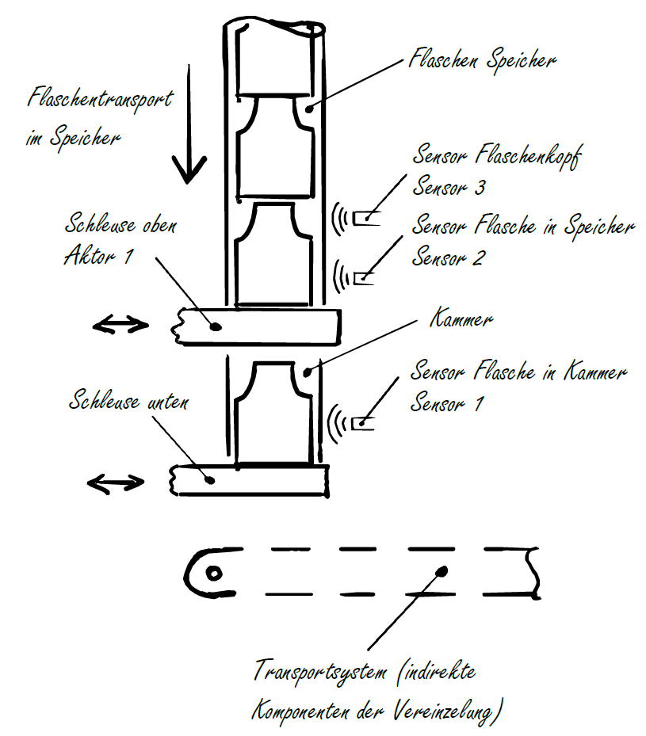

---

### Ablaufbeschreibung
- Ausgangszustand: Der Speicher wird manuell mit Flaschen befüllt, und beide Schleusen befinden sich in geschlossener Position.
- Die Sensoren "Flaschenkopf" und "Flasche in Speicher" detektieren eine korrekt positionierte Flasche durch die Signalkombination "Flaschenkopf" = FALSE und "Flasche in Speicher" = TRUE.
- Die erste Schleuse kann geöffnet werden, bis der Sensor "Flasche in Kammer" eine Flasche erkennt.
- Nach dem Erkennen wird die obere Schleuse wieder geschlossen.
- Sobald die obere Schleuse geschlossen ist, kann die untere Schleuse geöffnet werden und wird wieder geschlossen, wenn die Flasche die Kammer verlassen hat.
- Damit ist der Ausgangszustand wieder erreicht, und der Prozess kann erneut beginnen.

---

**2. Ablaufdiagramm erstellen (Anlagenablauf)**

- Um den Prozess von menschlicher Sprache in Maschinensprache zu überführen, bietet sich die Erstellung eines Ablaufdiagramms an.
- Das Ablaufdiagramm ist in nachstehender Abbildung dargestellt und umfasst drei Symboltypen:

&emsp; &emsp; &emsp; &emsp; &emsp; &emsp; 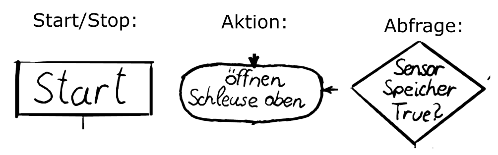


- Für die meisten Ablaufdiagramme sind diese Symbole ausreichend. Zusätzliche Symbole, für zum Beispiel Datenspeicherung oder Meldungen, können bei bedarf ergänzt werden.
---

### Ablaufdiagramm Vereinzelung
 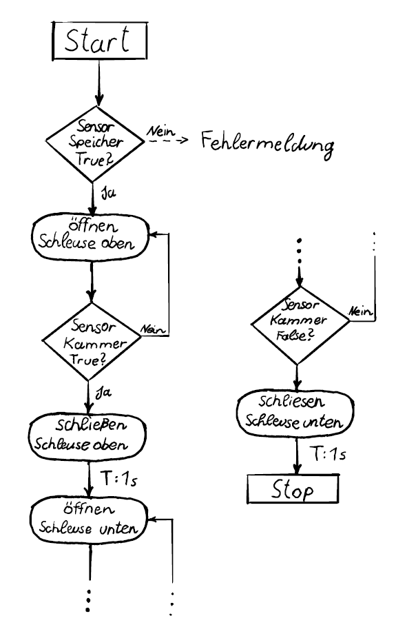

---

- Der Vereinzelungsprozess besteht aus vier Arbeitsschritten, da jede Schleuse einmal geöffnet und geschlossen werden muss.
- Es gibt drei Zustandsabfragen, wobei die letzten beiden in den vorherigen Arbeitsschritt zurückkehren. Somit gibt es keine Prozessverzweigung, sondern ein Arbeitsschritt wird so lange ausgeführt, bis eine Änderung der Abfrage erfolgt.
- Bei der ersten Abfrage erfolgt eine Art Prozessabzweigung, bei der eine Fehlermeldung für nicht vorhandene Flaschen angezeigt wird.
- Diese Fehlerbehandlung wird vorerst vernachlässigt und später im Kapitel zur Fehlerbehandlung wieder aufgenommen.
- Eine Mischung von Prozessprogramm und Fehlerbehandlungsprogrammen führt zu einem unübersichtlichen Code und erfordert daher eine andere Vorgehensweise.

---

**3. Sensor- und Aktuatorauswahl (Anlagenauslegung)**

- Die Flaschenförderung im Speicher wird durch Gravitation realisiert, wobei alternative Methoden wie die Verwendung von Förderbändern möglich sind.
- Es ist wichtig, zwischen aktiven und passiven Fördersystemen zu unterscheiden, da dies einen Einfluss auf die erforderlichen E/A-Geräte hat.
- Die Separation der Flaschen erfolgt durch zwei Schleusen, aber auch ein Drehtisch mit einer Ausnehmung für eine Flasche könnte genutzt werden.
- Sowohl lineare als auch rotierende Antriebe können als Aktuatoren für die Separation dienen, wobei es zahlreiche Ausführungsvarianten für beide Kategorien gibt.
- Die Flaschenförderung nach der Vereinzelung kann entweder durch eine rutschfähige Bahn als passives Element oder durch ein Förderband mit einem entsprechenden Aktor als aktives Element implementiert werden.

---

- Die Detektion von Flaschen bietet diverse Möglichkeiten, bei denen unterschiedliche Sensoren einsetzbar sind oder sogar auf Sensoren verzichtet werden könnte, was jedoch die Steuerbarkeit der Anlage einschränken würde.
- Die Umsetzung des Prozesses durch die Auswahl verschiedener Wirkprinzipien, Aktuatoren und Energieversorgungsformen ermöglicht eine facettenreiche Gestaltung der Anlage.
- In nachstehender Tabelle sind die gewählten Sensoren und Aktoren für die Vereinzelung nach dem Schema der Vereinzelung, aus vorherigen Abschnitt, aufgelistet.

---
#### Sensor / Aktor - Liste
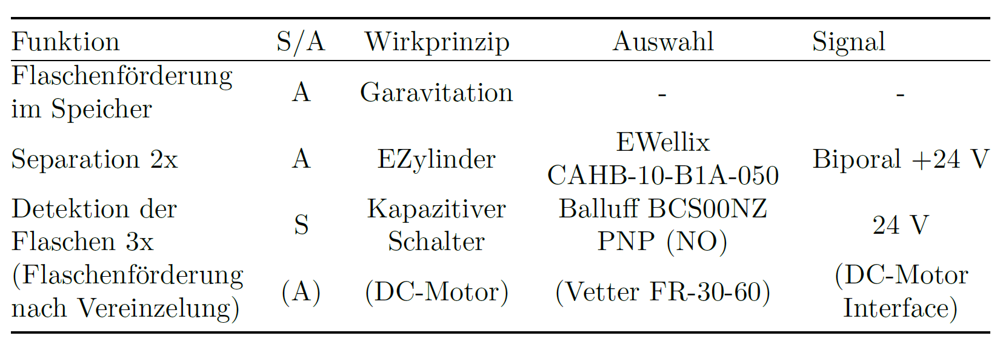

---

**4. Auswahl der E/A-Geräte (Anlagensteuerung)**

- Für die im technischen System vorhandenen digitale Ein- und Ausgänge können passende E/A-Geräte ausgewählt werden.
- Sensor-Signale können mit einer digitalen Eingangsklemme in die Steuerung integriert werden, wobei auf den Prellschutz in der Eingangsklemme verzichtet werden kann, da es sich um nichtmechanische Sensoren handelt.
- In diesem Beispiel wird eine 8-Kanal Klemme verwendet, da es in den weiteren Komponenten der Teaching Factory zusätzliche digitale Eingangssignale gibt, die auf der selben Klemme angeschlossen werden.
- Bei den bipolaren 24 V Signalen ist die Auswahl etwas komplexer. Während des Ausfahrens der Zylinder muss Leitung A mit 24 V versorgt und Leitung B an 0 V angeschlossen sein. Um den Zylinder wieder einfahren zu können, muss eine Umpolung in den Leitungen A und B erfolgen.
- Dieses Verhalten kann durch eine Relaisschaltung mit vier Relais umgesetzt werden, wie in folgender Abbildung dargestellt.

---

### Relaisschaltung für 2 E-Zylinder
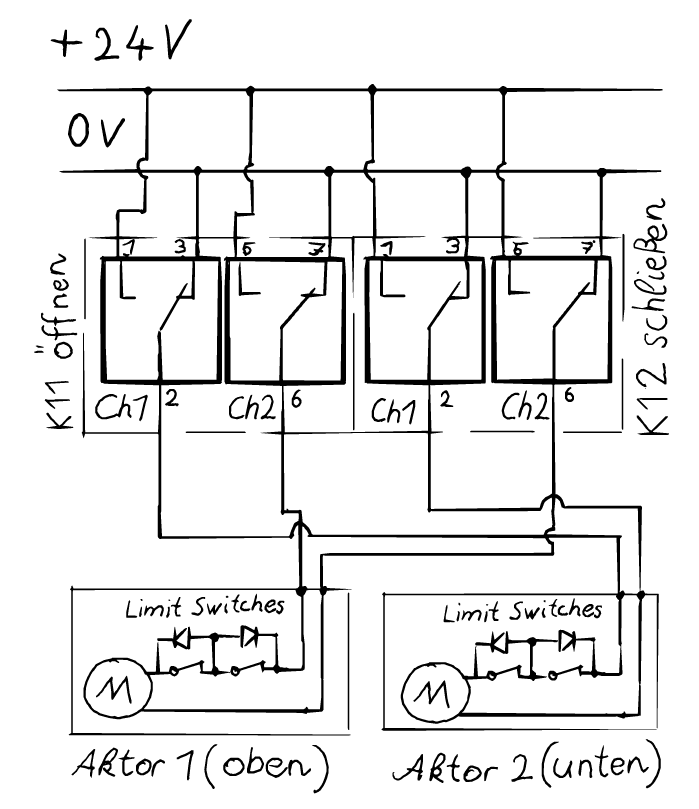

---

#### Klemmen-Variablen Verknüpfung
- Die Kanäle 1 und 2 der beiden Klemmen EL 2652 müssen mit den Aktuatorenanschlüssen verdrahtet werden.
- Dadurch wird Kanal 1 der Klemme 11 (K11) die Funktion zugewiesen, den zweiten Aktor zu öffnen, wenn das Relais geschaltet wird. Voraussetzung dafür ist, dass Kanal 1 der Klemme 12 (K12) nicht betätigt wird und somit das Relais auf 0 V durchschaltet.
- Gleiches gilt für Aktor 1 und Kanal 2 an der Klemme 11 und 12.
- Die Zuweisung aller Kanäle der Klemmen ist in nachstehender Tabelle ersichtlich.
- Auch die DI's für die Klemme EL1018 werden dort aufgelistet.
- Diese Prozesssignale und alle weiteren Prozesssignale der Teaching Factory werden innerhalb der SPS-Steuerung in einer Globalen Variablen Liste *IFC_HW* zusammengefasst, was das Hardware Interface bildet und die Signale der Anlage mit den Variablen des Steuerungsprogramms verknüpft.

---
#### Klemmen-Variablen Verknüpfung
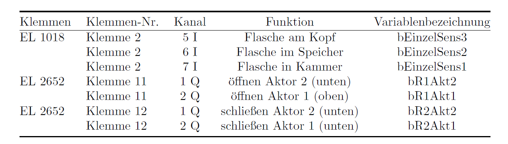

---

**5. SPS-Programmierung (Anlagenprogrammierung)**

- Der Prozess der Vereinzelung wird durch einen Funktionsblock implementiert, der für mehrere Vereinzelungen einsetzbar ist.
- Die E/A-Signale aus obiger Tabelle (Klemmen-Variablen Verknüpfung) werden nicht Eins zu Eins als E/A-Variablen für diesen Funktionsblock verwendet.
- Stattdessen werden die Schaltzustände der Ezylinder durch zwei bool'sche Variablen *bGate1* und *bGate2* ersetzt.
- Somit wird der Funktionsblock hardwareseitig abgegrenzt, um für andere Aktuatortypen einsetzbar zu bleiben. 
- Die Schleusen sind im Zustand *False* von *bGate1* oder *bGate2* geschlossen und im Zustand *True* für *bGate1* oder *bGate2*  geöffnet.

---

- Die Zuordnung zu den globalen Variablen aus der *IFC_HW* und somit den tatsächlichen Relaiszuständen erfolgt nach Aufruf des Funktionsblocks durch eine weitere Funktion im übergeordneten, anwendungsspezifischen Hauptprogramm.
- Um sicherzustellen, dass der Prozess gemäß dem Ablaufdiagramm funktioniert, müssen die Ausgangszustände für jeden Arbeitsschritt definiert werden.
- Die Signale müssen den Abfragen entsprechend zugeordnet werden, damit der Zustand im richtigen Moment wechselt.
- Diese Zuordnung der Zustände und Signale wird in Abbildung nachstehender Abbildung dargestellt, wobei auch eine Durchnummerierung nach Zustandswechsel erfolgt.

---

#### Zustandssignalliste (ohne Signale)
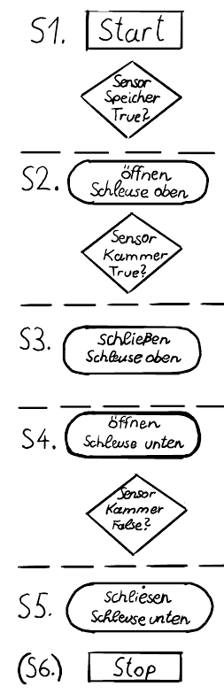

---

#### Zustandssignalliste

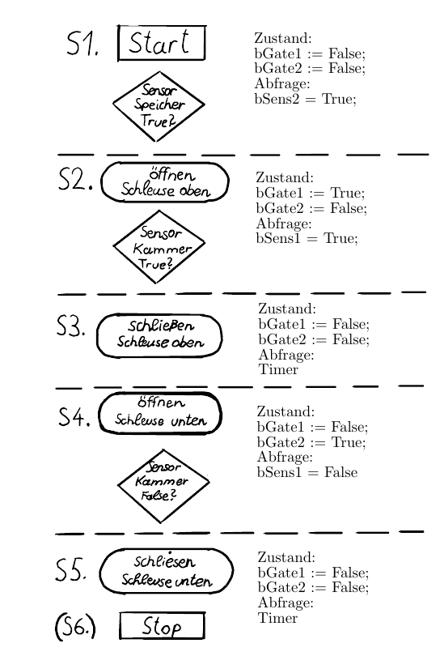

---


---

### Erstellung des Zustandsübergangsdiagramms 
- Die Implementierung der Prozessschrittkette in Strukturierten Text (ST) wird durch das Zustandsübergangsdiagramm erleichtert.
- Da es sich um ein einfaches Beispiel handelt und die Zustandsvariablen auf zwei bool'sche Werte beschränkt sind, können diese in die Zustände S1 bis S5 eingetragen werden.
- Bei komplexeren Systemen ist es oft übersichtlicher, die Zustandsvariablen nur in der Zustandsliste anzuführen.

---

#### Zustandsübergangsdiagramm der Vereinzelung

**Ausgänge:**
``bGate1(2) := False;`` &#8594; Schleuse zu
``bGate1(2) := True;`` &#8594; Schleuse offen
**Eingänge:**
``bSens1 := True;`` &#8594; Flasche in Kammer
``bSens2 := True;`` &#8594; Flasche in Speicher
**Interne Variablen:**
``fbTimer : TON``
``nState : INT``

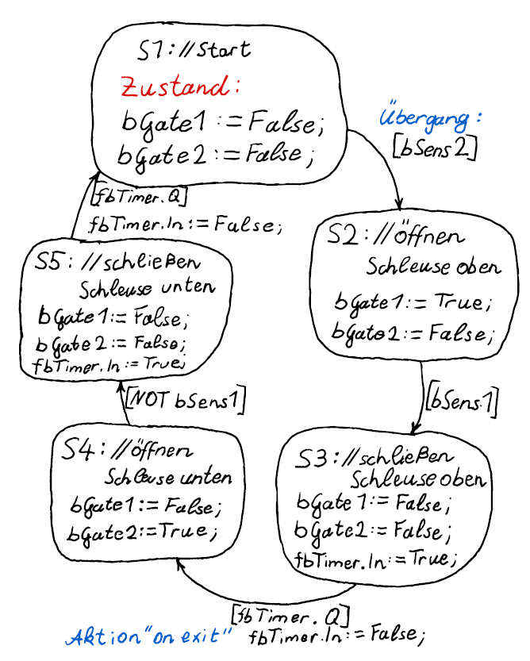

---

#### Programmüberführung
- Die Programmüberführung aus dem Zustandsübergangsdiagramm in Strukturierten Text (ST) erfolgt durch die Verwendung einer CASE-Anweisung.
- Die CASE-Anweisung dient der Auswahl von 1-n unterschiedlichen Programmteilen basierend auf einer INTEGER Variable.
- Für das Programmieren einer State Machine kann die Zustandsnummer S1-Sn als Auswahlvariable verwendet werden.
- Im Programmteil werden die Signalzustände entsprechend gesetzt.
- Zum Verlassen eines Zustands wird eine einfache IF-Anweisung verwendet, die die Eingangsvariablen der Übergangsbedingung abfragt.
- Sobald die Übergangsbedingung erfüllt ist, werden die Aktionen der IF-Abfrage ausgeführt, wie beispielsweise "on exit" Aktionen und das setzen der Auswahlvariable auf die neue Zustandsnummer.
- Ein Beispiel hierfür ist der Zustand S1 mit der Auswahlvariable nState: INT := 1.

---
#### Programmüberführung mit CASE-Anweisung

``` 
 CASE nState OF
 1: // Start
 	// Zustand
 	bGate1 := FALSE;
	bGate2 := FALSE
 
 	IF bSens2 THEN
 		nState := 2; // oeffnen Schleuse oben
 	END_IF
 
 2: // oeffnen Schleuse oben	
	...

 n: // n-ter State 
 END_CASE
 ```

---

#### CASE-Anweisung mit Enumerationsinstanzen

```
 CASE State OF
 State.Start: 
 	// Zustand
 	bGate1 := FALSE;
	bGate2 := FALSE
 
 	IF bSens2 THEN
 		State := State.OpenGate1; 
 	END_IF
 
 State.OpenGate1: 	
	...

 n: // n-ter State 
 END_CASE
 ```

---
### Hardware Schnittstelle

- Aufgrund unzureichender Ausgänge dieses Funktionsblocks zur Ansteuerung der Relais muss ein weiterer Funktionsbaustein erstellt werden.
- Dieser Funktionsbaustein soll die Relaissignale gemäß der Tabelle "Signalliste" ausgeben.
- Die Wahrheitstabelle für einen Aktor ergibt sich aus dieser Tabelle.
- Da zwei Ausgangswerte benötigt werden, kann keine einfache Funktion verwendet werden.
- Ziel des Funktionsbausteins ist es, die Ablaufsteuerung für allgemeine Vereinzelungen zu ermöglichen und die anwendungsspezifischen Signale in der übergeordneten Steuerung zu setzen.

---

#### Wahrheitstabelle Relaissteuerung

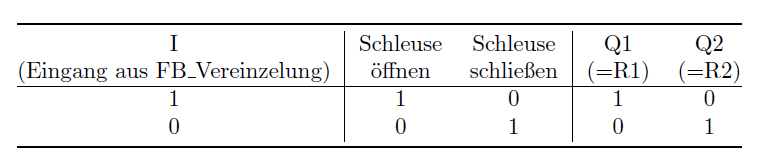

---

#### Relaissteuerung FB
``` 
FUNCTION_BLOCK FB_RCrtl
VAR_INPUT
	bIN : BOOL;
END_VAR
VAR_OUTPUT
	bQ1 : BOOL;
	bQ2 : BOOL;
END_VAR
-------------------------------------------------

IF bIn THEN
	bQ1 := TRUE;
	bQ2 := FALSE;
ELSIF NOT bIn Then
	bQ1 := FALSE;
	bQ2 := TRUE;
END_IF
```

---

**6. Prozess- und Programmoptimierung (Anlagenoptimierung)**

- Im aktuellen Steuerprogramm der Vereinzelung zeigen sich zwei ungünstige Verhaltensweisen.
  - Erstens erfolgt die zyklische Vereinzelung der Flaschen ohne externe Kontrolle.
  - Zweitens besteht die Möglichkeit, dass eine Flasche bei einer Fehlfunktion des Förderbandes in der unteren Schleuse stecken bleibt, was zu Beschädigungen führen kann.
- Um diese Probleme zu adressieren, wird in Abbildung 26 eine optimierte Ablaufsteuerung vorgeschlagen.
- Diese Optimierung beinhaltet zwei zusätzliche Eingangssignale, um die Vereinzelung zu initiieren und den eigentlichen Vereinzelungsprozess zu starten.

---

- Zur Minimierung des Risikos von Flaschenklemmungen wird die Ablaufsteuerung um einen Sensor erweitert.
- Ideal wäre ein Näherungssensor am ersten Abfüllplatz, der die Flasche außerhalb der Kammer detektieren kann.
- Sobald die Flasche diese Stelle erreicht, kann der Vereinzelungsprozess abgeschlossen werden.
- Eine zusätzliche Erweiterung des Zustandsgraphen betrifft die Betriebszustandsvariablen.
- Jeder Prozesszustand befindet sich in einem der definierten Betriebszustände.
- Diese Betriebszustände können beispielsweise als Off, Init, Ready, Production, Done, Error, Stop oder Setup festgelegt werden.

---

- Sie sind einheitlich für die gesamte Anlage, einschließlich einzelner Komponenten, Aktoren und Sensoren.
- Die Betriebszustände dienen als standardisierte Schnittstelle zwischen übergeordneten und untergeordneten Steuereinheiten.
- Sie werden als Ausgang an eine übergeordnete Steuereinheit zurückgemeldet, um den Gesamtprozess der Anlage zu steuern.
- Wenn die Produktion gestoppt werden soll, kann das bEnable Signal entzogen werden.
- Dadurch wird der Prozesszustand "Off" aktiviert, mit dem die Produktion beendet wird.


---

### Zustandübergangsdiagramm Optimiert

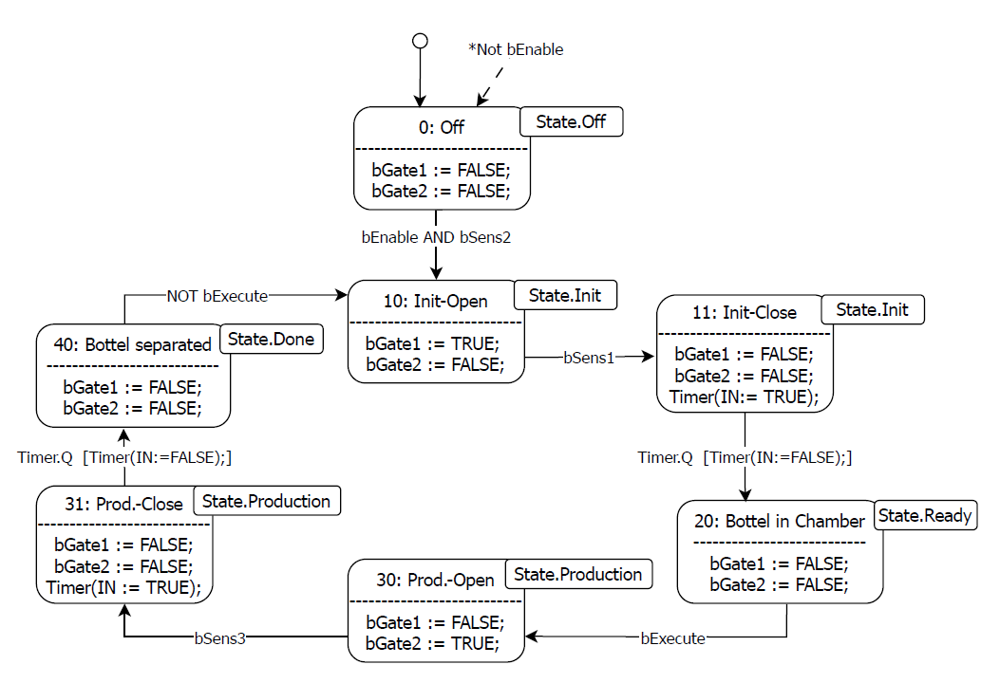

---

### Optimierung des Steuerungscodes
- Die vorgestellten Erweiterungen der Ablaufsteuerung können als ein allgemeines Framework für Funktionsbausteine auf den Ebenen Modul-, Prozess- und Hardware betrachtet werden.
- In einem späteren Kapitel wird detailliert aufzeigen, wie das Ebenenkonzept aufgebaut ist und welche Unterschiede zwischen den einzelnen Ebenen bestehen.
- Als Ergebnis dieser Erweiterungen ist festzustellen, dass alle Funktionsbausteine gleichartig angesteuert werden können und ein einheitliches Feedback liefern, wenn ein Prozess startbereit oder abgeschlossen ist.
- Diese Harmonisierung führt zu einem reduzierten Programmieraufwand.
- Die Verwendung eines definierten Frameworks ermöglicht zudem die Aufteilung der Programmierung auf mehrere Entwickler, ohne dass ein erheblicher Abstimmungsaufwand erforderlich ist.

---

<!-- header: Beispiel Betriebszustandsampel -->

## Betriebszustandsampel

- Zweck: Die Betriebszustandsampel soll den allgemeinen Anlagenzustand veranschaulichen und den Bedienern der Anlage einen direkten Überblick über den Betriebszustand ermöglichen.
- Funktion: Ein spezieller Funktionsbaustein wird benötigt, um definierte Leuchtsignale zu generieren, die den Betriebszustand anzeigen.
- Normative Grundlage: Die Definition der Zusammenhänge zwischen den Leuchtsignalen und dem Betriebszustand orientiert sich an der Norm EN ISO 13849-1.
- Signalvielfalt: Da acht verschiedene Betriebszustände durch nur drei Leuchtfarben dargestellt werden müssen, sind Leucht- und Blinksignale sowie zweifarbige Signale erforderlich.
- Tabelle: Die genauen Zusammenhänge zwischen den Leuchtsignalen und den Betriebszuständen sind in nachstehender Tabelle aufgeführt.

---
### Leuchtsignaltabelle
&emsp; &emsp; &emsp; &emsp; &emsp; 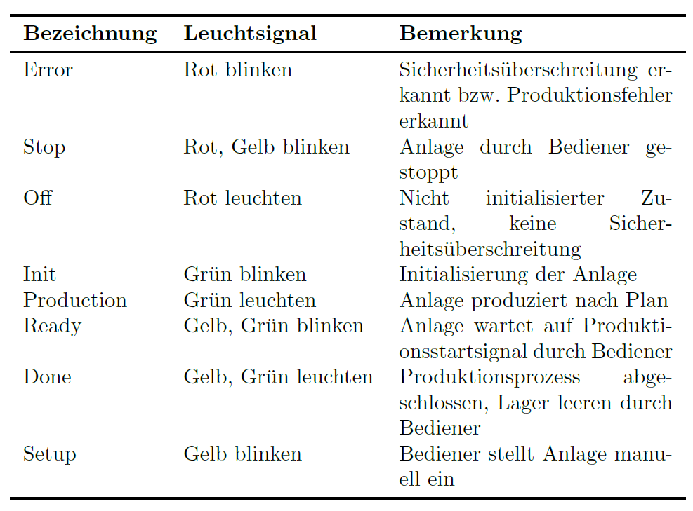

---

### Implementierung der Betriebszustandsampel
- DUT-Typ (Data Unit Type): Ein benutzerdefinierter Datentyp vom Typ Enumeration wird für die Implementierung der Zustandsampel erzeugt.
- Funktionsbaustein-Eingang: Der erstellte DUT-Typ repräsentiert die Betriebszustände und wird als Eingang in den Funktionsbaustein verwendet, wie in Abbildung unten dargestellt.
- Zuweisung der Leuchtsignale: Die Ausgänge des Funktionsbausteins werden gemäß der oben genannten Tabelle über eine Case-Anweisung den entsprechenden Leuchtsignalen zugeordnet.
- Das Blinksignal kann als Funktionsbaustein ähnlich wie im Einführungsbeispiel ohen Starttrigger verwendet werden.

---

### Blockschaltbild Betriebszustandsampel

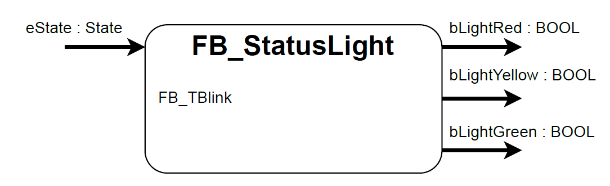
