<!-- paginate: true -->
<!-- header: Grundlagen Automatisierungstechnik -->

**SoSe 2024**
Serafin Kollegger & Julian Huber

# Grundlagen der Automatisierungstechnik

**SPS & SPS-Norm**
**Digitale E/A-Geräte**
**Einführung TwinCAT**
**Prozesszustandsbeschreibung**


---

## Was wird mit Automatisierungstechnik gemeint? 

- Automatisierungstechnik ist ein interdisziplinäres Fachgebiet, in welchem Produktionsarbeiten durch Maschinen und Anlagen automatisiert werden. 
- Die Automatisierung erfolgt durch den Einsatz von prozessorbasierten Steuerungen in Kombination mit Ein-/Ausgangsmodulensowie Sensoren und Aktoren.
- Prozessorbasierte Steuerung:
    - Microcontroller
    - CNC-Steuerung
    - Roboter Steuerung 
    - Speicherprogrammierbare Steuerung  

---

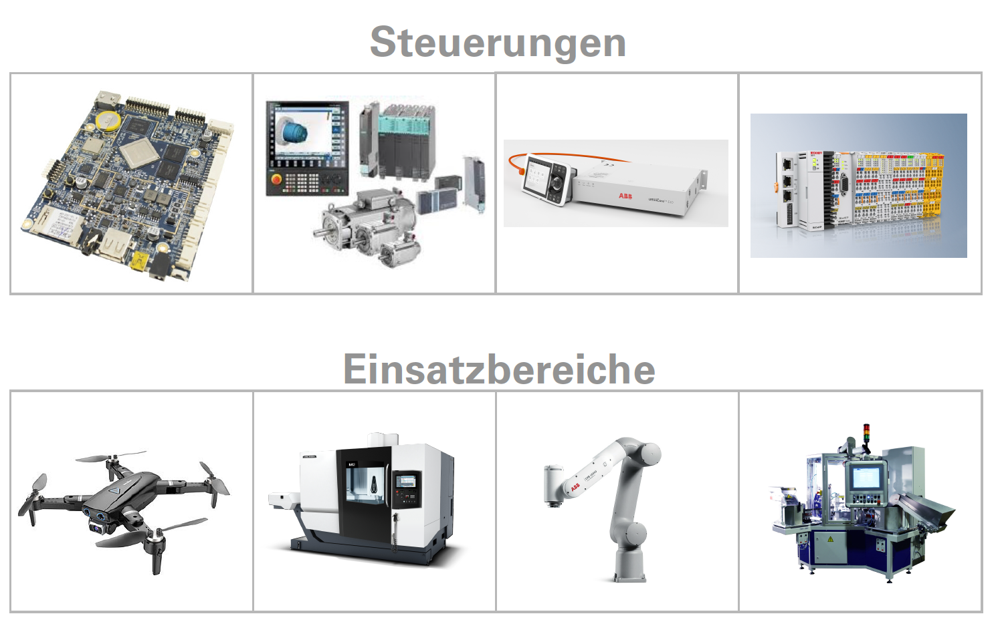

---

## Eingenschaften der Steuerungen

- Echtzeitfähig 
- Programmierbar auf spezifische Anwendungsfälle
- CNC und Robotersteuerungen sind hochspezialisiert und nur begrenzt erweiterbar
    - Fixe Anzahl an Ein- Ausgänge 
- Microcontroller und SPS sind flexibel einsetzbar
    - Microcontroller sind begrenzt erweiterbar
    - SPS sind fast unbegrenzt erweiterbar (~1000 E/A Signale)

---

## Automatisierungspyramide
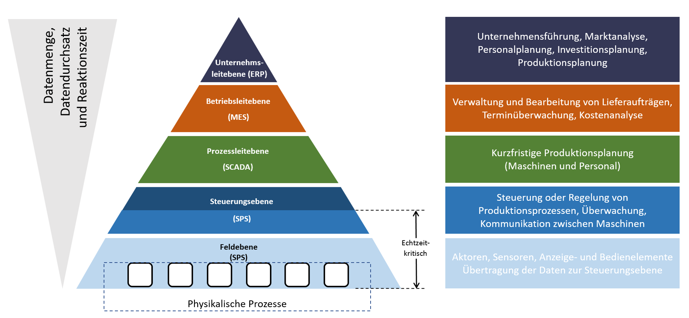

---

### Was ist Echtzeit?


---

### Echtzeit

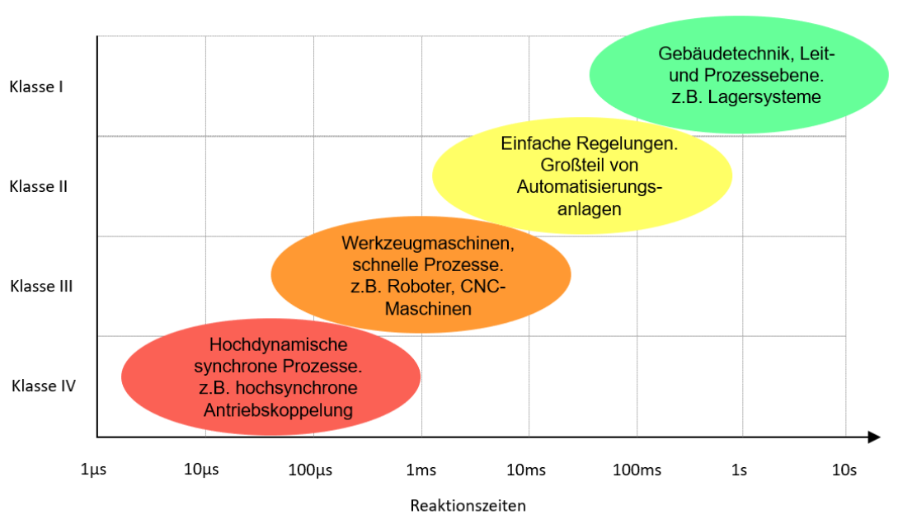

---

### Echtzeit

.
- **weiche Echtzeitanforderungen:**

Echtzeitaufgaben haben eine vorgegebene Reaktionszeit, deren Verletzung aber noch nicht sofort katastrophale Auswirkungen hat. Beispiel: Medienwiedergabe

.
- **harte Echtzeitanforderungen:**

Eine Verletzung der vorgegebenen Reaktionszeit führt unmittelbar zum maximalen Schaden. Die Einhaltung der Zeitvorgabe ist noch wichtiger als bei der weichen Echtzeitanforderung. 
Beispiele: Brennen einer Blu-ray, Achsenansteuerung einer CNC Fräse.


---

### Echtzeit


---

## Begriffsdefinitionen

**Die Automatisierungstechnik** ist das technische Fachgebiet, das sich mit Technologien und Methoden beschäftigt, um einzelne Arbeitsschritte,  zusammenhängende Arbeitsschritte oder den gesamten Umfang von Arbeitsschritten eines Prozesses mit Hilfe von Anlagen, Maschinen und Geräten ohne menschliches Zutun auszuführen.

**Ein Prozess** wird nach ANSI/EIA-632-1998 als eine Reihe miteinander verbundener Aufgaben, die gemeinsam Inputs in Outputs umwandeln definiert.

---

### Darstellung eines Prozesses als Blackbox

**Ein Prozess** wird nach ANSI/EIA-632-1998 als eine Reihe miteinander verbundener Aufgaben, die gemeinsam Inputs in Outputs umwandeln definiert.

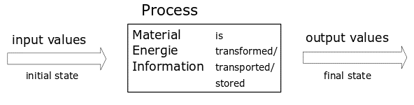


---

### Technische Prozessumsetzung 

Damit der Prozess umsetzbar ist, bedarf es einem **technischen System**
(**Anlage, Maschine oder Gerät**), welches mit Hilfe der Prozessleittechnik
entwickelt wird.

 Die **Prozessleittechnik** ist die Ingenieursdisziplin, welche sich mit den Architekturen, Mechanismen und Algorithmen zur Aufrechterhaltung des Outputs eines bestimmten Prozesses, innerhalb eines gewünschten Bereichs befasst. 

---

### Darstellung eines Technischen Systems zur Prozessumsetzung

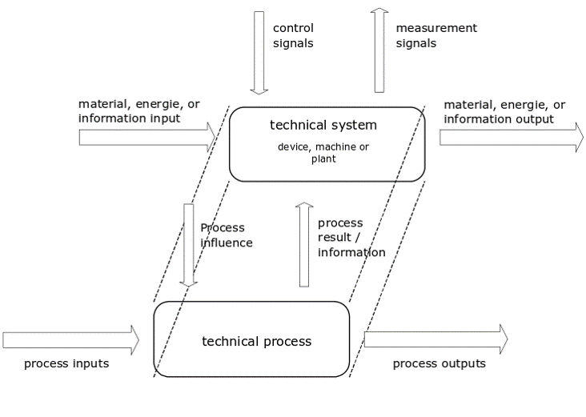

---

### Technische Systeme

- Das technische System übernimmt Grundfunktionalitäten für Steuerungs-, Regelungs- und Visualisierungsvorgänge.
- Diese Funktionen werden unter dem Begriff "Automatisierung" zusammengefasst.
- Als Steuerungen haben sich Speicherprogrammierbare Steuerungen (SPS) und Industrie-PCs (IPC) als Standard etabliert.
- Diese nutzt vorgefertigte Programme aus internen Speichern des Systems und bestimmen durch logische und mathematische Zusammenhänge neue Stellgrößen.
- Diese Stellgrößen werden durch die Komponenten des technischen Systems in physikalische Größen umgewandelt und greifen so in den technischen Prozess ein. 

---

### Unterscheidung Steuern und Regeln

- **Steuern:**
  - System bestimmt Ausgangsgrößen aufgrund vordefinierter Systemverhalten.
  - Zielgrößen werden nicht erfasst, und Störeinflüsse sind nicht kompensierbar.
  - Steuerungen verwenden oft digitale Messgrößen wie Näherungsschalter.
  - Ablaufsteuerung ist eine häufig implementierte Form des Steuerns von sequentiellen Prozessen.
  - Ablaufsteuerungen verwenden meist digitale Messgrößen als Feedback, um weitere Prozessschritte einzuleiten.

---

- **Regeln:**
  - Durch kontinuierliche Messungen der Prozessparameter wird die Abweichung zu den Vorgabeparametern verglichen.
  - Der entstehende Fehler wird durch einen Regler ausgeglichen, der die Stellgröße im System vorgibt.
  - Störeinflüsse können kompensiert werden.
  - Bei komplexen Automatisierungssystemen sind prozessschrittspezifische Vorgabeparameter erforderlich.
  - Diese Parameter werden in der Regel durch eine Ablaufsteuerung an die Regler übergeben.

---

### Vergleich Steuern und Regeln?

---

## Ziele der Automatisierung

Mit einer Automation von Prozessen bzw. Produktionsanlagen werden
unterschiedliche Ziele verfolgt. Teilweise können diese Ziele im
Widerspruch stehen, sodass eine Priorisierung auf anlagen- und
unternehmensspezifische Eigenschaften erfolgen muss. Die Ziele sind:

-   Steigerung der Qualität,

-   Humanisierung,

-   Steigerung der Sicherheit und

-   Rationalisierung.

---

### Wie können die Ziele der Automatisierung im Wiederspruch stehen?

---

### Wann ist Automatisierung sinnvoll?

---
<!-- header: Speicherprogrammierbare Steuerung -->
## Speicherprogrammierbare Steuerung - SPS

- Speicherprogrammierbare Steuerungen (SPS) sind aktuell die weitverbreitetste Hardware für die Automatisierung von Maschinen und Anlagen.
- Es existieren zwei etablierte Varianten: Hard-SPS mit speziell entwickelter Hardware und Soft-SPS mit Standardkomponenten aus PC-Systemen und herkömmlichem Betriebssystem (z.B., Windows).
- Hard-SPS besteht aus Stromversorgung, Steuerungsprozessor CPU, digitalen Ein- und Ausgangsbaugruppen sowie einem internen Bussystem.
- Soft-SPS ermöglicht die Ausführung anderer Software wie C++ Programme auf dem Industrie-PC.

---

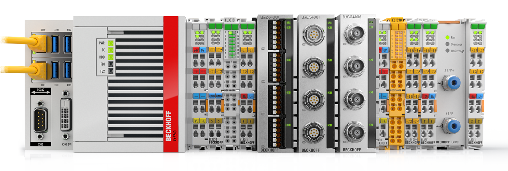

---

## SPS-Norm DIN EN 61131-3 (IEC 61131-3)

- Programmierung von automatisierten Systemen ist üblicherweise anwendungsspezifisch.
- Ziel der SPS-Norm: Rationelleres und herstellerunabhängiges Programmerstellungskonzept.
- Die Norm führt vier Grundkonzepte ein, um allgemeine und wiederverwendbare Programmbausteine zu entwickeln.
- In diesen Bausteinen sollten anwendungsspezifische SPS-Operanden, Eingänge, Ausgänge, Zähler und Zeitglieder sowie Merker nicht eingesetzt werden.
- Anlagenspezifische Zuweisungen, Zähler und Merker sollen erst bei der Erstellung des übergeordneten Anlagenprogramms berücksichtigt werden.
- Die vier Konzepte sind detaillierter in den nachfolgenden Punkten beschrieben.

---

### Datentypen

Eine einheitliche Definition für Datentypen, Konstanten und Variablen sind verbindlich vorgeschrieben. Für symbolische und absolute Adressierungen sind die definierten Datentypen Grundlage der expliziten Ausführung der Variablendeklaration. Beispiele einiger Datentypen: 
     
`bSensor AT%I* : BOOL;` &emsp; &ensp; Boolsche Variable, adressiert auf einen DI
`iCount : INT := 100;`  &emsp; &emsp;  Ganzzahlige Zählervariable
`nNumber : BYTE;` &emsp; &emsp; &emsp; &emsp;Bitfolge entsprechend einer Zahl
`sText : STRING := 'AUT'` &emsp;Textsymbole mit 4 Byte Speichergröße;
`rTemp : REAL; ` &emsp; &emsp; &emsp; &emsp; Gleitkommazahl einer Temperatur 32 Bit Auflösung


---

### Programmorganisationseinheiten (POU's)


 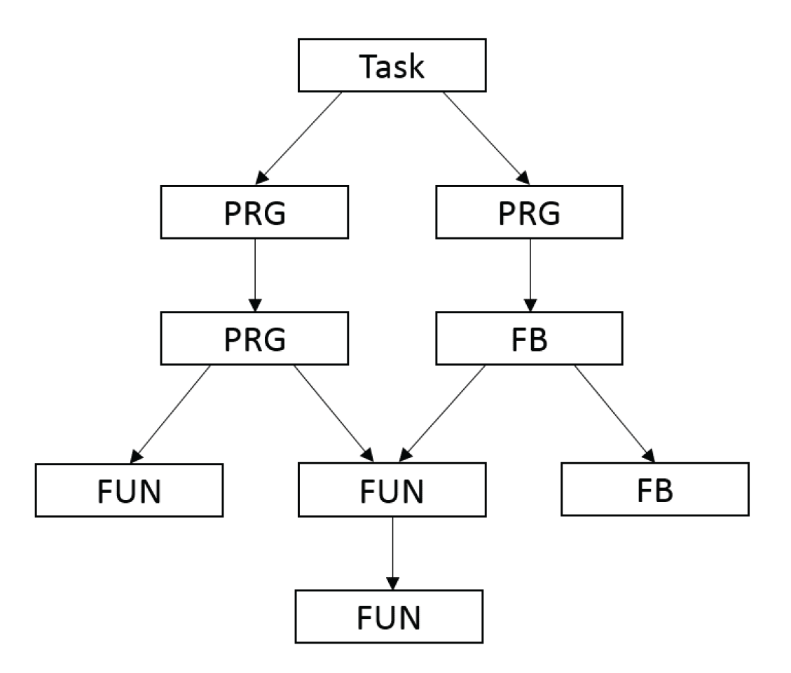

---

### Programmiersprachen


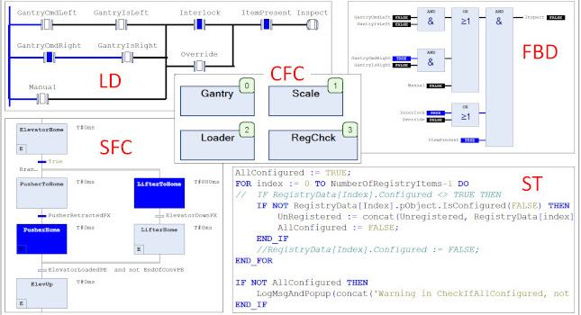

---

### Programmablauf

 
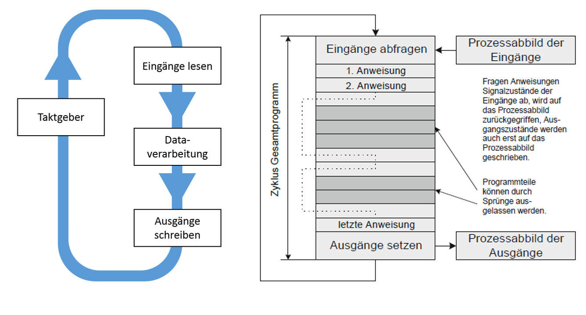

---

### Zusätzlich Funktionalitäten in TwinCAT 3 


- **Data Unit Type (DUT)- Anwenderspezifische Datentypen**

    Zusätzlich zu den Standard-Datentypen können Sie eigene Datentypen
wie Strukturen, Aufzählungen/Enumeration, Referenzen und Unions
definieren.

-   **Globale Variablen Listen (GVL)**

    Der Inhalt von Globalen Variablen Listen ist innerhalb des
SPS-Projektes für alle POU's zugreifbar. Deswegen
eignen sie sich für die Verwendung von Hardware oder HMI
Schnittstellen.

---

## TwinCAT Einführung I 

- Projekterstellung 
- SPS-Instanzierung
- Variablen Deklaration
- Programmausführung & Online-Modus
- Task anlegen und Zykluszeit Parametrierung
- Kernisolierung
- Zielsystem wählen & Geräte Scannen
- ...


---

### Laufzeitmodi (Runtimemode)

- Der oben genannte *Run Mode* ist einer von drei Modi, die die
Laufzeit (Runtime) der SPS annehmen kann, die Symbole sind 


---

**Konfig Mode**
- Grundsätzlich ist beim Entwickeln die Laufzeit im *Konfig Mode*. Wie der Name schon vermuten lässt, kann in diesem Modus die SPS konfiguriert werden. D.h. die Zykluszeiten und Priorisierung der Tasks kann eingestellt werde, neue Programme und Programmsegmente können erzeugt werden u.v.m..

**Free Run Mode**
- Der zweite Modus ist der *Free Run Mode*. Mit diesem ist es möglich Peripheriegeräte und E/A-Geräte einzulesen und zu parametrisieren. D.h. im *Free Run Mode* ist eine aufrechte Verbindung über den Feldbus und andere Schnittstellen vorhanden.

**Run Mode**
- Im *Run Mode* ist die SPS einsatzbereit und kann gestartet werden. Ab diesem Zeitpunkt sind die Kerne der CPU für die Rechenzeit des Programms blockiert und somit ein echtzeitfähiger Betrieb möglich.

---

## E/A-Geräte

- Alle Prozesssignale müssen durch E/A-Geräte erfasst bzw. gesetzt werden.
- Zur Reduzierung des Verkabelungsaufwands kommunizieren E/A-Geräte mit der SPS über Feldbussysteme.
- Bei Soft-SPS ist dieses Konzept immer erforderlich, während Hard-SPS in vielen Fällen auf das Feldbussystem verzichten kann, indem die Klemmen direkt an die SPS angeschlossen werden.
- Der Feldbus wird durch Buskoppler auf einen lokalen Klemmenbus übersetzt und galvanisch getrennt.
- Eingangsgeräte schreiben ihre Werte aus den Prozesssignalen auf den Klemmenbus, während Ausgangsgeräte die Klemmenbussignale lesen und die Prozesssignale setzen.
- Sowohl die Prozesssignale als auch der Klemmenbus sind galvanisch getrennt, was bei Störungen die Unversehrtheit der Bussysteme gewährleistet.

---

### Hardwarekomponenten


---

### Adressierung von Prozesssignalen

- Die Prozesssignale werden durch Adressen angesprochen, die flexibel oder explizit vergeben werden können.

**Flexible Adressierung**

- Flexible Adressbits bzw. -bytes, -words oder -doublewords können mit AT%I* oder AT%Q* vergeben werden. 
- Die Größe der zu übertragenden Daten wird automatisch festgelegt. 
- Die endgültige Zuweisung auf einen Klemmenkanal erfolgt durch manuelle Verknüpfung zu den E/A-Geräten. 
- Neben den Ein- und Ausgangsspeicherpräfixen I und Q gibt es einen Merkerspeicher mit Präfix M. 

---

**Explixite Adressierung**
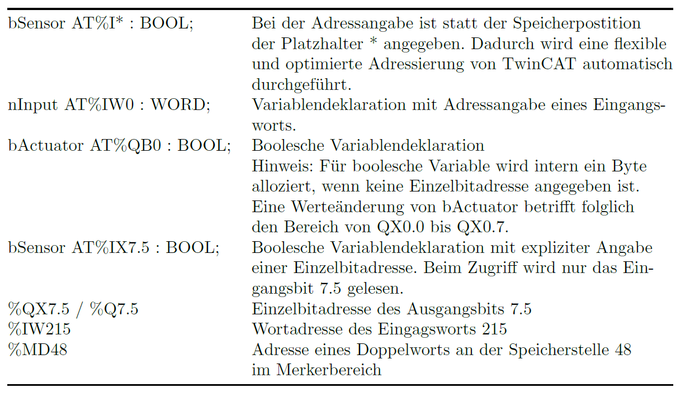

---

### Digitale Ein- / Ausgangsklemmen

- Digitale Signale, auch als binäre Signale bekannt, haben Wertezuweisungen von logischer 0 oder 1 in der Steuerung.
- Es ist wichtig, das Spannungsniveau zu definieren, welches die logische 0 und 1 für physikalische Signale aus dem Prozess darstellt.
- Gängige Nennspannungen für digitale Signale sind 3 V, 4 V, 12 V oder 24 V, wobei es hierbei nicht um die Schaltniveaus, sondern nur um die Nennspannung geht.
- Da reale Signale niemals den genauen Spannungswert annehmen, werden Schaltniveaus aufgrund von Störungen und Leitungswiderständen festgelegt.
- Diese Schaltniveaus lassen sich in einer Hysteresiskurve darstellen.

---

### Hysteresiskurve von Digitalen Signalen
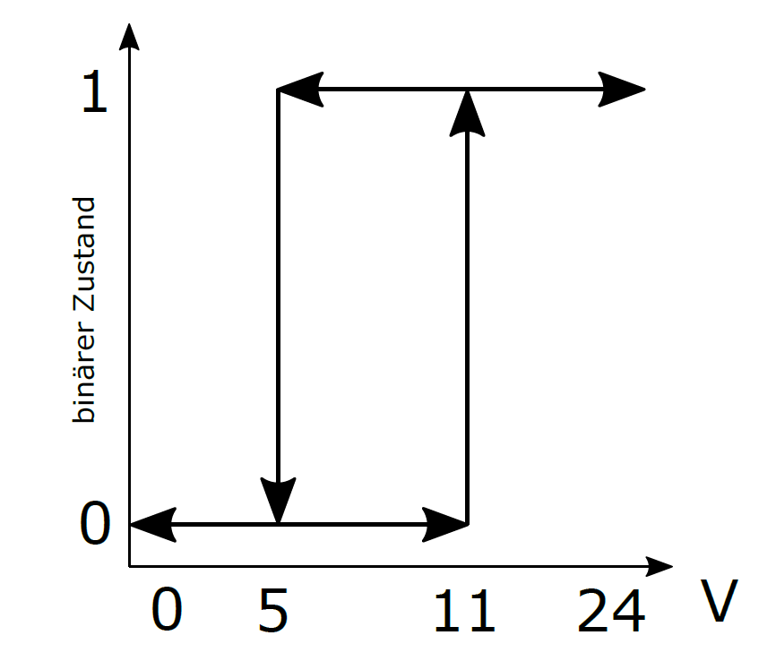

---

### Digitale Eingangsklemmen

- Bei der Auswahl von digitalen E/A-Klemmen ist es entscheidend, die Art des Sensors zu berücksichtigen.
- Es gibt eine grundlegende Unterscheidung zwischen 2-Leiter- und 3-Leiter-Sensoren.
- 3-Leiter-Sensoren benötigen im nicht ausgelösten Zustand weniger Leistung als 2-Leiter-Sensoren, da kein Reststrom für die Leistungsversorgung erforderlich ist.

---

#### PNP | NPN Konzept (Sourcing | Sinking)

- Ein weiterer wichtiger Faktor bei der Auswahl ist die Bestimmung, ob der Sensor als Stromquelle oder als Stromsenke ausgeführt ist.
- Sensoren, die als Stromquelle agieren, werden als PNP (Positive-Negative-Positive) bezeichnet, und in diesem Fall muss das Eingangsgerät als Stromsenke fungieren.
- Digitale Eingangsgeräte mit einer Senkenfunktion sind beispielsweise die Modelle EL100x & EL101x.
- Falls der Sensor jedoch als NPN (Negative-Positive-Negative) Sensor konfiguriert ist, ändert sich die Richtung des Stromflusses.
- In diesem Fall sollte ein passendes Eingangsgerät mit Quellfunktionalität am Eingang ausgewählt werden, wie beispielsweise die Modelle EL108x & EL109x.

---

#### 2- & 3-Leitersensoren (Sinking Device)

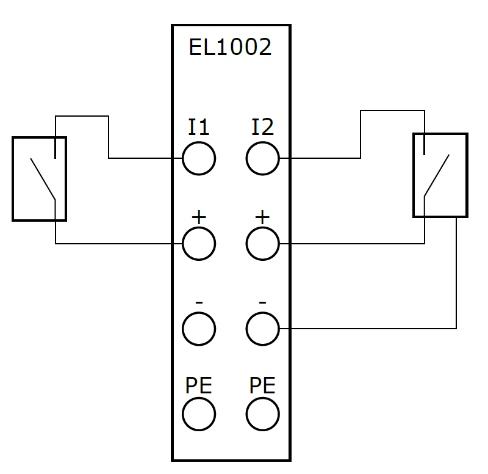

---

#### NO | NC Konzept (Öffner | Schließer)
- Die Schaltzustände der Sensoren werden häufig mit "normally open" (NO) und "normally closed" (NC) bezeichnet.
- Dies bezieht sich auf das Verhalten der Sensoren im nicht aktiven Zustand.
- Bei NO liegt kein Signal am Eingangsgerät an, und innerhalb der SPS wird der Wert 0 *[FALSE]* angezeigt.
- Bei NC liegt ein Signal an, und der Wert 1 *[TRUE]* wird angezeigt.

---

#### Schaltzustände NO & NC

 &emsp; &emsp; &emsp; &emsp; &emsp; 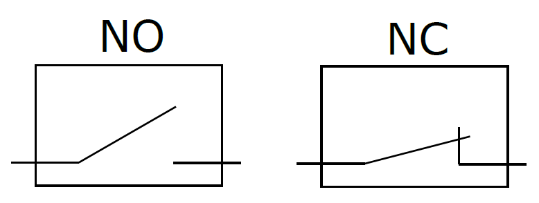

---

#### Prellung von mechanischen Tastern

- Mechanische Taster zeigen Tendenz zum Prellen, dabei entsteht wiederholtes Öffnen und Schließen des Kontakts durch elastische Materialverformungen.
- Das Prellen kann zu undefinierten Flanken führen, was Fehler im Steuerungsprogramm verursachen kann.
- Durch Eingangsfilter mit längeren Schaltzeiten, z.B. 3 ms, kann das Signal geglättet werden.
- Die Glättung des Signals stellt sicher, dass bei der Änderung der Schalterstellung eine klare Flanke erzeugt wird.


---

##### Eingangsfilter (notwendig für mechanische Taster)

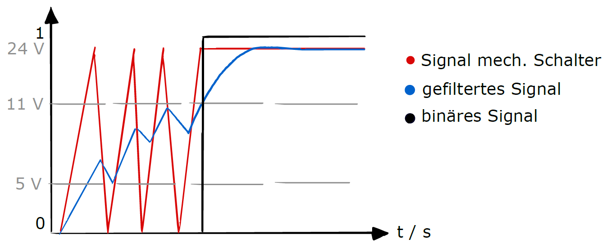


---

### Digitale Ausgangsklemmen

- Digitale Ausgangsklemmen bei SPS dienen dem Senden von digitalen (binären) Signalen an externe Geräte oder Aktoren.
- Sie ermöglichen das Schalten elektrischer Signale zur Steuerung von Prozessen in der realen Welt.
- Die Signalsteuerung kann durch Relais oder Halbleiterschalter realisiert werden.
- Es gibt interne (Typ 2) oder externe (Typ 1) Spannungsversorgungsmöglichkeiten.
- Externe Versorgung ermöglicht es in einigen Fällen das Schalten größerer Leistungen zu realisieren.
- Binärausgänge schalten oft induktive Lasten, was zu hohen Spannungsspitzen beim Trennen des Stromkreises führen kann.
- Eine Freilaufdiode verhindert das Auftreten dieser Spitzen. 


---

#### Schaltbild von DO-Geräten mit externen oder interen Spannungsversorgung

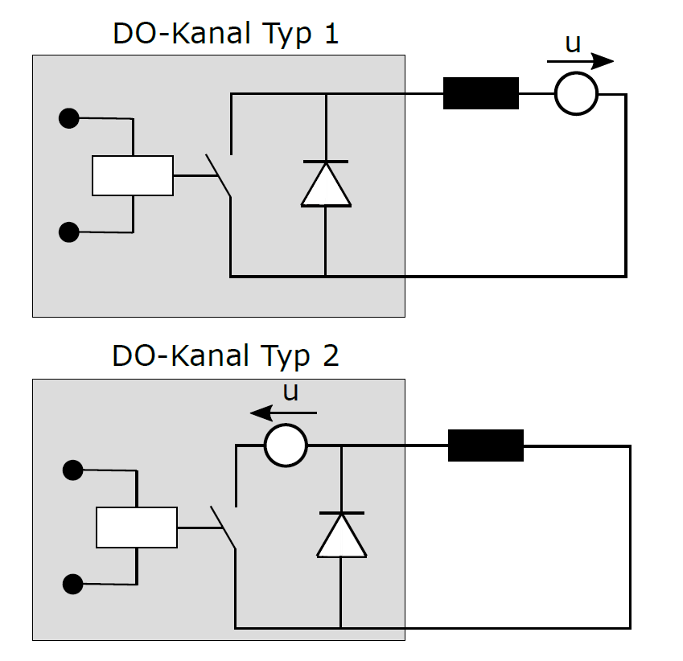


---
####  Digitale Ausgangsklemmen
- Standartklemmen für digitale Ausgänge (DO) variieren im Nennstrom. Beispielsweise haben EL200x-Modelle mit 24 Vdc zwei, vier oder acht Kanäle mit 0.5 A, während EL202x-Modelle zwei oder vier Kanäle mit 2 A bieten.
- Einige Klemmen verfügen über zusätzliche Diagnosefunktionen wie Drahtbrucherkennung.
- Digitale Ausgänge können nach dem PNP- oder NPN-Prinzip arbeiten. Bei externer Spannungsversorgung kann die Masse (0 V) als Ausgang durchgeschaltet werden, wie bei der Klemme EL208x.
- Weiters gibt es verschiedene Ausführungsvarianten von digitalen Ausgängen, darunter Push-Pull-Outputs mit Tristate, pulsweitenmodulierte (PWM) Ausgänge für Aktoren oder LED-Steuerung, sowie PWM-Lichtwellenleiter-Ausgangssignale für spezielle Anwendungsfälle.
- siehe Beckhoff Infosys: Feldbuskomponenten/EL2xxx

---

## TwinCAT Einführung II

- Verwendung von Bibliothek Funktionsblöcken
- IF-Anweisung
- Logische Gleichungen
- Verwendung von POU's 

**Tipp:** Es stehen Tutorial-Videos wie <https://www.youtube.com/watch?v=GOFUsWc61Hk&t=21s> von Christian Stöcker zur Verfügung.


---


### Bibliotheken und Standard FB's

- In TwinCAT sind standardmäßig drei Bibliotheken (References) hinterlegt, die POU's nach IEC 61131-3 enthalten. Beispiele hierfür sind Timer, Stringfunktionen, Zähler und Trigger.
- Diese Bibliotheken ermöglichen zusätzlich den Zugriff auf systemeigene Parameter aus dem Programm heraus.
- Ein Beispiel für einen Bibliotheksfunktionsblock ist der *TON*, der eine Einschaltverzögerung umsetzt.
- Der Funktionsblock hat zwei Eingänge, *.In* vom Datentyp Bool und *.PT* vom Datentyp Time und zwei Ausgänge, *.Q* vom Datentyp Bool und *.ET* vom Datentyp Time.

---

### Blockschaltbild TON

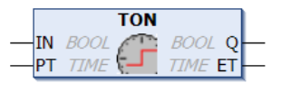

---

### TON Funktionsweise
- Der Eingang *.IN* fungiert als Startsignal. Nach Ablauf der vorgegebenen Zeit *.PT* (Periodtime) wird der Ausgang *.Q* auf TRUE bzw. 1 gesetzt.
- Der zweite Ausgang *.ET* gibt die verstrichene Zeit (Elapsed Time) seit dem Startsignal an und behält den Wert der voreingestellten Zeit *.PT* nach Erreichen der Periodendauer.
- Sobald *.IN* auf FALSE gesetzt wird, wird die verstrichene Zeit *.ET* zurückgesetzt.
- Dieses Verhalten ist im Zeit-Signal Diagramm dargestellt.


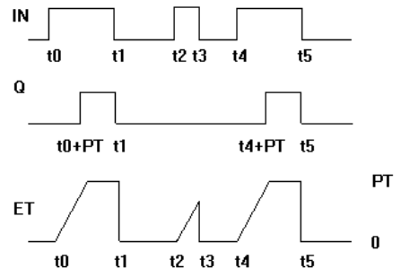

---

### FB Aufruf in einem Programm
Aufgerufen wird ein Bibliotheksfunktionsblock, wie jeder Funktionsblock
durch Deklarierung im Deklarationsteil und Funktionsaufruf im
Programmteil.

```
PROGRAM MAIN                // Deklarationsteil
VAR
	fbTon 	    : TON;
	bIn 	    : BOOL;
	bOut 	    : BOOL;
	tPt	    : TIME;
	tEt	    : TIME;
END_VAR     
-----------------------------------------------------------------------------------------------
fbTon(	IN := bIn,                  // Programmteil
	PT := tPt,
	Q  => bOut,
	ET => tEt); 
```


---

## Einführungsaufgabe - Blinklicht

- Einführungsaufgabe: Entwurf eines Blinklichts als Einstieg in die SPS-Programmierung.
- Das Licht wird durch eine steigende Flanke eines Eingangs gestartet und bei erneuter Flanke ausgeschaltet.
- Die Flankenerkennung erfolgt durch einen Trigger-Funktionsbaustein (FB) *R_TRIG*.
- Die Blinklichtsteuerung wird durch einen TON Timerbaustein erstellt.
- Eine Probeinbetriebnahme soll anhand der virtuellen Teaching Factory durchgeführt werden.  

---

### Blockschaltbild Flankenerkennung R_TRIG
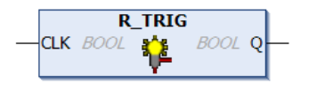
- Wenn der Eingang *.CLK* = TRUE wird, wird der Ausgang *.Q* = TRUE.
- Jede weitere Ausführung des FB gibt *Q = FALSE* zurück, bis eine fallende und erneut eine steigende Flanke auftreten.
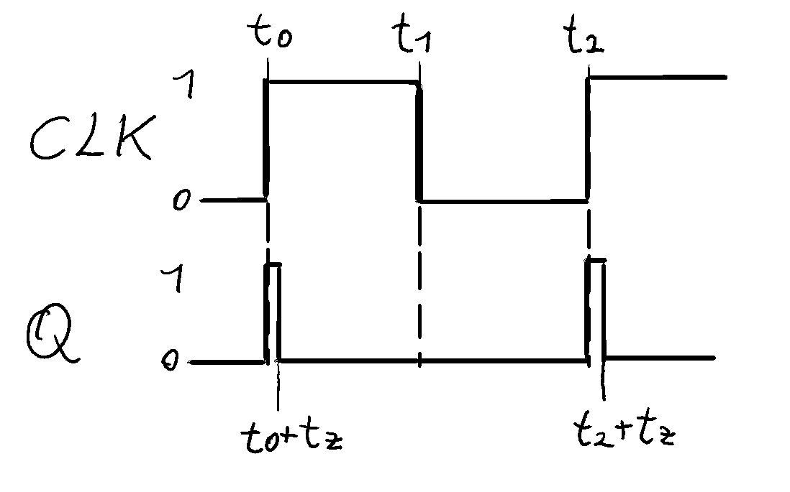  

---

### Start- und Stopsignal durch einen nicht rastenden Schalter

```
fbTrigOn(CLK:= bIN , Q=> );

// Flankenabfrage
IF fbTrigOn.Q AND NOT bBlink THEN
	bBlink := TRUE;
ELSIF fbTrigOn.Q AND bBlink THEN
	bBlink := FALSE;
END_IF 
```


---

### Blincklichtsteuerung

- Das Blinklicht kann mithilfe eines *TON* FB erzeugt werden.
- Der negierte Ausgang *.Q* wird mit dem Startsignal *bBlink* durch ein logisches UND-Verknüpfung auf den Eingang *.IN* des FB *TON* geschrieben.
- Dies führt zu einem periodischen Sägezahnsignal von *.ET*, wie im Zeit-Signal-Diagramm dargestellt ist.

---

#### Zeit-Signal-Diagramm des zyklischen TON
&emsp; &emsp; &emsp; &emsp;  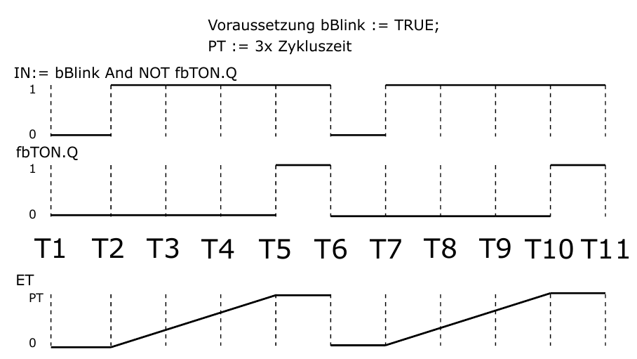

---
#### Erstellung des Periodischen Blinksignals 

- Das eigentliche Blinksignal kann durch eine Abfrage, ob die erstrichene Zeit kleiner oder größer als die halbe Periodendauer ist, erstellt werden.
- *bOut* ist der Ausgang des Blinksignals 

```
fbTON(IN:=bBlink AND NOT fbTON.Q, PT:=T#1S);

IF bBlink AND fbTON.ET < T#1S/2 THEN
	bOUT := TRUE;
ELSE
	bOUT := FALSE;
END_IF
```

---

### FB Implementierung 

- Die Start- und Stopfunktion kann zusammen mit der Blinklichtsteuerung in einem Funktionsbaustein *FB_BlinkBsp* implementiert werden.

&emsp; &emsp; &emsp; &emsp; &emsp; &emsp; &emsp; &emsp; 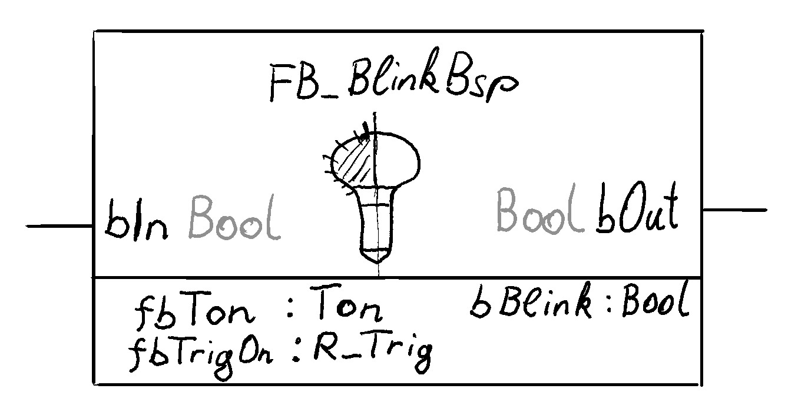

---

### FB Verwendung im MAIN 


- Um den Funktionsbaustein [FB_BlinkBsp]{.roman} auszuführen, muss dieser
im Programm [MAIN]{.roman} aufgerufen werden und mit den richtigen
Signalen der [IFC_HW]{.roman} verknüpft werden.
- Die GVL *IFC_HW* ist das Hardware Interface der Teaching Factory, in ihr werden alle Prozesssignale zusammengefasst, um sowohl die reale als auch virtuelle Anlage steuern zu können. 
- Download von Sakai *Ressourcen/Source Code Files/IFC_HW.TcGVL* möglich   

```
PROGRAM MAIN
VAR	
	fbBlink		: FB_BlinkBsp;
	
END_VAR
------------------------------------------------------------------------------------------------
fbBlink(bIN:=IFC_HW.bExecute , bOUT=>IFC_HW.bAmpelGelb );
```


---
<!-- header: Prozesszustandsbeschreibung -->

## Prozesszustandsbeschreibung

- Die beiden hier besprochenen Prozessbeschreibungsvarianten dienen der grafischen Darstellung von ansonsten verbal beschriebenen Prozessen.
- Einsatz finden diese Beschreibungen bei der Programmerstellung, Inbetriebnahmen und Fehlersuche. 
- Mit Hilfe einer richtig erstellten Prozessbeschreibung, ist die Lösung der entsprechenden Steueraufgabe quasi gefunden.

---

### Ablauf-Funktionsplan

- Der Ablauf-Funktionsplan eignet sich für Prozesse mit unterscheidbaren Aktionen, die ereignis- oder zeitgesteuert in Reihen- oder Parallelfolge ablaufen.
- Er bietet grafische Elemente für eine Ablaufbeschreibung, die Steuerzustände mit entsprechenden Aktionen und Übergangsstellen mit entsprechenden Bedingungen darstellen.
- Die Herausforderung bei der Anwendung dieser Methode liegt in der Einteilung der Steuerzustände und Übergangsstellen, was Übung und Erfahrung erfordert.
- Der Ablauf-Funktionsplan dient dazu, das Denken während der Entwurfsphase der Anlage zu unterstützen.


---

### Ablauf-Funktionsplan
Beispiel 2-Punkt Temperaturregelung
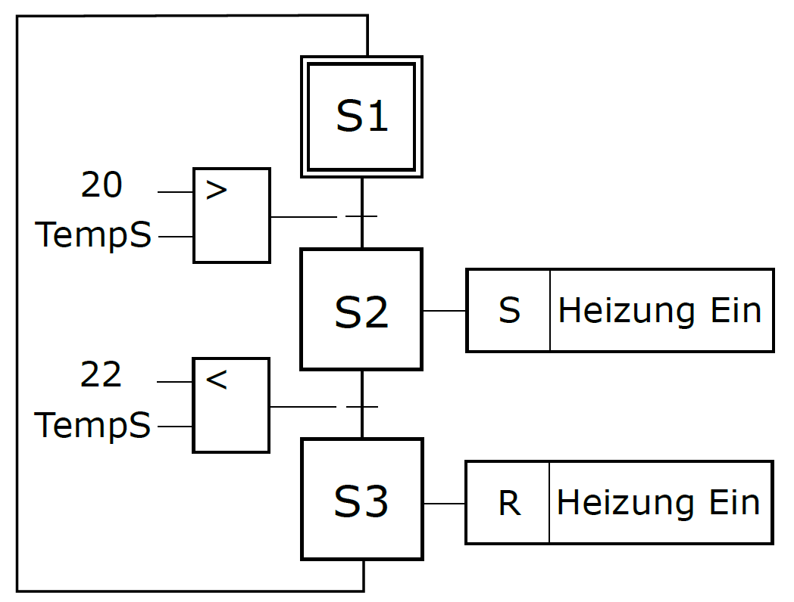

---


### Zustandsübergangsdiagramm 

- Wenn Prozessabfolgen keinen zwangsläufigen schrittweisen Ablauf mehr haben, wird die Anwendung des Ablauf-Funktionsplans schwierig.
- Eine alternative Beschreibungsmethode in solchen Fällen ist das Zustandsübergangsdiagramms.
- Ein Zustandsübergangsdiagramm beschreibt eine Zustandsmaschine (State Machine), die es ermöglicht, aus jedem Zustand in jeden anderen Zustand zu wechseln, sofern dies für den Ablauf des Prozesses erforderlich ist.
- Jeder Zustand wird als Kreis mit einer eindeutigen Nummer dargestellt.
- Die Übergänge zwischen den Zuständen werden im Diagramm durch Pfeile dargestellt, wobei aus einem Zustand mehrere Übergänge wegführen bzw. hinführen können.
- Ähnlich wie bei Ablauf-Funktionsdiagrammen können in den Zuständen und Übergängen Aktionen durchgeführt werden, bis der Zustand verlassen oder die Transition vollendet ist.

---

### Zustandsübergangsdiagramm
Beispiel einer Maschinentürsteuerung
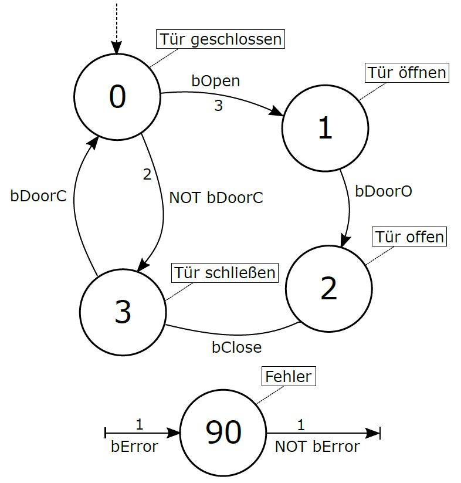

---

### TwinCAT Einführung III
- Implementierung einer Zustandsmaschine 
- CASE - Anweisung


---

<!-- header: Virtuelle Inbetriebnahme -->

## Virtuelle Inbetriebnahme XiL (X in the Loop)

- Abkürzungen MiL, SiL, HiL und AT configuration sind mit verschiedenen Phasen der virtuellen Inbetriebnahme verbunden und repräsentieren unterschiedliche Testebenen.

&emsp;&emsp; &emsp; &emsp; 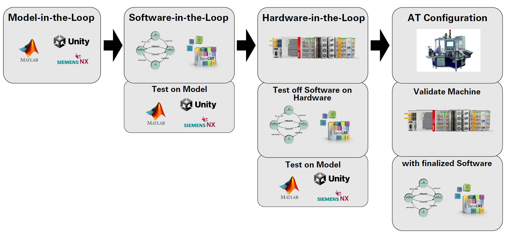

---

### MiL - Model-in-the-Loop

MiL bezieht sich auf die Testebene, bei der das Modell der Anlage entwickelt und getestet wird. Dazu wird eine vereinfachte Steuerungslogik verwendet. Auf basis dieser kann die Maschinen-steuerung entwickelt werden.

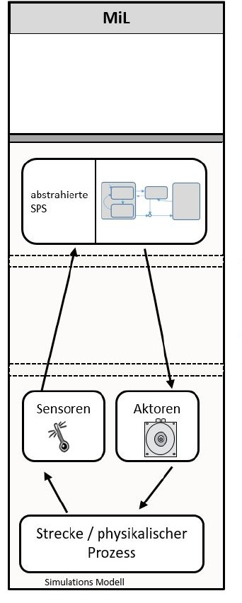

---

### SiL - Software-in-the-Loop

Im Entwicklungsschritt SiL wird die Steuerungssoftware entwickelt und anhand des Modells geteste. Somit kann die Ablauflogik und Reglerimplementierung validiert und optimiert werden. 

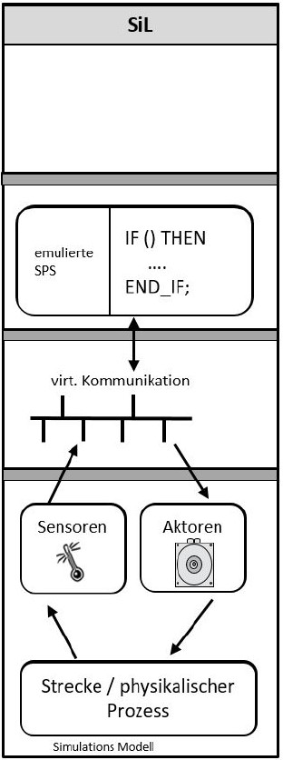

---

### HiL - Hardware-in-the-Loop

HiL bezieht sich auf die Testebene, bei der die reale Steuerungs-hardware mit der entwickelten Software getestet wird. Das Zusammenspiel zwischen Steuerungshardware und Software wird validiert sowie die Übertragung des Feldbussystems in einer realistischen Umgebung zu überprüfet. 

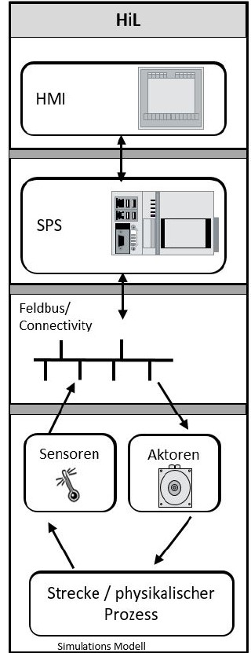

---

### AT configuration - Acceptance Test Configuration**

AT configuration bezieht sich auf die Konfiguration der Akzeptanztests. In dieser Phase wird die virtuelle Inbetriebnahme genutzt, um sicherzustellen, dass das Gesamtsystem, bestehend aus Hard- und Software sowie Sensoren und Aktoren der Maschine, die gestellten Anforderungen erfüllt. Dies ist die letzte Stufe vor der Maschinenabnahme.

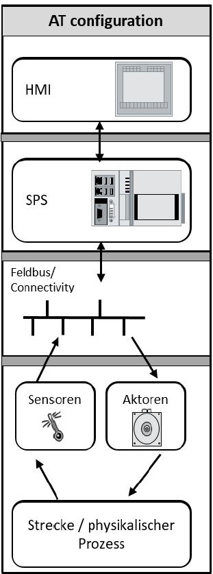


