<!-- paginate: true -->

**SoSe 2024**
Serafin Kollegger & Julian Huber

# Motorsteuerung

**TwinCAT Motion Baukasten**
**Tc2_Mc2 Motion-Bibliothek**
**Beispiel Förderband**

--- 

## Grundlagen zur Motorsteuerung

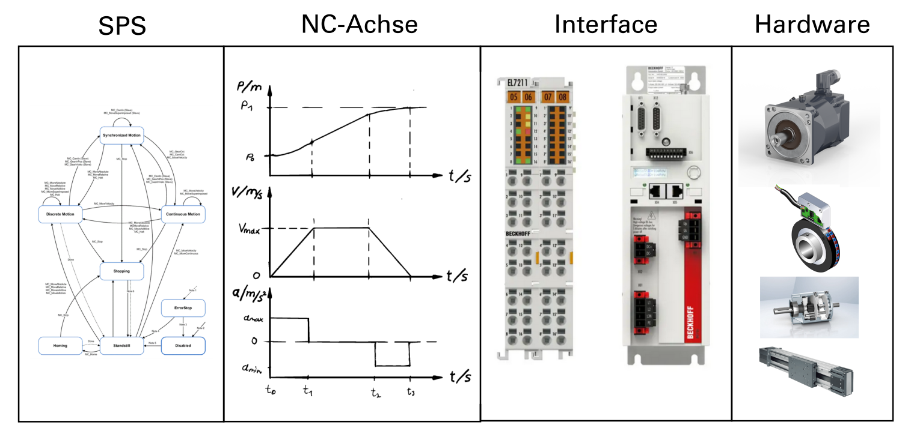

---

### Ebenenansicht der Motorsteuerung

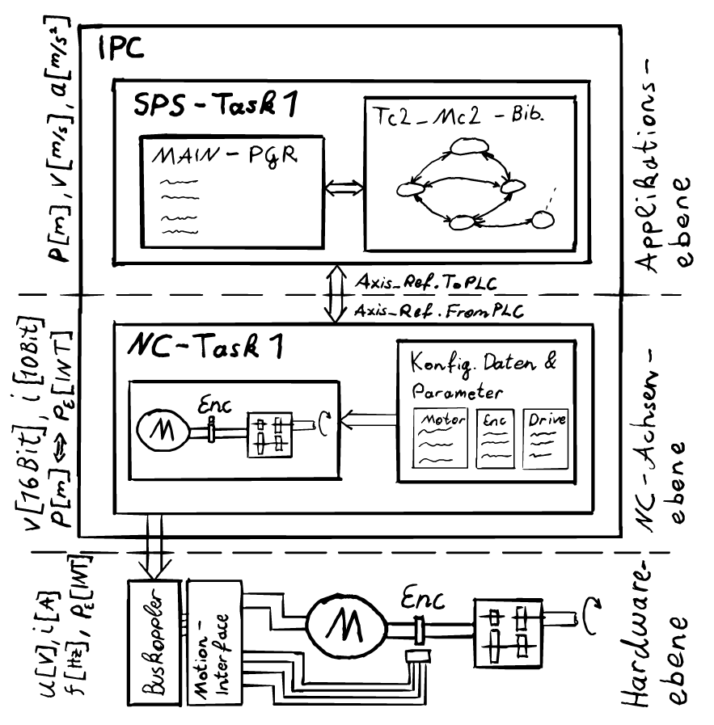

---
## TwinCAT Motion Baukasten

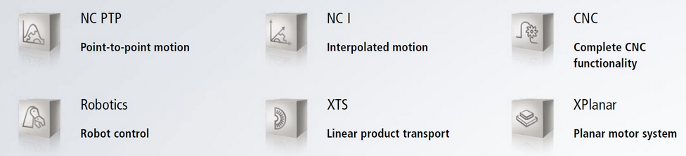

[Video Link XPlanar](https://www.youtube.com/watch?v=IYw8fy9VQ24)

---

## Applikationsebene

Die Bewegungsarten der Tc2_Mc2 sind gemäß den Spezifikationen von PLCopen-motion-control gestaltet und umfassen drei Kategorien:

- Kontinuierliche Bewegung: Diese wird durch Geschwindigkeitseingaben definiert.
- Diskrete Bewegung: Diese wird durch Positions- oder Zeitangaben definiert.
- Synchronisierte Bewegung: Diese wird durch die Bewegung der Master-Achse definiert.

Die Unterschiede zwischen diesen Kategorien liegen in ihren erforderlichen Steuereingängen. Zusätzliche Eingaben wie maximale Geschwindigkeiten, Beschleunigungen und Bewegungsrichtung ergänzen die Definition der Bewegung.

---

## Kontinuierliche Bewegung 
**MC_MoveVelocity**

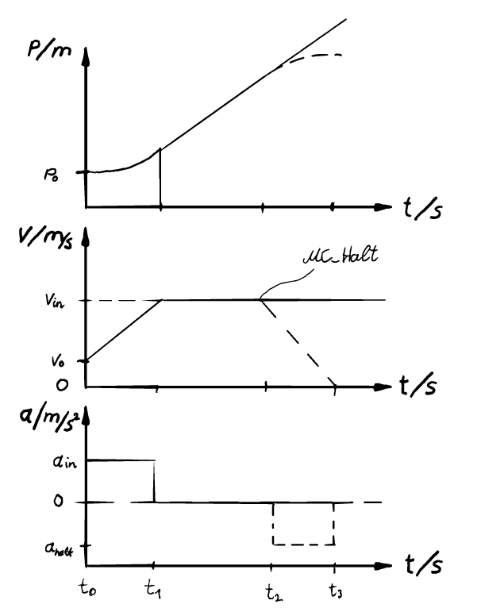

---

&emsp; &emsp; &emsp; &emsp; 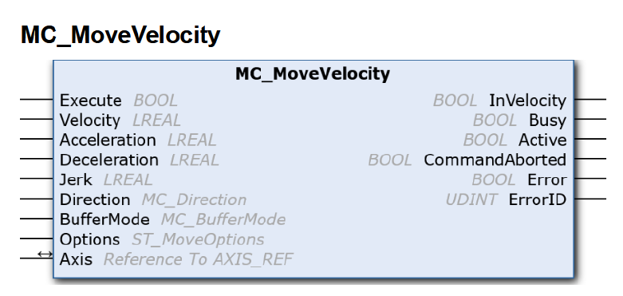

---

## Diskrete Bewegung
**MC_MoveAbsolute**

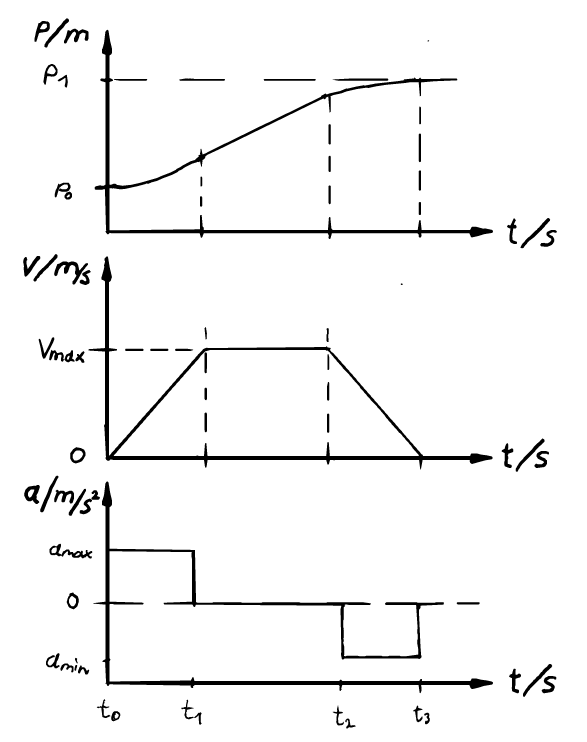

---

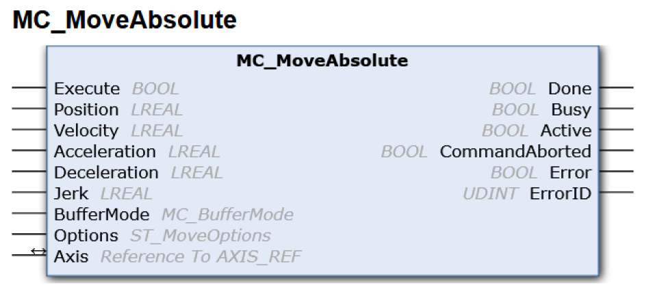

---

## Diskrete Bewegung
**MC_MoveRelative**

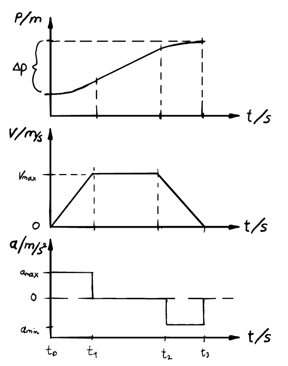

---

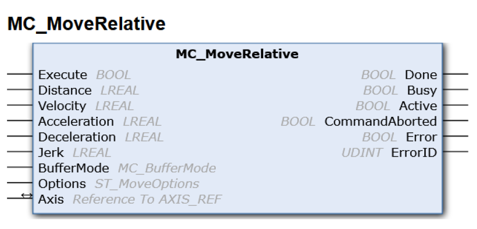

---

## Achsen Referenz (Axis_Ref)

- Der Datentyp AXIS_REF enthält Information zu einer Achse. AXIS_REF ist eine Schnittstelle zwischen der SPS und der NC und wird den MC-Funktionsbausteinen als Referenz auf eine Achse mitgegeben.
- Dieser Eingang ist keine gewöhnliche Variable, sondern eine *In_Out*-Variable.
- Dadurch werden Daten des Datentyps *Axis_Ref* empfangen und ausgegeben.
- Dies ermöglicht eine bidirektionale Kommunikation mit der NC-Achse, wie in oben stehender Abbildung des Ebenenmodells zwischen SPS-Task und NC-Task dargestellt.
- Jede Achse in der Anlage erhält eine individuelle Achsenreferenz.
Dadurch kann jede Achse eindeutig durch den Aufruf eines Bewegungsbausteins angesteuert werden

---

## Zustandsdiagramm der Tc2_Mc2

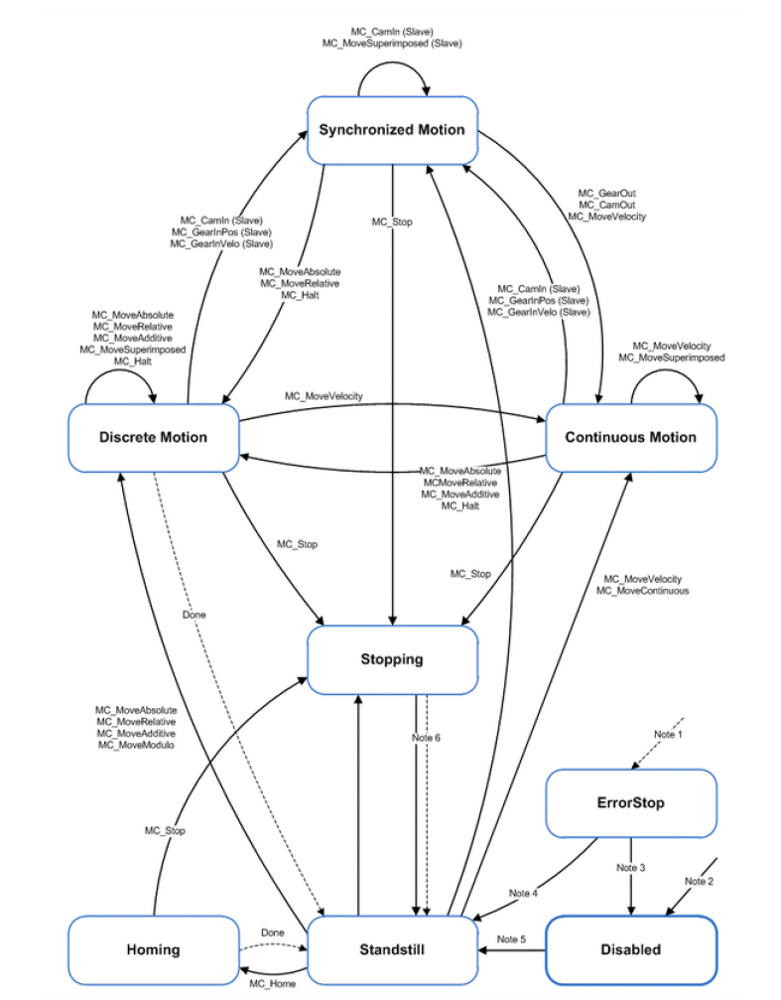

---

### Organisationsbausteine der Tc2_Mc2

**MC_Power**
**MC_Reset**

---

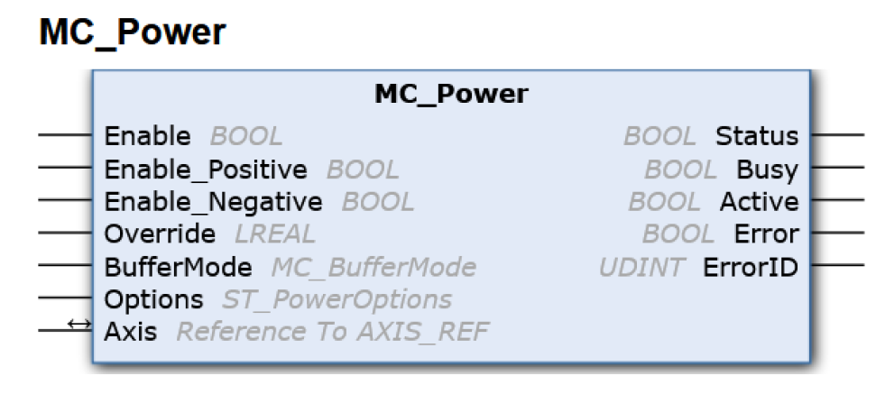

---

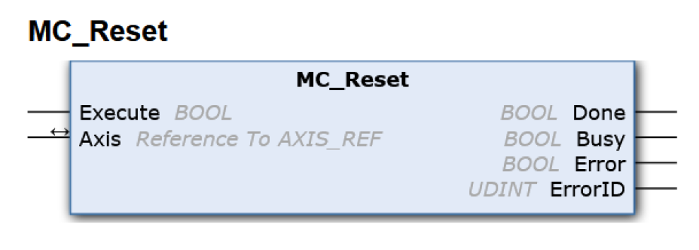

---

## NC-Achsenebene

---

## Achsen Konfiguration

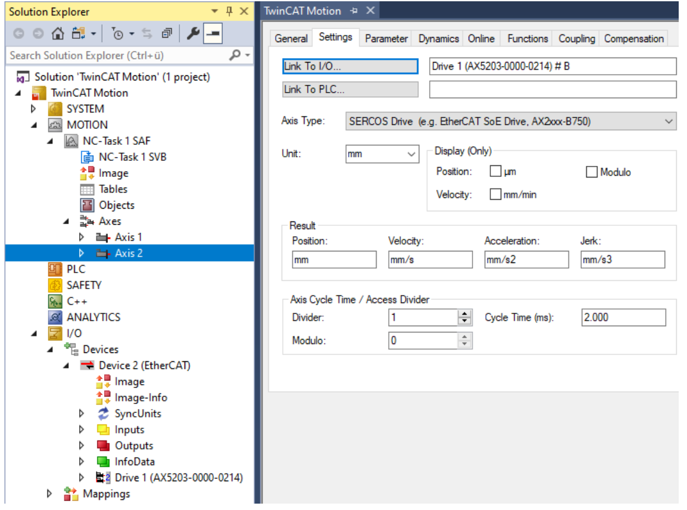

---

### Parameter der Achse

 - Bezugsgeschwindigkeit
 - Max. Geschwindigkeit, Beschleunigung, Verzögerung
 - Normal Beschleunigung, Verzögerung, Ruck
 - Manuele Beweungsparameter und Homing (Referenzfahrten)
 - Endlagenüberwachung Software
 - Überwachungsparameter (Schleppabstand, Positionsbereichsüberwachung)
 - Weitereparameter wie Eilgang oder Sollwert Generator u.v.m. 

---

## Encoder Konfiguration

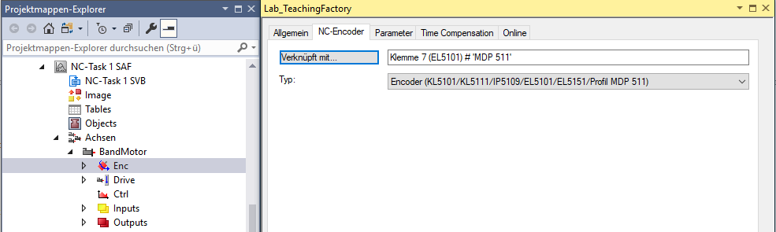

---

### Parameter des Encoders

 - Geberrichtung
 - Skalierfaktoren und Modulofaktor
 - Filter
 - Referenzfahrtparameter (Endschalter, MC_Home, usw.)
 - Encodermode (Pos, PosVel, PosVelAcc)

---
## Reglerimplementierung

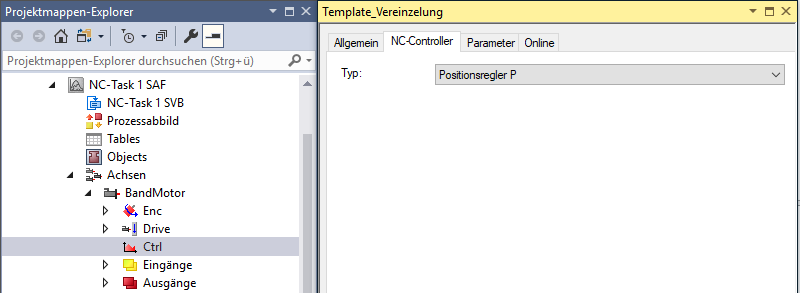

---

### Reglerparameter

- Reglertyp 
- Reglerspezifische Paramter

---

### Online-Betrieb (Jogging Mode)

SPS-Pausiert oder Achsenreferenz nicht vergeben!

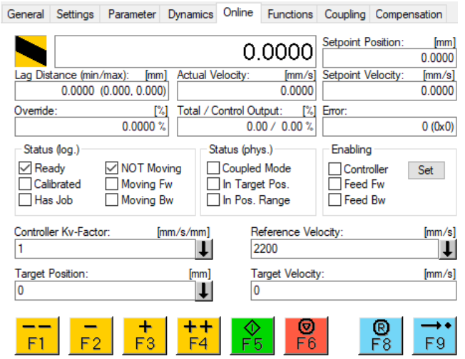

---
## Hardware Interface Ebene

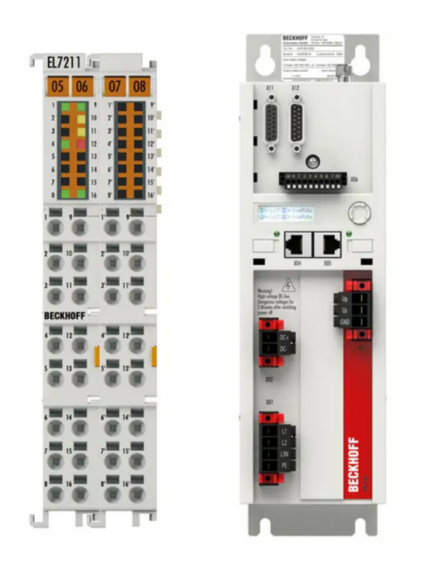

---

### Hardware Interface Parameter (CoE-Parameter)

- Wiklungswiderstände
- Wiklungsinduktivitäten
- Fullsteps (Schrittmotor)
- Nennspannung und -strom
- Tunningbefehle (automatisierte Systemidentifikation)
- Encoderparameter
- u.v.m. 

---

## Hardware (Motoren und Encoder)

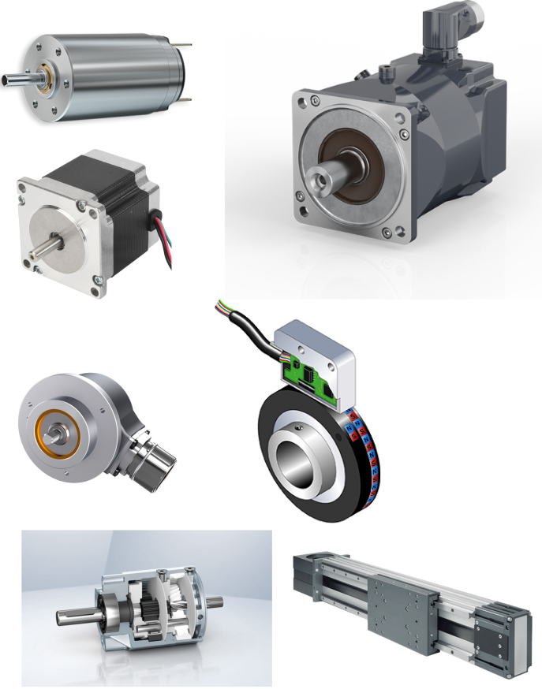

---

### Inkremetalencoder

---

### Absolute Encoder

---

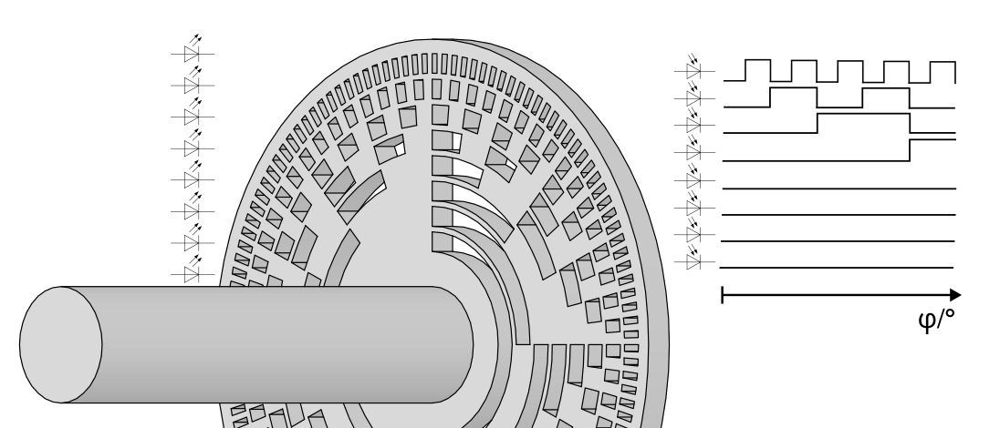

---

### Multiturn Encoder (Hall Effekt)

https://www.youtube.com/watch?v=wpAA3qeOYiI
https://www.youtube.com/watch?v=jkXsqwXNVlw

