<!-- paginate: true -->
<!-- header: Entwicklung von Steuerungsprogrammen -->

**SoSe 2024**
Serafin Kollegger & Julian Huber

# Automatisierungstechnik
**Steuerungsprogramme**
**Hierarchischer Ansatz von Graphengruppen**

---

# Entwicklung von Steuerungsprogrammen 

- Funktionseinheiten können definiert werden, um die Komplexität von Zustandsgraphen zu reduzieren.
- Sie repräsentieren das Verhalten einzelner Komponenten.
- Übergeordnete Funktionsgruppen steuern diese Einheiten.
- Eine sorgfältige Auswahl der Komponenten ist entscheidend.
- Eine hierarchische Struktur kann für eine zweckmäßige Verknüpfung der Funktionseinheiten genutzt werden.

---

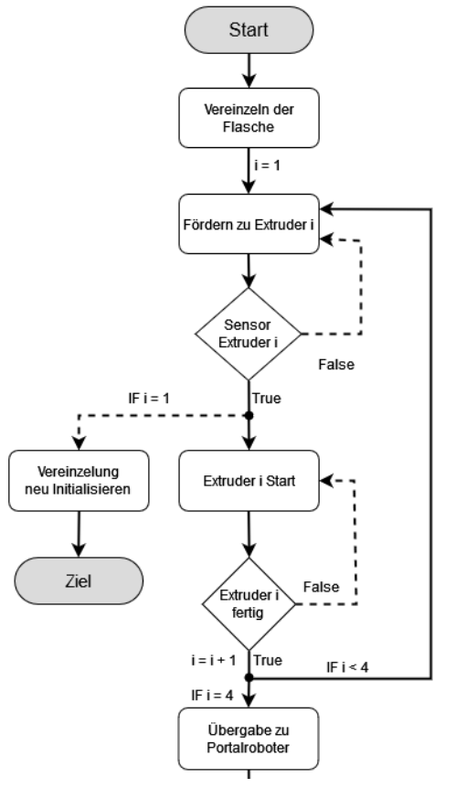

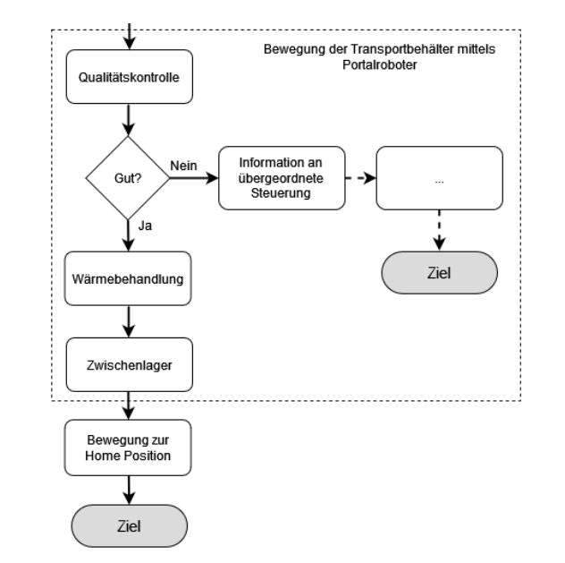

---

## Hierarchischer Ansatz

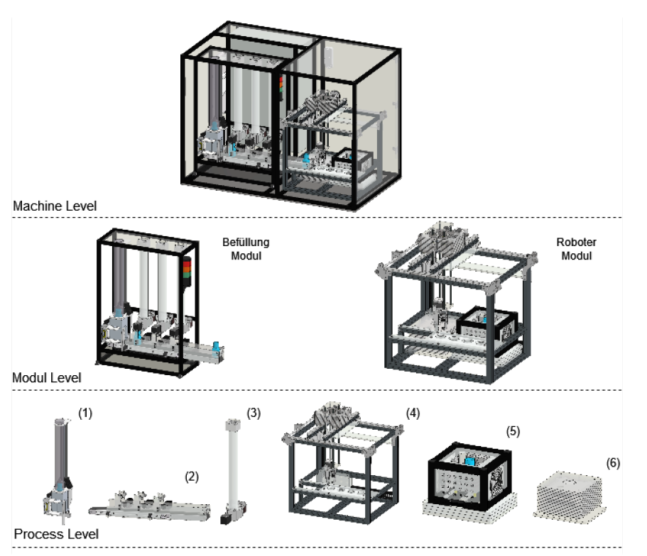

---

## Hierarchischer Ansatz

- Definition von drei Hauptebenen für den hierarchischen Ansatz
- Oberste Ebene: Maschinen-/Anlagen-Ebene (Machine Level)
- Darunter: Modul-Ebene (Modul Level)
- Unterste Ebene: Prozess-Ebene (Process Level)
- Funktionseinheiten werden auf der Prozess-Ebene gesteuert
- Anpassung der Programmstruktur an den mechanischen Aufbau

---

### Erweiterungen des Ebenenansatzes

**Submodule**

- Einführung zusätzlicher Submodul-Ebenen für komplexe Anlagen
- Die Modul-Ebene besteht aus Submodulen anstelle von Funktionseinheiten
- Submodule sind wiederum aus Funktionseinheiten zusammengefasst

**Hardware Ebene**
- Ziel: Herstellung eines hardwareunabhängigen Steuerungscodes
- Steuersignale in der Prozessebene werden allgemein und abstrahiert gehalten
- Die tatsächlich angeschlossene Hardware wird durch eigene Funktionsbausteine gesteuert
- Dadurch kann ein Großteil des Programmieraufwands bereits erledigt werden, bevor die Anlagenentwicklung abgeschlossen ist
- Flexibilität, da sich Sensoren und Aktoren noch ändern können, ohne den Programmieraufwand zu erhöhen

---

## Graphengruppen

Pseudobeispiel in TwinCAT...

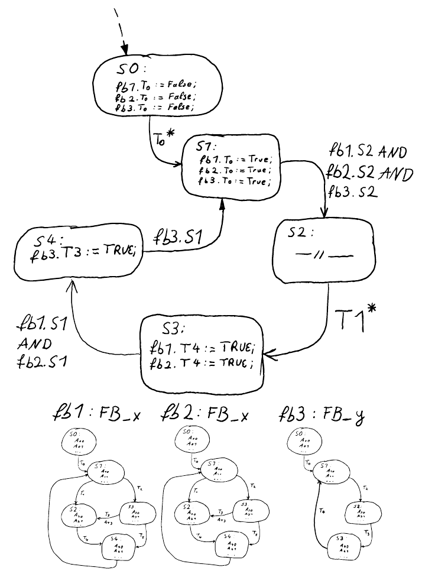

---

## Graphengruppen

Drei Grundgedanken sollten dabei Hilfe bieten, um eine Graphengruppe zu erstellen.
- Globale Initialisierung
- Sequentielle Startsignale
- Signalaustausch der Funktionseinheiten

---
### Globale Initialisierung

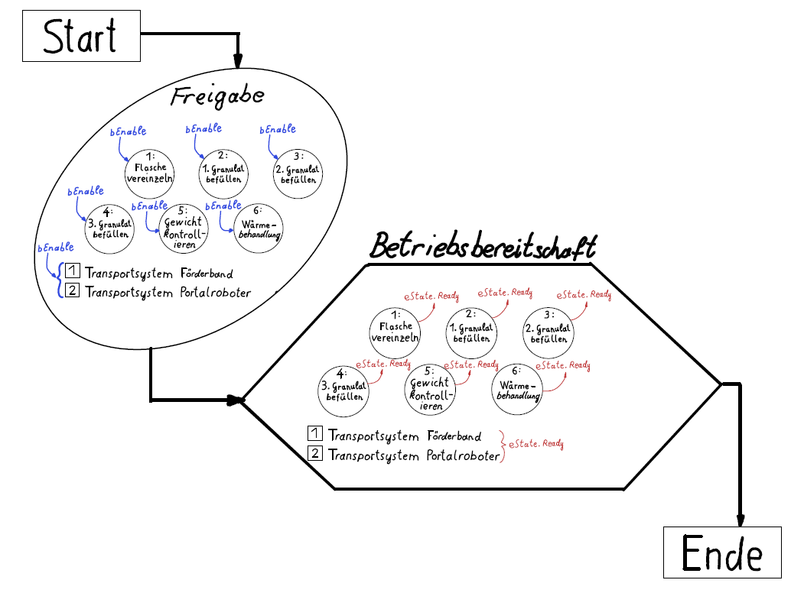

---
### Sequentielle Startsignale

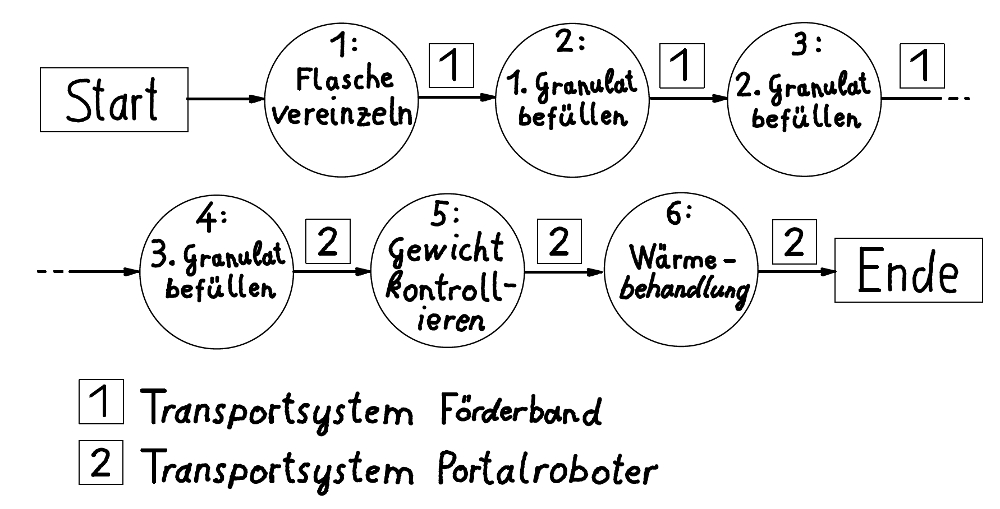

---
### Signalaustausch der Funktionseinheiten

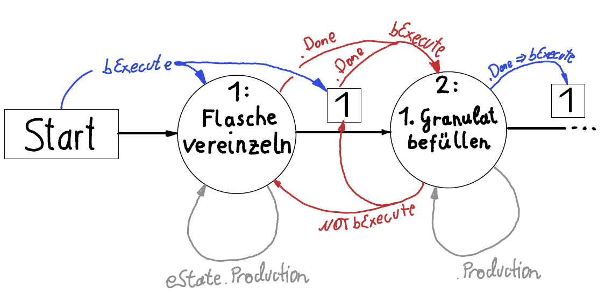

---

## Programmstruktur abhängig von Funktionseinheiten

**Variante 1**
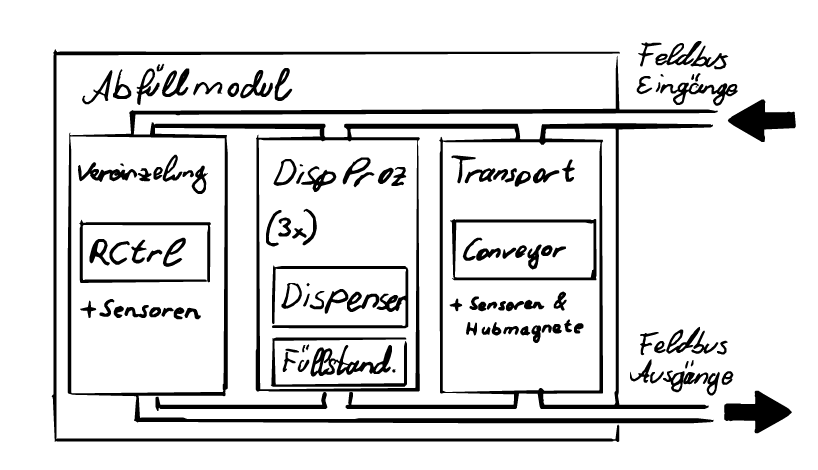

---

**Variante 2**
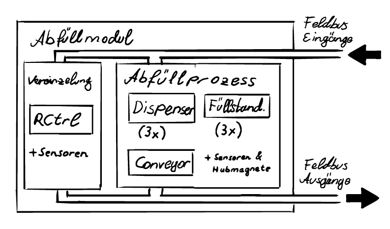

---

**Variante 3**
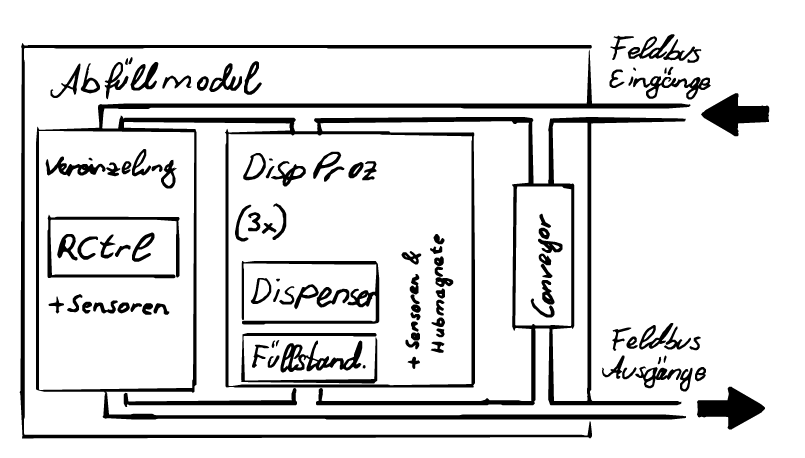

---
## Basisaufgaben 

---

### Beschreibung Transporteinheit

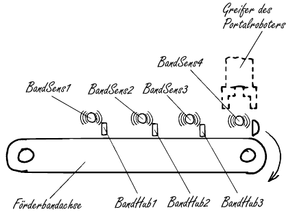

---

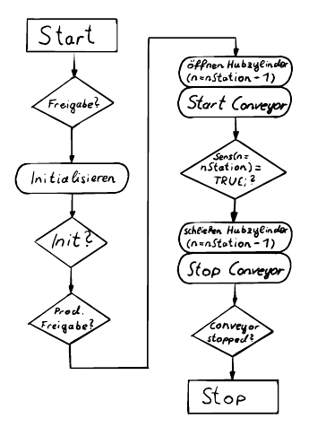

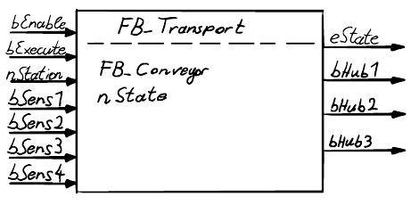

---

### Abfüllmodul 

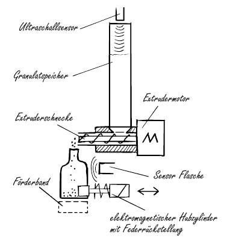

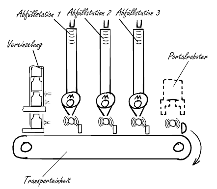

---

### Manipulatoreinheit 

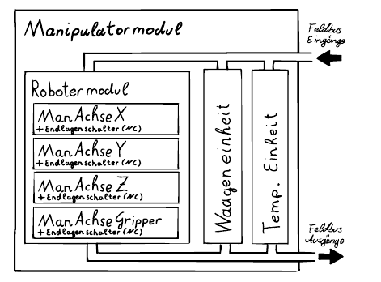

---

#### Ablaufdiagramm Robotermodul

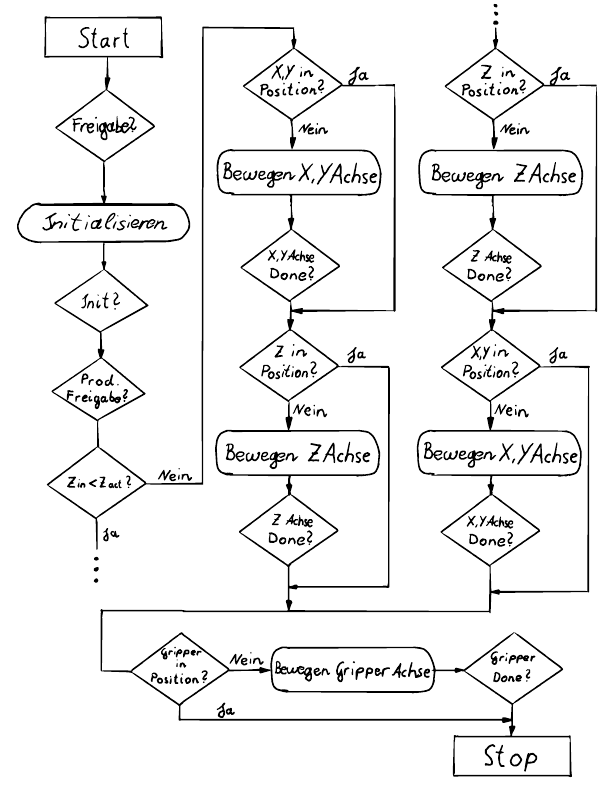