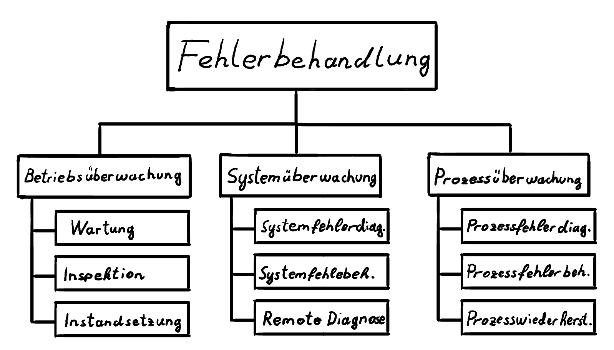
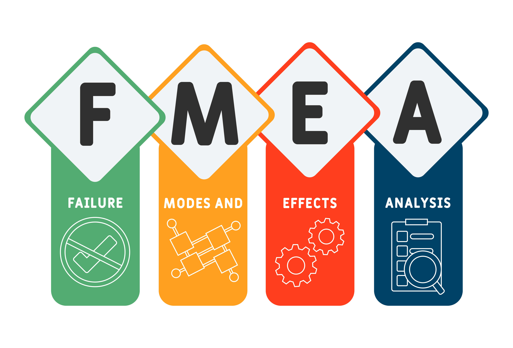
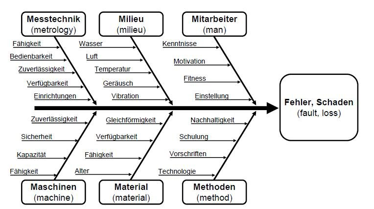
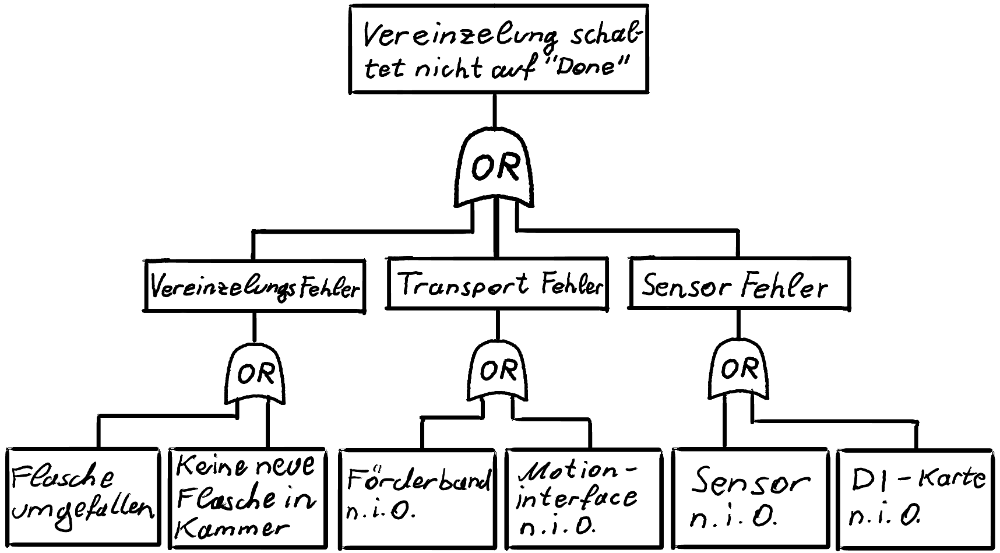
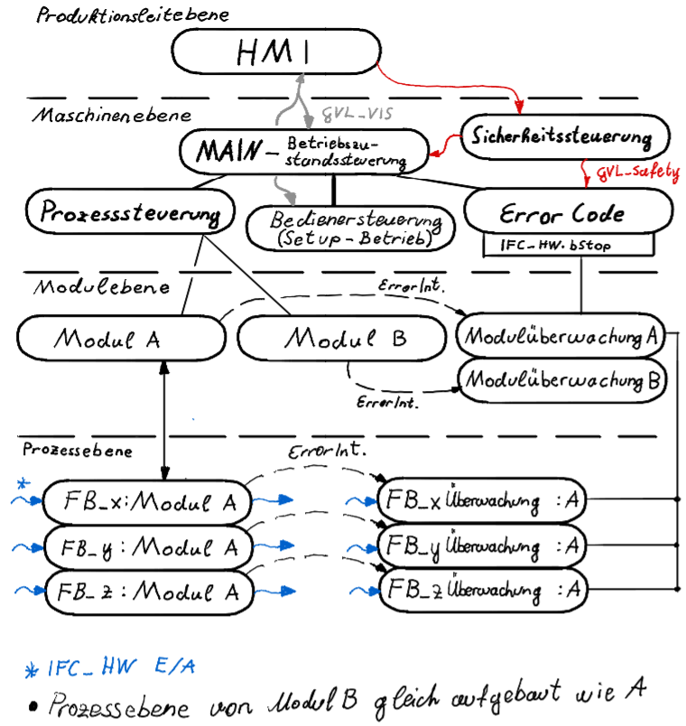
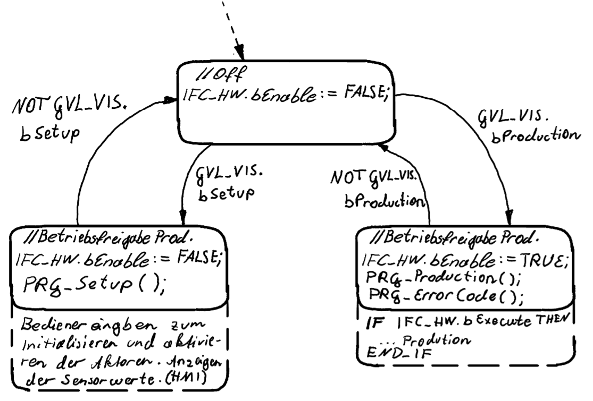
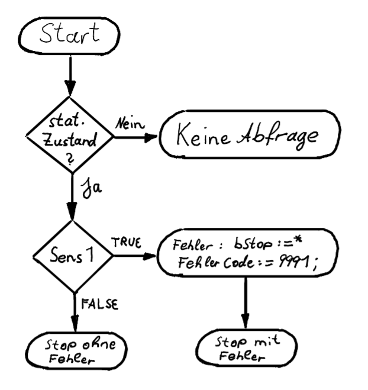
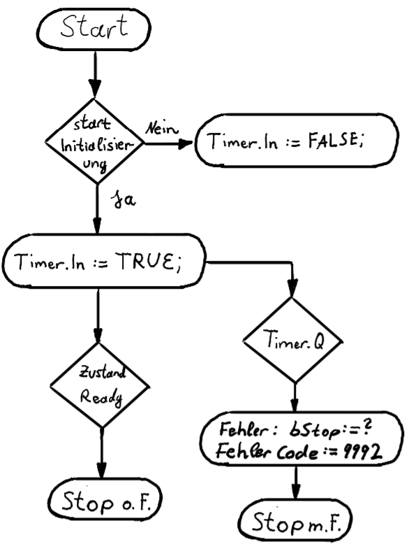
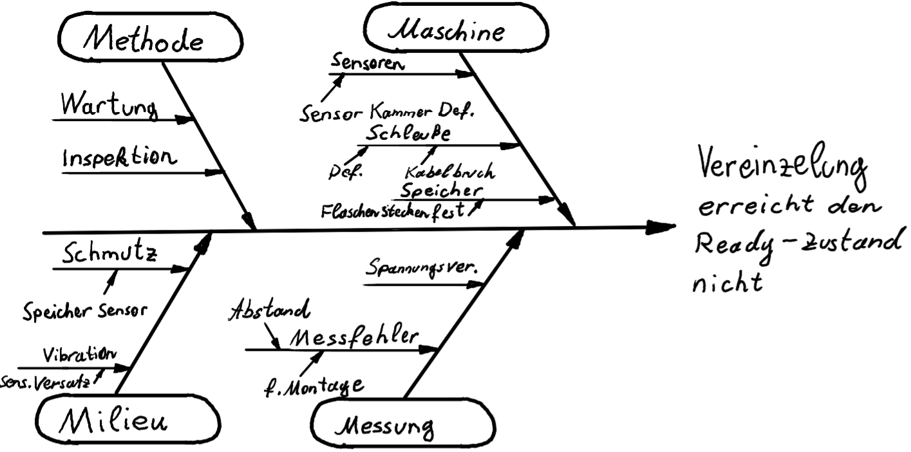
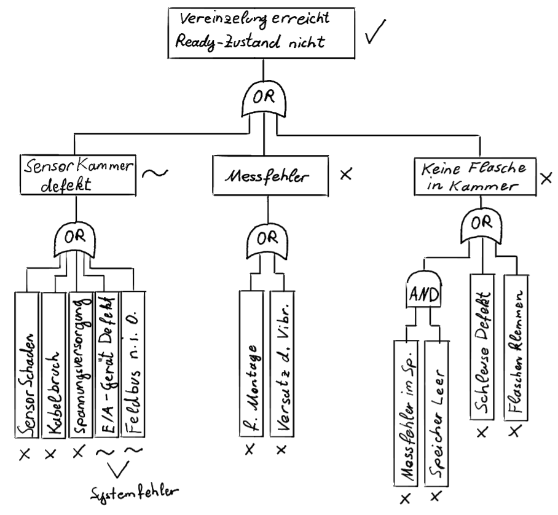

<!-- paginate: true -->

**SoSe 2025**
Serafin Kollegger & Julian Huber

# Automatisierungstechnik
**Fehlerbehandlung Allgemein**
**Fehlertypen**
**Fehleranalyse**
**Fehlerdetektionsbausteine**


---

# Fehlerbehandlung

---

## Kategorisierung der Fehler




---

### Betriebsüberwachung

- Betriebsdauer 
- Wartungsplanung
- Instandsetzung und Komponenten Historie 

---

### Systemüberwachung 

- Komponentenlaufzeiten
- Fehleranalyse von Sensoren und Aktoren
- Systemfehler der Steuerung

---

### Prozessüberwachung

- Prozessfehler identifikation
- Anlage gezielt in stillstand setzen
- Produktionswiederherstellungsmaßnahmen

---

# Fehleranalyse

**FMEA - Failure Mode and Effect Analysis**
**Fehler Ursachen-Wirkungs-Diagramm**
**FTA - Fault Tree Analysis**

---

## FMEA

Die Anwendung einer FMEA (Fehlermöglichkeits- und -einflussanalyse) erfolgt in mehreren Schritten und dient dazu, potenzielle Fehler in einem Prozess oder System zu identifizieren, deren Auswirkungen zu bewerten und Maßnahmen zur Fehlervermeidung oder -minimierung zu entwickeln. Hier ist eine Zusammenfassung der wichtigsten Schritte:



---


1. **System- oder Prozessanalyse:**
   - Identifizierung des zu analysierenden Systems oder Prozesses.
   - Aufteilen in kleinere, handhabbare Teile oder Komponenten.

2. **Fehleridentifikation:**
   - Ermitteln potenzieller Fehlerquellen für jede Komponente oder jeden Prozessschritt.
   - Beschreibung der Fehlerarten, z.B. Ausfall, Fehlfunktion, Abweichung von Spezifikationen.

3. **Bewertung der Fehlerfolgen:**
   - Analyse der möglichen Auswirkungen jedes identifizierten Fehlers auf das Gesamtsystem oder den Prozess.
   - Einstufung der Schwere der Auswirkungen (z.B. auf einer Skala von 1 bis 10).


4. **Ursachenanalyse:**
   - Bestimmung der möglichen Ursachen für jeden Fehler.
   - Bewertung der Wahrscheinlichkeit des Auftretens der Ursachen (z.B. auf einer Skala von 1 bis 10).

---

5. **Entdeckung und Prävention:**
   - Analyse, wie gut der Fehler durch aktuelle Maßnahmen oder Kontrollen entdeckt werden kann.
   - Bewertung der Wahrscheinlichkeit, dass der Fehler entdeckt wird, bevor er den Endnutzer erreicht (z.B. auf einer Skala von 1 bis 10).

6. **Risikobewertung:**
   - Berechnung des Risikoprioritätszahl (RPZ) durch Multiplikation der Bewertungen für Schwere (S), Auftretenswahrscheinlichkeit (O) und Entdeckungswahrscheinlichkeit (D).
   - RPZ = S × O × D

7. **Maßnahmenplanung:**
   - Identifizierung und Implementierung von Maßnahmen zur Reduktion von Risiken mit hohen RPZ-Werten.
   - Maßnahmen können technische Änderungen, Prozessverbesserungen, zusätzliche Tests oder Kontrollen umfassen.

---

8. **Überprüfung und Nachverfolgung:**
   - Überwachung der Wirksamkeit der umgesetzten Maßnahmen.
   - Regelmäßige Überprüfung und Aktualisierung der FMEA, um sicherzustellen, dass sie relevant bleibt und neue potenzielle Fehler identifiziert werden.

Durch die Anwendung der FMEA können Unternehmen proaktiv Risiken managen, die Qualität ihrer Produkte oder Prozesse verbessern und letztendlich Ausfälle und Kosten minimieren.

---

## Fehler Ursache-Wirkungs-Diagramm



---

### Fehler Ursachen-Wirkungs-Diagramm

Ermöglicht es die Ursachen zu identifizieren die eine Fehlerauswirkung erzeugen. Hilfreich in der Entwicklung, um gezielt fehlerponteniale einzudämen und während des Betriebs, um schnelle Ursachenerhebungen zu erhalten damit der Fehler ausgebessert werden kann. Speziell wenn menschliches Fehlverhalten die Ursache des Fehlers ist. 

---

## FTA 



---

### FTA - Failure Tree Analysis

Fehlerzusammenhänge können hier genauer betrachtet werden. Fehlerketten erleichtern die Suche von Fehlerursachen und erhöhen das Verständnis, wie mehrer Fehler in Subsystemen zu einem Fehler im gesamt System führen. 

---

# Fehleridentifikation im SPS-Programm

---

## Separation des Steuercodes von Fehlercodes



---

## Maschineneben

- Koordiniert die Betriebszustände durch Bedienereingaben.
- Stellt den Gesamtanlagenzustand dar.
- Fungiert als Zentraler Steuerungsknoten zwischen den unterschiedlichen Steuerungskomponenten. 

---

## Zustandsmaschine des MAIN-Programms 



---

## Error Code Programm

- Wird parallel zum Steuerungscode ausgeführt. 
- Beinhaltet alle Überwachungsbausteine der Module und Funktionseinheiten. 
- Löst bei bedarf das Stopsignal IFC_HW.bStop aus. 
- Managed Fehlercodes und bildet die Schnittstelle zur Fehlermeldung an HMI ab. 

---

## Factory Stop (IFC_HW.bStop) 

- Mittels der IFC_HW.bStop Variable, soll es möglich sein die Anlage in einen gezielten Stopzustand zu versetzten.
- Notwendig für Fehler mit gefährdung für Anlagen- oder Menschenschäden. 
- Auch bei Sicherheitsstops kann der Steuerungscode in den Stopzustand gesetzt werden, um einen Neuanlauf der Anlage zu ermöglichen. 
- Zwei unterschiedliche Konzepte werden für das Anhalten durch bStop benötigt. 

---

### Prozessebene, Modulebenen Stopkonzept

- In der Prozess- bzw. Modulebene ist der Stop der Anlage relativ einfach umzusetzen. 
- Ziel ist des den Zustand zu speichern, bei welchem der Stop befehl aufgerufen wurde. Dafür kann die Übergangsbedingung von Zuständen, welche nicht erreicht werden dürfen während eines Aktiven Stopsignals, mit ``` AND NOT IFC_HW.bStop``` erweitert werden.

- Somit verhart der Steuerungscode in diesem zustand bis `` IFC_HW.bStop = False `` ist und startet im richtigen zustand bei Wiederanlauf der Anlage.

---

### Hardware-Ebenen Stopkonzept

- In der Hardwareebene, vorallem bei Motorsteuerungen, kann obiges Konzept nicht eingesetzt werden. Weshalb eine alternative Stragegie notwendig wird. 
- Da die Klemmen bei Sicherheitsstops stromfrei geschalten werden ist eine neue Initialisierung notwedig. Zusätzlich müssen die Daten (Position, etc) der Achsen zu Zeitpunkt des Stops gespeichert werden. 
- Die Übergangsbedindung wird erweitert durch den Übergang in den Zustand ```` 800: // Stop```` durch z.B.

```` 
    IF mcRelative.done THEN
        nState := nState + 1;
    ELSIF IFC_HW.bStop then
        nState := 800; // Stop
    END_IF 
````

---

### Beispiel Neuinitialisierung Manipulator Achse
````
800 : // Stop
	eState := State.Stop;
	bAxMovAbs := FALSE;
	bAxHalt := FALSE;
	bAxReset := FALSE;
	bAxPower := FALSE;
	
	IF NOT bStop THEN
		nState := nState +1; // ReInit
	END_IF

801 : // ReInit
	eState := State.Stop;
	bAxReset := TRUE;
	
	IF fbReset.Done THEN
		nState := nState + 1 ; // RePower
	END_IF
	
802 : // Repower
	eState := State.Stop;
	bAxReset := FALSE;
	bAxPower := TRUE;
	
	IF fbPower.Status THEN
		nState := nState + 1; // Direct Homing
	END_IF
	
803 : // Direct Homing
	eState := State.Stop;
	bAxHome := TRUE;
	fbHome.HomingMode := MC_HomingMode.MC_Direct;
	fbHome.Position := fStopHome;
	
	IF fbHome.Done THEN
		nState := nStateMem; // jump back to last running State
		nStateMem := 0;
		bAxHome := FALSE;
	END_IF

````

---

### Beispiel Neuinitialisierung Dispenserachsen

````
800 : // Stop

	eState := State.Stop;
	bAxReset := FALSE;
	bAxMove  := FALSE;
	bAxPower := FALSE;
	
		IF NOT bStop THEN
		nState := nState +1; // ReInit
	END_IF

801 : // ReInit
	eState := State.Stop;
	bAxReset := TRUE;
	
	IF fbReset.Done THEN
		nState := nState + 1 ; // RePower
	END_IF
	
802 : // Repower
	eState := State.Stop;
	bAxReset := FALSE;
	bAxPower := TRUE;
	
	IF fbPower.Status THEN
		nState := nStateMem; // jump back to last running State
		nStateMem := 0;
	END_IF
````

---

## Factory Stop Reset

````

IF NOT bEnable THEN 
	nState := 0; // Not bEnable überschreibt den Stop zustand und setzt ihn auf False
END_IF

CASE nState OF
	0: // No Stop Signal
	bStop := FALSE;
	
	IF bStopsignal THEN  // kommt von IFC_HW.bStop
		nState := nState + 1;
	END_IF
	
	1: // Factory Stop
	bStop := TRUE;    // IFC_HW.bStop wird am Ausgang überschrieben
	
	IF bReset THEN // Reset Schalter am Bedienpanel
		nState := nState + 1; 
	END_IF
	
	2: // Reset Stop Signal
	bStop := TRUE;
	
	IF bRestart THEN // Start Knopf am Bedienpanel
		nState := 0;
	END_IF
END_CASE
````

---

## Error Interface

- Das Error Interface dient des Informationsaustausches zwischen den Steuerungsfunktionsblöcken und den Überwachungsfunktionsblöcken. (eState, Zähler, usw.)
- Damit auf den tatsächlichen Speicher der zu übertragenden Variable zugeriffen wird, können Pointer verwedet werden. 
- Somit kann das Error Interface als GVL von Pointervariablen ausgeführt werden. 
- ```` GVL_ErrorInt.eStateVereinzelung := ADR(fbVereinzelung.eState) ```` kann im Modul oder im FB ausgeführt werden, nur so ist die Pointervariable definiert. 
- Im Überwachungsbaustein kann nun auf die eState Variable der Vereinzelung durch ``` GVL_Error.eStateVereinzelung^ ``` zugegriffen werden. ^ ist dabei der Dereferenzierungsoperator.

---

## Überwachungsbausteine

- Eingabefehler 
- Zustandsfehler
- Ausgabefehler
- Zeitabhängigefehler

---

### Zustandsfehler 

Flasche am Kopf -> Kann nur in statischen Zuständen überprüft werden

*) bStop wird gesetzt bei schweren Fehlern.
Ist dies ein schwerer Fehler mit potentiel katastrophalen Auswirkungen?



---

### Zeitabhängigerfehler



---

<!--- # Basisaufgabe

### Fehlerdetektion FB's - 10 Punkte

- Fehleranalyse des Abfüllmoduls.
- Überwachungsbausteine für das Abfüllmodul.
- Keine Stopfunktionalität notwendig.

# Optionale Aufgabe

### Fehlerbehandlung - 20 Punkte

- Testen der Fehleridentifikation an realer Anlage
- Stopfunktionalität Integriert.
- Testen des Neuanlaufes nach Fehlerquittierung.  --->


# Beispiele Fehleranalyse



---

