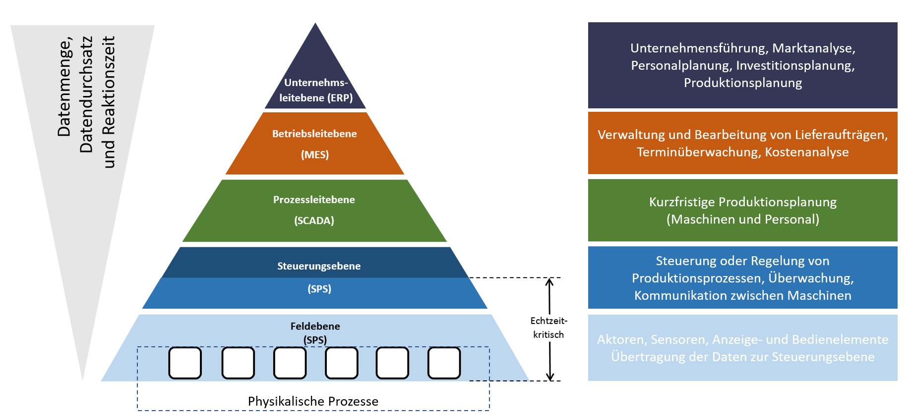
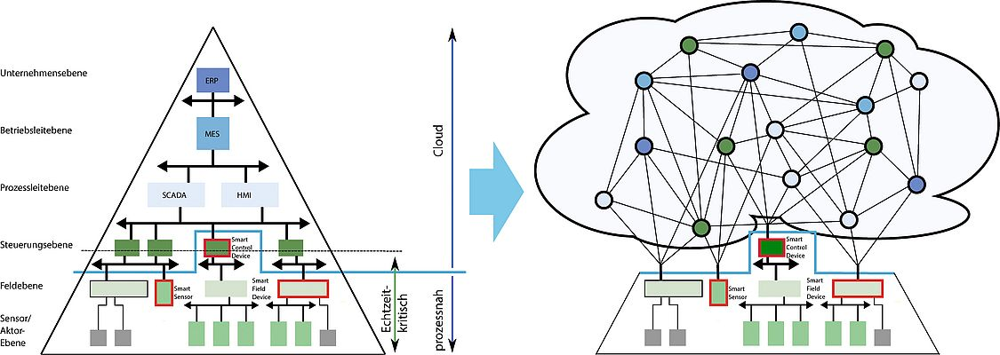

# Industrial Internet of Things – Grundlagen

## Klassische Automatisierungspyramide

Die klassische Automatisierungspyramide beschreibt die Hierarchie industrieller Steuerungssysteme:

- **Feldebene**: Sensoren und Aktoren, die über analoge Ein- und Ausgänge an die Steuerung angeschlossen sind
- **Steuerungsebene**: SPS, die die Steuerung einzelner Anlagen übernehmen
- **Prozessleitebene**: SCADA-Systeme (Supervisory Control and Data Acquisition), die mehrere Anlagen überwachen
- **Betriebsleitebene**: MES (Manufacturing Execution Systems), die den gesamten Produktionsprozess steuern
- **Unternehmensebene**: ERP-Systeme (Enterprise Resource Planning, z.B. SAP) für die unternehmensweite Planung — Finanzen, Einkauf, Logistik; keine Echtzeitanforderungen

Die Datenmenge nimmt von unten nach oben ab — nur die **relevantesten** Daten werden weitergegeben. Zugriff und Steuerungsverantwortung sind klar definiert.

Im IIoT wird diese strenge Hierarchie aufgebrochen: Geräte kommunizieren direkt miteinander und mit der Cloud — über ein vermaschtes Netzwerk statt einer Pyramide.

*Quelle: [ien-dach.de](https://www.ien-dach.de/artikel/netzwerke-der-zukunft-ot-security-im-kontext-von-industrie-40/)*

---

## Fragestellungen im IIoT

- **Intelligence in der Produktion**: Wie wird aus den Daten ein Mehrwert generiert?
- **Security und Safety**: Wie wird die Sicherheit und Verfügbarkeit der Systeme gewährleistet?
- **Architektur**: Wie werden die zusätzlichen Daten übertragen und gesammelt?

---

## Intelligence in der Produktion

### Effizienzsteigerung durch Automatisierung

<iframe width="560" height="315" src="https://www.youtube.com/embed/6LmJmnT4D3c?si=yP5kpU1BGGYhFE7i" title="YouTube video player" frameborder="0" allow="accelerometer; autoplay; clipboard-write; encrypted-media; gyroscope; picture-in-picture; web-share" referrerpolicy="strict-origin-when-cross-origin" allowfullscreen></iframe>

### Steigerung der Verfügbarkeit

<iframe width="560" height="315" src="https://www.youtube.com/embed/5ChEy3lIqMQ?si=85b5VqTbfMhnOBeh" title="YouTube video player" frameborder="0" allow="accelerometer; autoplay; clipboard-write; encrypted-media; gyroscope; picture-in-picture; web-share" referrerpolicy="strict-origin-when-cross-origin" allowfullscreen></iframe>

### Flexibilisierung der Produktion

<iframe width="560" height="315" src="https://www.youtube.com/embed/IGlUyDVtT4A?si=XxxCs5NLrlED2IkF" title="YouTube video player" frameborder="0" allow="accelerometer; autoplay; clipboard-write; encrypted-media; gyroscope; picture-in-picture; web-share" referrerpolicy="strict-origin-when-cross-origin" allowfullscreen></iframe>

---

## Anwendungsfälle

- Daten von außerhalb der Automatisierungstechnik müssen integriert werden (z.B. Bilderkennung)
- Daten, die bisher nur innerhalb der AT genutzt wurden, müssen auch außerhalb nutzbar sein (z.B. Schwingungsdaten)
- Daten von verschiedenen Anlagen müssen zusammengeführt werden (z.B. Planungsdaten und Produktionsdaten)

### Praxisbeispiele aus der Industrie

- **Energieeffizienz:** Produktionsparameter (z.B. Heiztemperatur) in Echtzeit überwachen und optimieren → weniger Energieverbrauch bei gleicher Qualität
- **Predictive Maintenance:** Schleppkette kontinuierlich überwachen — Qualität der Datenübertragung in Kabeln sinkt → Ausfall vorhergesagt bevor er eintritt
- **Zustandsüberwachung Motor:** Motor zieht plötzlich mehr Strom als früher → Lager verschlissen? Intervention bevor Stillstand
- **Bottleneck-Erkennung:** Durchlaufzeiten in der Produktion messen → wo verliert der Prozess Zeit?
- **Retrofitting:** Ältere Maschinen ohne native IIoT-Unterstützung nachträglich mit smarter Sensorik ausstatten
- **Digital Twin:** Digitales Abbild der Anlage als Ziel — Optimierung und Simulation auf Basis realer Sensordaten

---

## Kommunikationsarchitektur

### OSI-Schichtenmodell

Die Entscheidung für ein geeignetes Protokoll hängt von den Anforderungen ab. In IIoT-Anwendungen werden typischerweise Protokolle auf dem **TCP/IP-Stack** eingesetzt:

- Standard für das Internet, weite Verbreitung
- Unterstützung für kabelgebundene und drahtlose Kommunikation
- Echtzeitfähigkeit in der Regel nicht erforderlich

### Warum flexible Protokolle?

Consumer-Produkte erfordern hohe Standardisierung (Plug & Play). Industrielle Anwendungen hingegen erfordern mehr **Flexibilität und Anpassungsfähigkeit** bei den Datenmodellen.

Daraus folgt: Wir benötigen Protokolle, die

- eine hohe Flexibilität bei den Datenmodellen bieten,
- auf dem TCP/IP-Stack aufbauen.

### MQTT vs. REST

| Eigenschaft | MQTT | REST (HTTP) |
|-------------|------|-------------|
| Kommunikation | Sternförmig (über Broker) | Peer-to-Peer |
| Muster | Publish-Subscribe | Client-Server |
| Eignung | Sensordaten, Echtzeit, IoT | APIs, Webservices |
| Overhead | Sehr gering | Mittel |

**Für den IIoT-Kurs verwenden wir MQTT** — details auf der nächsten Seite.

---

## Die Learning Factory

Die Learning Factory ist unsere Lernanlage. Sie simuliert einen realen Produktionsprozess mit:

- Drei Dispensern (rot, blau, grün) zum Befüllen von Flaschen
- Ultraschallsensoren zur Füllstandsmessung
- Einem Förderband
- Vibrationssensoren zur Erkennung defekter Flaschen
- Einem Wiegesensor für das Endgewicht
