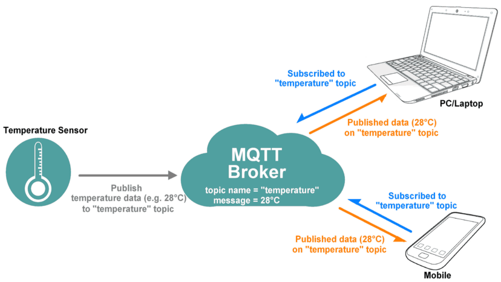
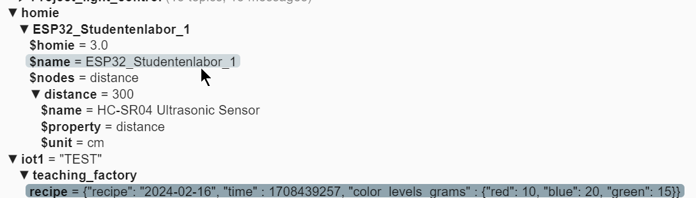
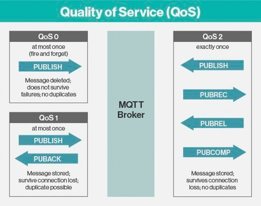
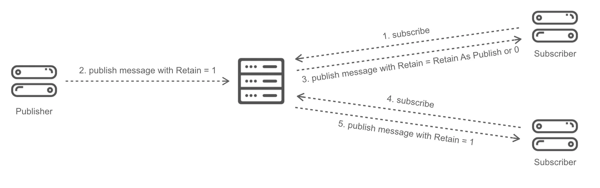

# MQTT

## Was ist MQTT?

**MQTT (Message Queuing Telemetry Transport)** ist ein offenes Netzwerkprotokoll für Machine-to-Machine-Kommunikation:

- Leichtgewichtig, häufig für IoT-Sensoren eingesetzt
- Daten werden als Nachrichten übertragen (beliebige Bitfolgen)
- Nachrichten werden in **Topics** veröffentlicht und abonniert
- Viele Alternativen existieren (Apache Kafka, etc.) — MQTT ist aber der IIoT-Standard

---

## Message Broker

Der **Broker** ist eine zentrale Instanz (Server), die Nachrichten verteilt:

- Identifiziert durch IP-Adresse und Port
- Sicherheitseinstellungen: Username/Passwort, TLS-Verschlüsselung
- Bildet Message-Queues für Topics
- Mehrere Clients können sich verbinden



### Hosting von MQTT-Brokern

- **Fremd-gehostet in der Cloud**: z.B. [HiveMQ](https://console.hivemq.cloud/)
- **Selbst gehostet**: z.B. mit [Mosquitto](https://mosquitto.org/) — auch lokal auf einer Soft-SPS möglich

### Kurs-Broker

**Broker:** `158.180.44.197:1883`  
**User:** `bobm`  
**Passwort:** `letmein`

---

## Topics und Payload



- `topic`: thematische Zuordnung — Struktur ähnlich einem Dateisystem, Hierarchie-Ebenen mit `/` getrennt
- `payload`: Inhalt der Nachricht — beliebige Bitfolgen, z.B. UTF-codierte Texte im JSON-Format

**Beispiel-Topics im Kurs:**
```
aut/SoSe26/<Gruppe>/$groupsname
aut/SoSe26/<Gruppe>/names
aut/SoSe26/<Gruppe>/Fuellstand_rot
aut/SoSe26/<Gruppe>/Fuellstand_rot/$unit
```

---

## Producer (Publisher)

- Definieren Verbindung zu einem Broker über URL
- Veröffentlichen (**publishen**) Nachrichten zu einem oder mehreren Topics
- **Push-Prinzip**: Producer legen selbst fest, wann sie eine Nachricht veröffentlichen

**Beispiel `paho-mqtt 2.x` in Python:**

```python
import paho.mqtt.client as mqtt

broker = "158.180.44.197"
port = 1883
topic = "aut/SoSe26/test/temperatur"
payload = "23.5"

def on_publish(client, userdata, flags, reasonCode, properties):
    print("Nachricht gesendet")

mqttc = mqtt.Client(mqtt.CallbackAPIVersion.VERSION2)
mqttc.username_pw_set("bobm", "letmein")
mqttc.on_publish = on_publish
mqttc.connect(broker, port)

mqttc.publish(topic, payload)
mqttc.disconnect()
```

---

## Consumer (Subscriber)

- Definieren Verbindung zu einem Broker über URL
- Empfangen alle Nachrichten zu den von ihnen abonnierten Topics
- Laufen i.d.R. in einem endlosen Loop, um Nachrichten zu empfangen
- Grundsätzlich werden nur Nachrichten empfangen, die **während der Laufzeit** gesendet werden (Ausnahme: Retain-Flag)

**Beispiel `paho-mqtt 2.x` in Python:**

```python
import paho.mqtt.client as mqtt

broker = "158.180.44.197"
port = 1883
topic = "aut/SoSe26/#"

def on_message(client, userdata, message):
    print(f"Topic: {message.topic}")
    print(f"Payload: {message.payload.decode()}")

mqttc = mqtt.Client(mqtt.CallbackAPIVersion.VERSION2)
mqttc.username_pw_set("bobm", "letmein")
mqttc.on_message = on_message
mqttc.connect(broker, port)
mqttc.subscribe(topic, qos=0)

while True:
    mqttc.loop(0.5)
```

---

## MQTT-Wildcards

Möchte man mehrere Topics gleichzeitig abonnieren:

```
aut/SoSe26/GruppeA/Fuellstand_rot
aut/SoSe26/GruppeA/Fuellstand_blau
aut/SoSe26/GruppeB/Fuellstand_rot
aut/SoSe26/GruppeB/Fuellstand_blau
```

- **Single Level `+`** — ersetzt genau eine Ebene:
  ```
  aut/SoSe26/+/Fuellstand_rot   → alle Gruppen, nur rot
  ```
- **Multi Level `#`** — ersetzt alle nachfolgenden Ebenen:
  ```
  aut/SoSe26/#                  → alles im Semester
  aut/SoSe26/GruppeA/#          → alles von GruppeA
  ```

---

## Quality of Service (QoS)

QoS gibt an, wie viel Wert auf die Zustellung gelegt wird:

| Level | Name | Bedeutung |
|-------|------|-----------|
| QoS 0 | Fire and Forget | Keine Garantie — schnellste Option |
| QoS 1 | At least once | Mindestens einmal zugestellt (Duplikate möglich) |
| QoS 2 | Exactly once | Genau einmal — sicherste, aber auch langsamste Option |



---

## Retain Flag

- Einzelne Topics können mit dem **Retain Flag** versehen werden
- Der Broker speichert die **letzte Nachricht** dieses Topics
- Neue Subscriber bekommen sofort die gespeicherte Nachricht — auch wenn diese vor ihrer Verbindung gesendet wurde
- Zum Löschen: leere Message senden



**Anwendungsfälle im Kurs:**
- Gruppenname und Nachnamen → einmalig beim Start, Retain = TRUE
- SI-Einheiten (`$unit`) → einmalig beim Start, Retain = TRUE  
- Messwerte → periodisch alle 10s, Retain = TRUE (damit Subscriber immer aktuellen Wert sehen)
