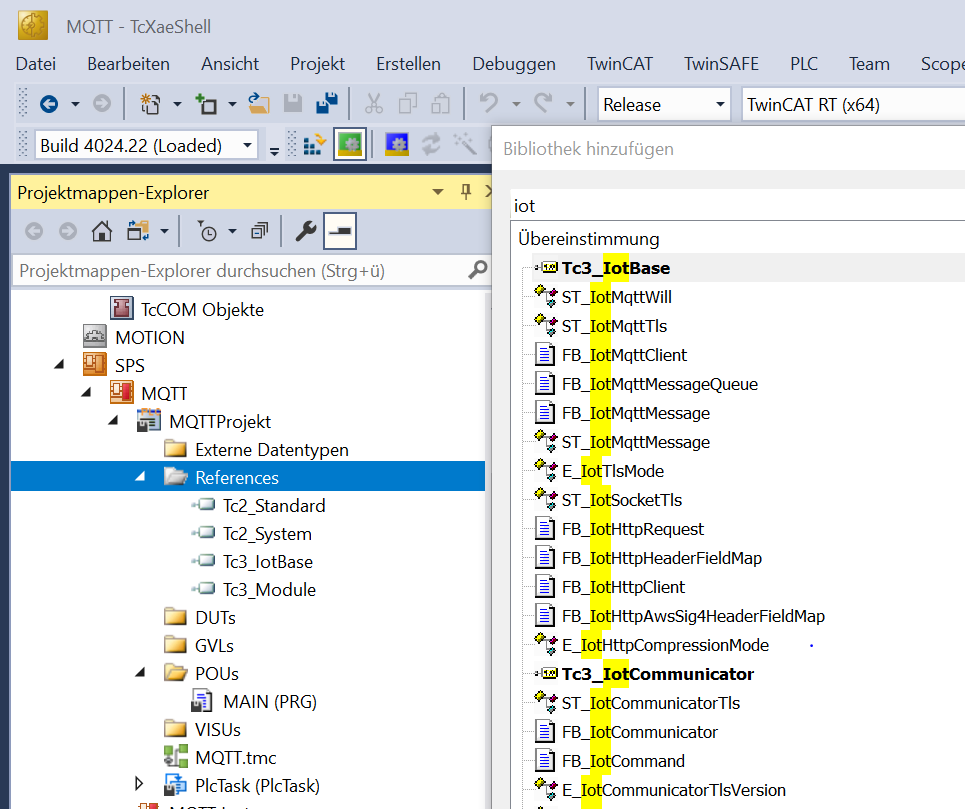

# TwinCAT MQTT-Client

## 🏆 Aufgabe 12.1.1 (20% Punkte)

Erweitert euer TwinCAT-Programm um einen MQTT-Client, der Sensordaten der Learning Factory an den Broker sendet:

- Füllstände aller Dispenser alle **10 Sekunden** übertragen
- Falls der Füllstand noch nicht implementiert ist: beliebigen anderen Wert senden
- **Alle Werte müssen retained gesendet werden**

### Topic-Schema

| Topic | Inhalt | Wann |
|-------|--------|------|
| `aut/SoSe26/<Gruppe>/$groupsname` | Name der Gruppe | einmalig beim Start |
| `aut/SoSe26/<Gruppe>/names` | Nachnamen der Mitglieder | einmalig beim Start |
| `aut/SoSe26/<Gruppe>/<Größe>` | Messwert (INT oder REAL) | alle 10s |
| `aut/SoSe26/<Gruppe>/<Größe>/$unit` | SI-Einheit als String | einmalig beim Start |

**Abgabe gilt als bestanden:** Werte kommen am Broker an und werden durch Retain gespeichert — überprüfbar mit [MQTT-Explorer](https://mqtt-explorer.com/).

---

## Schritt 1: IoT-Library einbinden

Die Library `TC3_IotBase` (TF6701) muss im TwinCAT Library Manager referenziert werden:



---

## Schritt 2: SPS als Client konfigurieren

### Variablen deklarieren

```pascal
VAR
    fbMqttClient          : FB_IotMqttClient;
    sMessageToPublish     : STRING(255);
    tmrSendMessageInterval: TON := (PT := T#10S);
    first_cycle           : BOOL := TRUE;
    bStaticPublished      : BOOL := FALSE;
END_VAR
```

### Verbindung aufbauen (erster Zyklus)

```pascal
IF first_cycle THEN
    fbMqttClient.sHostName     := '158.180.44.197';
    fbMqttClient.nHostPort     := 1883;
    fbMqttClient.sTopicPrefix  := 'aut/SoSe26/<Gruppe>/';
    fbMqttClient.sClientId     := 'Publishing PLC';
    fbMqttClient.sUserName     := 'bobm';
    fbMqttClient.sUserPassword := 'letmein';
    first_cycle := FALSE;
END_IF

fbMqttClient.Execute(bConnect := TRUE);
```

### Startwerte publizieren (Retain = TRUE, einmalig)

```pascal
// Nur einmal nach dem Verbinden senden — bStaticPublished-Flag verhindert Wiederholung
IF NOT bStaticPublished THEN
    sMessageToPublish := '<GRUPPENNAME>';
    fbMqttClient.Publish(sTopic := '$$groupsname',
                         pPayload := ADR(sMessageToPublish),
                         nPayloadSize := LEN(sMessageToPublish) + 1,
                         eQoS := TcIotMqttQos.AtMostOnceDelivery,
                         bRetain := TRUE,
                         bQueue := TRUE);

    sMessageToPublish := 'g';
    fbMqttClient.Publish(sTopic := 'Fuellstand_rot/$$unit',
                         pPayload := ADR(sMessageToPublish),
                         nPayloadSize := LEN(sMessageToPublish) + 1,
                         eQoS := TcIotMqttQos.AtMostOnceDelivery,
                         bRetain := TRUE,
                         bQueue := TRUE);
    bStaticPublished := TRUE;
END_IF
```

### Messwerte periodisch publizieren (alle 10s)

```pascal
IF fbMqttClient.bConnected THEN
    tmrSendMessageInterval(IN := TRUE);
    IF tmrSendMessageInterval.Q THEN
        tmrSendMessageInterval(IN := FALSE);

        sMessageToPublish := UINT_TO_STRING(iIn_USS1);
        fbMqttClient.Publish(sTopic := 'Fuellstand_rot', pPayload := ADR(sMessageToPublish), nPayloadSize := LEN(sMessageToPublish) + 1, eQoS := TcIotMqttQos.AtMostOnceDelivery, bRetain := TRUE, bQueue := FALSE);

        sMessageToPublish := UINT_TO_STRING(iIn_USS2);
        fbMqttClient.Publish(sTopic := 'Fuellstand_blau', pPayload := ADR(sMessageToPublish), nPayloadSize := LEN(sMessageToPublish) + 1, eQoS := TcIotMqttQos.AtMostOnceDelivery, bRetain := TRUE, bQueue := FALSE);

        sMessageToPublish := UINT_TO_STRING(iIn_USS3);
        fbMqttClient.Publish(sTopic := 'Fuellstand_gruen', pPayload := ADR(sMessageToPublish), nPayloadSize := LEN(sMessageToPublish) + 1, eQoS := TcIotMqttQos.AtMostOnceDelivery, bRetain := TRUE, bQueue := FALSE);
    END_IF
END_IF
```

---

## Hinweise zur Implementierung

- Legt einen oder mehrere neue Funktionsbausteine an (z.B. `FB_IotMqtt`)
- Mögliche Input-Variablen: `topic`, `payload`
- Überlegt, wie ihr **einmalige Nachrichten** (Gruppenname, Einheiten) von **periodischen Nachrichten** (Messwerte) trennt
- Der MQTT-Client hat ein Attribut `sTopicPrefix` für den ersten Teil des Topics — `Publish()` erhält nur den hinteren Teil als `sTopic`

---

## Bekannte Stolperfallen

**`$unit` in Structured Text:** Das `$`-Zeichen ist in TwinCAT eine Escape-Sequenz. Je nach Version muss es escaped werden:
```pascal
// statt '$unit' ggf.:
'$$unit'
```

**TwinCAT-Neustart beim ersten MQTT-Aktivieren:** Manchmal startet TwinCAT beim Aktivieren der MQTT-Verbindung neu. Strategie: zuerst Verbindung ohne Publish testen, dann schrittweise Nachrichten hinzufügen.

**Retain bei allen Werten:** Setzt Retain = TRUE für alle Topics — dann sehen auch Subscriber, die sich erst nach dem Start verbinden, sofort die aktuellen Werte.

---

## Komplette Implementierung

Fertiger Funktionsbaustein — `<GRUPPENNAME>` und `<Nachname1> <Nachname2>` ersetzen, dann in MAIN einbinden.

### Deklaration

```pascal
FUNCTION_BLOCK FB_iot
VAR_INPUT
    iUSS1 : UINT;
    iUSS2 : UINT;
    iUSS3 : UINT;
END_VAR
VAR
    fbMqttClient           : FB_IotMqttClient;
    sMessageToPublish      : STRING(255);
    tmrSendMessageInterval : TON := (PT := T#10S);
    first_cycle            : BOOL := TRUE;
    bStaticPublished       : BOOL := FALSE;
END_VAR
```

### Implementierung

```pascal
IF first_cycle THEN
    fbMqttClient.sHostName     := '158.180.44.197';
    fbMqttClient.nHostPort     := 1883;
    fbMqttClient.sTopicPrefix  := 'aut/SoSe26/<GRUPPENNAME>/';
    fbMqttClient.sClientId     := '<GRUPPENNAME>-LF';
    fbMqttClient.sUserName     := 'bobm';
    fbMqttClient.sUserPassword := 'letmein';
    first_cycle := FALSE;
END_IF

fbMqttClient.Execute(bConnect := TRUE);

IF fbMqttClient.bConnected THEN
    IF NOT bStaticPublished THEN
        sMessageToPublish := '<GRUPPENNAME>';
        fbMqttClient.Publish(sTopic := '$$groupsname', pPayload := ADR(sMessageToPublish), nPayloadSize := LEN(sMessageToPublish) + 1, eQoS := TcIotMqttQos.AtMostOnceDelivery, bRetain := TRUE, bQueue := TRUE);
        sMessageToPublish := '<Nachname1> <Nachname2>';
        fbMqttClient.Publish(sTopic := 'names', pPayload := ADR(sMessageToPublish), nPayloadSize := LEN(sMessageToPublish) + 1, eQoS := TcIotMqttQos.AtMostOnceDelivery, bRetain := TRUE, bQueue := TRUE);
        sMessageToPublish := 'g';
        fbMqttClient.Publish(sTopic := 'Fuellstand_rot/$$unit', pPayload := ADR(sMessageToPublish), nPayloadSize := LEN(sMessageToPublish) + 1, eQoS := TcIotMqttQos.AtMostOnceDelivery, bRetain := TRUE, bQueue := TRUE);
        fbMqttClient.Publish(sTopic := 'Fuellstand_blau/$$unit', pPayload := ADR(sMessageToPublish), nPayloadSize := LEN(sMessageToPublish) + 1, eQoS := TcIotMqttQos.AtMostOnceDelivery, bRetain := TRUE, bQueue := TRUE);
        fbMqttClient.Publish(sTopic := 'Fuellstand_gruen/$$unit', pPayload := ADR(sMessageToPublish), nPayloadSize := LEN(sMessageToPublish) + 1, eQoS := TcIotMqttQos.AtMostOnceDelivery, bRetain := TRUE, bQueue := TRUE);
        bStaticPublished := TRUE;
    END_IF

    tmrSendMessageInterval(IN := TRUE);
    IF tmrSendMessageInterval.Q THEN
        tmrSendMessageInterval(IN := FALSE);
        sMessageToPublish := UINT_TO_STRING(iUSS1);
        fbMqttClient.Publish(sTopic := 'Fuellstand_rot', pPayload := ADR(sMessageToPublish), nPayloadSize := LEN(sMessageToPublish) + 1, eQoS := TcIotMqttQos.AtMostOnceDelivery, bRetain := TRUE, bQueue := FALSE);
        sMessageToPublish := UINT_TO_STRING(iUSS2);
        fbMqttClient.Publish(sTopic := 'Fuellstand_blau', pPayload := ADR(sMessageToPublish), nPayloadSize := LEN(sMessageToPublish) + 1, eQoS := TcIotMqttQos.AtMostOnceDelivery, bRetain := TRUE, bQueue := FALSE);
        sMessageToPublish := UINT_TO_STRING(iUSS3);
        fbMqttClient.Publish(sTopic := 'Fuellstand_gruen', pPayload := ADR(sMessageToPublish), nPayloadSize := LEN(sMessageToPublish) + 1, eQoS := TcIotMqttQos.AtMostOnceDelivery, bRetain := TRUE, bQueue := FALSE);
    END_IF
END_IF
```

### MAIN-Integration

```pascal
VAR
    fbiot : FB_iot;
END_VAR

fbiot(iUSS1 := iIn_USS1, iUSS2 := iIn_USS2, iUSS3 := iIn_USS3);
```
