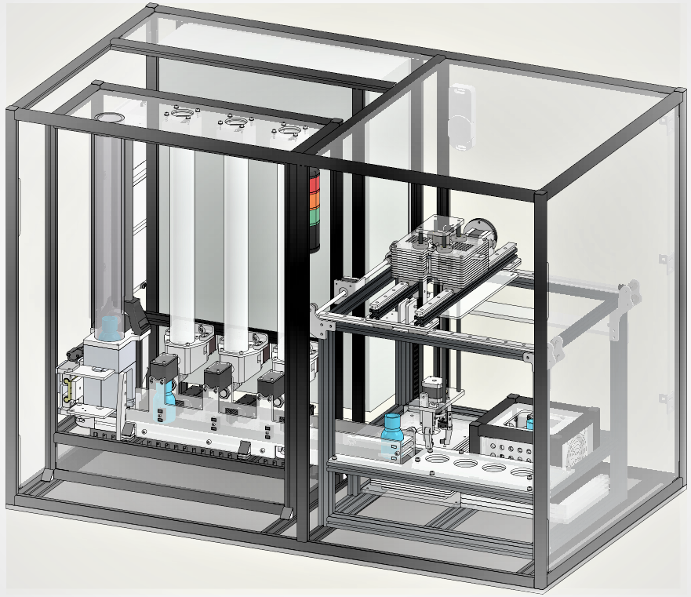
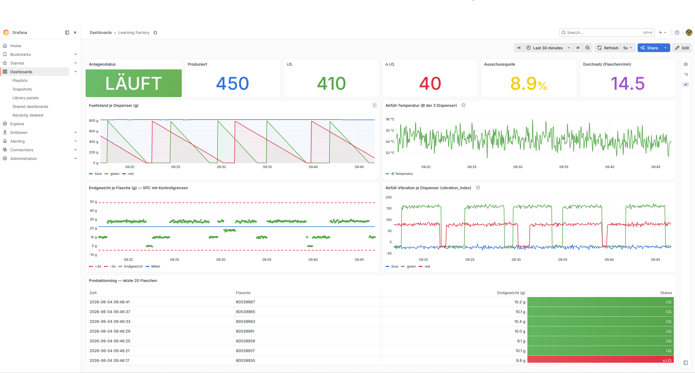
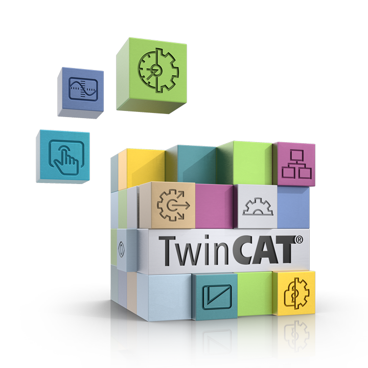

# Zeitreihen-Datenbanken & Visualisierung (Industrie-Ausblick)

> **Ausblick / Industrie — kein Pflichtstoff für [Aufgabe 12.1.2](7_Datenspeicherung.md).**
> Die Pflicht bleibt **CSV + Live-Plot**. Diese Seite zeigt, womit *dieselben* Daten in der
> Industrie gespeichert und visualisiert werden — und warum. InfluxDB und Grafana sind dort
> die **Bonus-Stufen** der Aufgabe.

Auf der vorigen Seite haben wir die Daten in einer CSV abgelegt. Das genügt fürs Bestehen —
aber sobald **dauerhaft, mit hoher Frequenz und über lange Zeiträume** gespeichert werden
soll, greift die Industrie zu spezialisierten Werkzeugen. Genau das bauen wir als
Schaufenster: einen **Edge-Server**, der `MQTT → InfluxDB → Grafana` rund um die Uhr fährt.

{ width="520" }

---

## Warum Zeitreihendaten besonders sind

Sensordaten einer Anlage haben einen sehr eigenen Charakter:

- **Append-only:** Es kommen ständig *neue* Punkte hinzu; alte werden so gut wie nie geändert.
- **Zeit-indiziert:** Jeder Wert hängt an einem Zeitstempel; fast jede Abfrage ist eine
  *Zeitfenster*-Frage („Mittelwert der letzten 5 Minuten", „Temperaturverlauf heute").
- **Hohe Frequenz & Volumen:** Viele Sensoren × hohe Abtastrate = sehr viele Zeilen.

Eine **Zeitreihen-Datenbank** (Time Series Database, TSDB) ist genau dafür gebaut: schnelles
Schreiben (Append), effizientes Komprimieren über die Zeitachse und eingebaute
Zeitfenster-Aggregationen (Mittelwert, Min/Max, **Downsampling**).

---

## Zeitreihen-DB vs. relationale vs. dokumentbasierte DB

| Typ | Beispiele | Stärke | Wann |
|-----|-----------|--------|------|
| **Relational** | SQLite, PostgreSQL | feste Tabellen, Joins, Transaktionen | strukturierte Stammdaten, Aufträge, Berichte |
| **Dokumentbasiert** | TinyDB, MongoDB | flexible JSON-Dokumente, kein festes Schema | heterogene Daten, schnelles Prototyping |
| **Zeitreihen (TSDB)** | **InfluxDB**, TimescaleDB | Append + Zeitfenster-Aggregation + Komprimierung | **Sensor-/Maschinendaten** |

Das knüpft an die **Hot/Warm/Cold**-Einteilung der vorigen Seite an: InfluxDB ist ein
typischer **Warm Storage** — schnell genug für Dashboards, dauerhaft genug für Analysen.

---

## Das InfluxDB-Datenmodell

InfluxDB speichert jeden Messpunkt nach demselben Schema:

```
measurement,tag1=wert,tag2=wert  field1=wert,field2=wert  timestamp
```

- **measurement** — *was* gemessen wird (z.B. `dispenser`, `temperature`). Wie eine Tabelle.
- **tags** — indizierte **String**-Metadaten zum **Filtern/Gruppieren** (z.B. `color=red`).
- **fields** — die eigentlichen **Messwerte** (Zahlen), *nicht* indiziert.
- **timestamp** — der Zeitpunkt (hier: Unix-Sekunden aus dem `time`-Feld der Anlage).

Für unsere Learning Factory sieht ein Punkt z.B. so aus:

<div class="lineprotocol">
<code><span class="lp-measurement">dispenser</span>,<span class="lp-tag">color=red</span> <span class="lp-field">fill_level_grams=638.6,vibration_index=102.8,bottle="80290512"</span> <span class="lp-timestamp">1716554173</span></code>
</div>

<p class="lp-legend">
<span class="lp-measurement">■</span> <strong>measurement</strong> — was gemessen wird&nbsp;&nbsp;&nbsp;
<span class="lp-tag">■</span> <strong>tag</strong> — indiziert, zum Filtern/Gruppieren&nbsp;&nbsp;&nbsp;
<span class="lp-field">■</span> <strong>field</strong> — die Messwerte (nicht indiziert)&nbsp;&nbsp;&nbsp;
<span class="lp-timestamp">■</span> <strong>timestamp</strong> — der Zeitpunkt
</p>

> Hinweis: Das InfluxDB-Feld `vibration_index` (Unterstrich) ist **dasselbe Signal** wie das
> MQTT-JSON-Feld `vibration-index` (Bindestrich, siehe [Datenspeicherung](7_Datenspeicherung.md)) —
> beim Schreiben in InfluxDB wird aus dem Bindestrich ein Unterstrich.

### Die wichtigste Design-Regel: Kardinalität

> **Tags sind für niedrig-kardinale Werte, Felder für hoch-kardinale.**

Jede **eindeutige Kombination aus measurement + Tags** erzeugt eine eigene *Serie*. Packt man
einen Wert mit vielen verschiedenen Ausprägungen in einen **Tag**, explodiert die Anzahl der
Serien (hohe **Kardinalität**) — und damit der Speicher-/RAM-Bedarf.

Konkret bei uns: Die **`bottle`-ID** ist für jede Flasche anders (hoch-kardinal). Sie gehört
deshalb in ein **Feld**, nicht in einen Tag — sonst bekäme jede Flasche eine eigene Serie.
Die **Dispenser-Farbe** dagegen kennt nur drei Werte (`red`/`blue`/`green`) und eignet sich
perfekt als **Tag**.

*(Das passt zur Notiz auf der vorigen Seite, dass `bottle` ein String ist: hier wird sie als
String-**Feld** abgelegt — Schlüssel, nicht Rechengröße.)*

<figure class="diagram">

<figcaption>Warum <code>color</code> ein Tag sein darf, <code>bottle</code> aber nicht: Jede Tag-Ausprägung erzeugt eine eigene Zeitreihe.</figcaption>
</figure>

> Hinweis: InfluxDB **3** hebt diese Kardinalitäts-Grenze technisch auf. Im Schaufenster läuft
> aber **InfluxDB 2.x**, wo die Regel klassisch gilt — und das Prinzip „Identifikatoren in
> Felder" ist auch sonst eine gute Angewohnheit.

---

## Referenzarchitektur: MQTT → InfluxDB → Grafana

<figure class="diagram">

<figcaption>Referenzarchitektur <code>MQTT → Collector → InfluxDB → Grafana</code>. Die Datenquelle ist nur über den Broker angebunden — wie eine echte Maschine vom Auswertesystem entkoppelt.</figcaption>
</figure>

```
Anlage / Simulator ──publish──► MQTT-Broker ──subscribe──► Collector ──► InfluxDB ──► Grafana
   (SPS, Sensoren)                                       (schreibt Points)  (TSDB)    (Dashboard)
```

- **Broker:** verteilt die Nachrichten (vergisst sie aber — nur der letzte Retain-Wert bleibt).
- **Collector:** abonniert die Topics und schreibt jeden Wert als Point in die TSDB.
- **InfluxDB:** speichert die Zeitreihen dauerhaft.
- **Grafana:** fragt InfluxDB ab und zeigt Live-Dashboards.

Im Schaufenster laufen Collector, InfluxDB und Grafana als **drei Docker-Container** auf einem
**Edge-Server**. In einer echten Anlage wäre das ein **Industrie-PC bzw. Edge-Gateway** im
Schaltschrank oder Serverraum, und die Datenquelle wäre die **Maschine selbst** (SPS + Sensoren).
Bei uns übernimmt **ein einziger kompakter Rechner beide Rollen** — er simuliert die Anlage
*und* hostet den Stack. Entscheidend bleibt: der Simulator (die „Anlage") ist mit dem Stack
**nur über den Broker** verbunden — genau wie eine echte Maschine vom Auswertesystem entkoppelt
ist.

<div class="logo-strip">


</div>

### Edge Computing: das Gateway im Kleinen

Der Edge-Server macht vor Ort, was in echten Anlagen ein **Edge-Gateway** tut: lokal **sammeln,
speichern und visualisieren**, nah an der Maschine, 24/7 — ohne dass alle Rohdaten erst in die
Cloud müssen.

---

## Daten abfragen: Flux

InfluxDB 2.x wird mit der Abfragesprache **Flux** abgefragt — als Pipeline (`|>`), ähnlich wie
man Daten in Pandas durch Schritte schiebt. Beispiel „Füllstand der letzten 15 Minuten, in
30-Sekunden-Fenstern gemittelt":

```flux
from(bucket: "learning_factory")
  |> range(start: -15m)
  |> filter(fn: (r) => r._measurement == "dispenser" and r._field == "fill_level_grams")
  |> aggregateWindow(every: 30s, fn: mean, createEmpty: false)
```

Solche Aggregationen über Zeitfenster sind der Grund, warum eine TSDB hier mehr leistet als
eine CSV: Man bekommt sie geschenkt, statt sie selbst zu programmieren.

---

## Visualisierung: Grafana

**Grafana** ist der De-facto-Standard für Zeitreihen-Dashboards. Stärken im Industrieeinsatz:

- **Provisioning as Code:** Datenquellen und Dashboards liegen als versionierte
  Konfigurationsdateien im Repository — reproduzierbar statt „im Browser zusammengeklickt".
- **Template-Variablen:** ein Dashboard für viele Anlagen/Linien, statt eines pro Maschine.
- **Alerting:** Schwellwerte und Benachrichtigungen direkt auf den Live-Daten.

Ein typisches **„Learning Factory"-Dashboard** kombiniert **Status- und Kennzahl-Kacheln**
(Anlagenstatus, produzierte Flaschen, **i.O./n.i.O.**-Anteil, Ausschussquote, Durchsatz) mit
**Prozess-Zeitreihen** (Füllstand je Dispenser, Temperatur, Endgewicht mit Kontrollgrenzen,
Vibration) und einem **Produktionslog** je Flasche — alle live aus demselben Datenstrom, der in
dieser Lehrveranstaltung über MQTT hereinkommt.

<figure class="diagram">

<figcaption>Das „Learning Factory"-Dashboard live auf dem Edge-Server: Anlagenstatus und Qualitäts-/Leistungskennzahlen (i.O./n.i.O., Ausschussquote, Durchsatz), Prozessgrößen und ein Produktionslog — alle aus <em>demselben</em> MQTT-Datenstrom abgeleitet.</figcaption>
</figure>

---

## Best Practices — was wir hier bewusst richtig machen

- **Retain nur auf Status/Config, nicht auf Telemetrie.** Das `recipe`-Topic ist *retained*
  (ein neuer Subscriber kennt sofort das aktuelle Rezept); die Messwerte sind es **nicht** —
  sonst bekäme man einen alten Wert als „aktuell" untergeschoben. *(In der Kurs-Aufgabe 12.1.1
  setzen wir Retain bewusst auf **alle** Topics — so sind die Werte im MQTT-Explorer auch dann
  sichtbar, wenn die SPS gerade nicht sendet. Das ist eine didaktische Vereinfachung; industriell
  bliebe hochfrequente Telemetrie un-retained.)*
- **QoS passend wählen.** QoS 0 (höchster Durchsatz) für unkritische, hochfrequente Telemetrie;
  QoS 1 (mindestens einmal) für wichtige Ereignisse.
- **Kardinalität im Griff behalten:** Identifikatoren (`bottle`) in **Felder**, niedrig-kardinale
  Metadaten (`color`, `dispenser`) in **Tags**.
- **Ein measurement je Entitätstyp** (`dispenser`, `temperature`, `final_weight`,
  `ground_truth`, `recipe`) statt alles in eine „Tabelle".
- **Retention & Downsampling:** alte Rohdaten automatisch verfallen lassen oder verdichten
  (z.B. Minuten- statt Sekundenwerte für die Langzeit-Historie).

---

## Bezug zu Beckhoff / TwinCAT

Der Weg von der **SPS** an den Broker ist in der Beckhoff-Welt nativ vorgesehen:

<div class="logo-strip small">


</div>

- **TF6701 – TwinCAT 3 IoT Communication (MQTT):** der Funktionsbaustein
  **`FB_IotMqttClient`** publiziert Laufzeitvariablen direkt aus der Steuerung per MQTT — mit
  Wahl von **QoS** und Payload und **TLS**-Absicherung. Das ist genau die Brücke, die auf der
  Seite [TwinCAT MQTT-Client](6_TwinCAT_MQTT.md) gezeigt wird.
- **Beckhoff empfiehlt selbst InfluxDB + Grafana** zur Archivierung und Visualisierung der so
  gesendeten Daten — unsere Stack-Wahl ist also kein Zufall, sondern der dort vorgeschlagene Weg.
- **Native Alternativen** (falls jemand fragt „warum nicht alles bei Beckhoff?"):
  **TF6420** (Database Server) und **TwinCAT Analytics** decken Speicherung/Auswertung
  innerhalb des Beckhoff-Ökosystems ab.

---

## Wo die Industrie hingeht

- **TIG-Stack & Telegraf:** Der verbreitetste Aufbau heißt **TIG** = *Telegraf + InfluxDB +
  Grafana*. **Telegraf** ist ein **konfigurierbarer Collector ohne eigenen Code** (Plugins für
  MQTT, OPC UA, Modbus …). Unser Python-Writer ist die *transparente Lehr-Variante*; in
  Produktion ersetzt oft eine Telegraf-Konfiguration den Code.
- **Unified Namespace (UNS):** ein Broker als „Single Source of Truth" mit semantisch
  geordnetem Topic-Baum (Enterprise → Site → Area → Line → Cell). Unser
  `aut/SoSe26/learning_factory_simulation/…` ist ein **Mini-UNS**.
- **Sparkplug B:** eine Spezifikation über MQTT mit standardisiertem Namespace,
  **Protobuf**-Payloads, Geburts-/Todes-Zertifikaten der Geräte (Zustandsbewusstsein) und
  Store-and-Forward — für große, herstellerübergreifende Anlagen.

---

## Bezug zur Aufgabe 12.1.2

InfluxDB ist eine der genannten **Bonus-Datenbanken**, Grafana eine der **Bonus-Dashboard**-
Optionen. **Für die meisten reicht CSV + Live-Plot** — dieser Stack ist das „obere Ende /
was die Industrie real einsetzt". Wer ihn ausprobiert, sieht denselben Datenstrom einmal
ganz unten (CSV) und einmal ganz oben (TSDB + Grafana) — und versteht, *warum* es die
spezialisierten Werkzeuge gibt.
