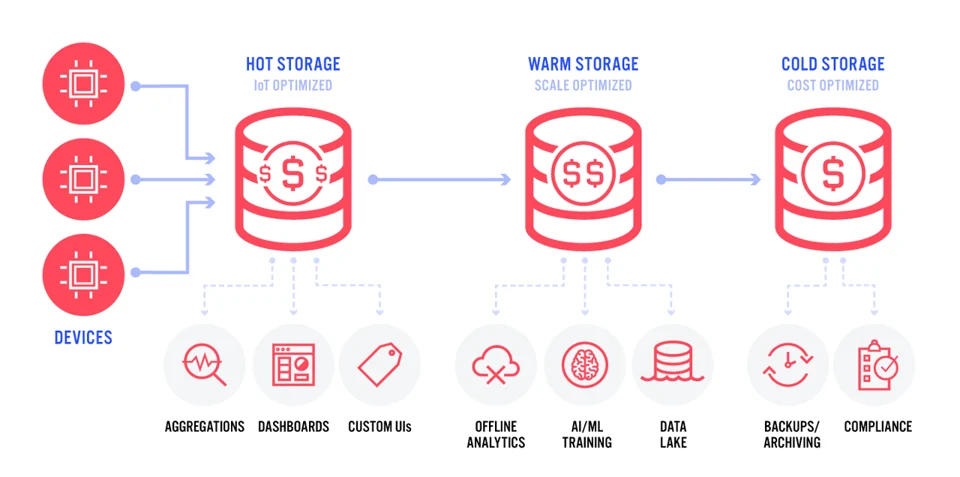
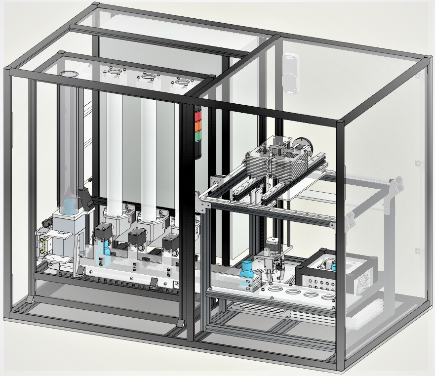
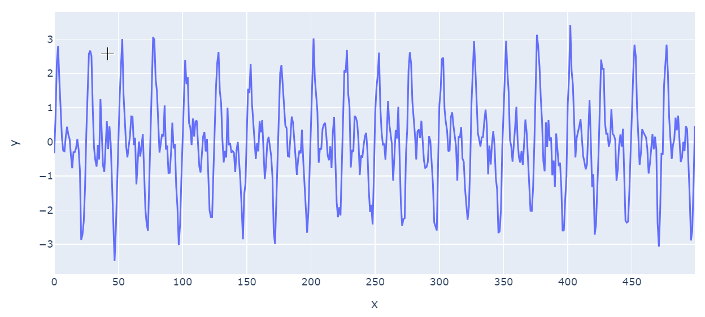

<!-- paginate: true -->


# Datenspeicherung


Serafin Kollegger & Julian Huber


---


## Persistierung und Visualisierung von Daten

<!-- _class : white -->


Dieses System holt die Daten der SPS vom MQTT-Broker ab und speichert diese in einer Datenbank. Zudem werden die Daten in einem Dashboard visualisiert.

* **MQTT-Client**: Dieser Teil des Systems ist für das Abholen der Daten von der SPS und das Senden an den MQTT-Broker zuständig.
*  **Datenbank**: Dieser Teil des Systems ist für das Speichern der Daten in einer Datenbank zuständig.
*  **Visualisierung**: Dieser Teil des Systems ist für die Visualisierung der Daten zuständig.

---

### Lebenszyklus von Daten

 



 


---

| Storage Type | Typische Software Tools | Anwendungsfälle |
|--------------|------------------------|----------------------|
| Hot Storage  | Arbeitsspeicher (BeckhoffH MI, node-red)  | Dashboards, Echtzeitverarbeitung (z.B. Mittelwertbildung) |
| Warm Storage | Dokumentenbasierte Datenbaken (z.B. MongoDB, tinyDB), Zeitreihen-Datenbanken (z.B. InfluxDB) | Persistierung von Daten, die für Dashboards und Analysen benötigt werden |
| Cold Storage | Relationale Datenbanken (z.B. SQLite, PostgreSQL), Data Warehouses | Langfristige Speicherung von Daten, die für Analysen und Berichte benötigt werden |


### Extract, Transform, Load (ETL) 

<!-- _class : white -->


---

* Pipeline von Datenquellen zum Speicher

* Extraktion
    * periodisch: z.B. Temperatursensor über REST
    * ereignisgesteuert: z.B. Bewegungsmelder über MQTT
    * anfragegesteuert: z.B. Kamera über REST
* Transformation
    * Syntaktische Transformationen (Form): z.B. Format der Zeitstempel 
    * Semantische Transformationen (Inhalt): z.B. Durchschnitt 
* Laden
    * Einbringen in die zentrale Datenstruktur (z.B. Data Warehouse oder Datenbank) z.B. tinyDB oder CSV-Datei


---

### Speichern

* Datenbank:
    * Softwaresystem zur Aufbewahrung von Daten
* Data Warehouse:
    * Sammlung aufbereiteter Daten in fester Struktur
* Data Lake:
    * Unstrukturierte Sammlung von Daten

---

## 🏆 Aufgabe 12.1.2 (40 %)

- **Abgabeformalien:** Dokumentieren Sie ihr Vorgehen sehr kurz als gerne als Markdown-Datei
- In dieser Aufgabe soll ein System zur Datenspeicherung (Warm oder Cold Storage) und Visualisierung implementiert werden
- Wir werden die Daten zu einen späteren Zeitpunkt für die Fehleranalyse verwenden
- In diesem Fall speichern wir die Daten einer anderen Simulation unter dem Topic `iot1/teaching_factory`

- Umfang fürs bestehen der Aufgabe:
    - [ ] Einfache Lösung mit CSV-Datei als Datenbank
    - [ ] Daten aller relevanten (siehe unten) Topics werden vollständig und korrekt gespeichert
    - [ ] Python-Programm, welches eine beliebige Zeitreihe aus der Datenbank visualisiert
    - [ ] Der Report im Markdown enthält einen Plot einer Ausgewählten Zeitreihe für die Sie die Daten gespeichert haben
    - [ ] Mindestens 15 Minuten Daten sind gespeichert
- durch folgende Aufgaben kann die Punktzahl erhöht werden
    - [ ] Datenbank wird durch tinyDB, SQLite oder InfluxDB ersetzt
    - [ ] Plots werden durch Dashboard mit z.B. mit Grafana oder Plotly ersetzt
    - [ ] System ist durch config-Datei konfigurierbar (z.B. MQTT-Server)
    - [ ] Sinnvolle Fehlerbehandlung z.B. bei Verbindungsabbruch zum MQTT-Server
    - [ ] Daten oder Informationen über die Daten können einfach aus anderen Systemen abgerufen werden (auch während das System läuft), z.B. durch eine REST-API oder SQL-Abfragen

---

## Komponenten

### 1. MQTT-Client (Extract)

- Der MQTT-Client ist ein Python-Programm, welches die Daten von der SPS abholt und an den MQTT-Broker sendet.
- Hierzu wird z.B. die Bibliothek `paho-mqtt` verwendet.
- Der Client abonniert das Topic `iot1/teaching_factory` und sendet die Daten an die Datenbank.
- Hinweise:
    - Nutzen Sie das Skript aus den Beispielen und versuchen Sie zunächst ein Topic zu abonnieren und die Daten in der Konsole auszugeben.
    - Überlegen Sie sich dann Funktionen, um die Daten in eine Struktur zu bringen, und diese in dann zu speichern.
    - Passen sie dieses Vorgehen dann auch für die anderen Topics an.


---

### 2. Datenbank (Transform & Load)

- Hier müssen Sie eine Entscheidung treffen, wie die Daten gespeichert werden sollen.
    - Für das Dashboard sollten die Daten so gespeichert werden, dass sie einfach visualisiert werden können.
    - Für die späteten Analysen sollten die Daten so gespeichert werden, dass sie möglichst vollständig sind und sinnvoll miteinader verknüpft werden können.
    - Sehen Sie sich dazu die Datenstruktur (unten) für die Aufgaben Lineare Regression und Classification an.
- Treffen Sie bewusste Entscheidungen, wie die Daten gespeichert werden und ob sie den Aufwand der Umwandlungen beim Speichern oder beim Laden aufbringen wollen.


---





---

#### Datenbedarf für die Aufgabe Lineare Regression

**Idee: Können wir die Waage am Ende des Prozesses einsparen?**

| bottle | vibration-index_red | time_red        | fill_level_grams_red | recipe | temperature_C_red | final_weight_grams | 
|--------|-----------------|-------------|------------------|--------|---------------|---------------|
| 20939           | 102.823497  | 1716554173       | 638.667673     | 21            | 23.045409     | 45.01 |
| 20940           | 105.050436  | 1716554177       | 628.085354     | 21            | 24.043060     |44.01 |
| 20941           | 100.824738  | 1716554181       | 618.295130     | 21            | 23.664343     |45.31 |
| 20942           | 107.097053  | 1716554185       | 607.837681     | 21            | 23.052217     |45.41 |

- der `vibration-index` ist eine Metrik, die Vibrationswerte jedem Dispenser beim Abfüllen jeder Flasche zuordnet
- Ebenso müssen die Werte für die anderen beiden Dispenser (rot und blau) gespeichert werden. Für die folgenden Aufgaben muss alles in einer Tabelle gespeichert werden.

---

#### Datenbedarf für die Aufgabe Classification

**Idee: Können wir gesprunge Flaschen anhand der Schwingungen beim Aufprall aus der Verzeinzelung identifizieren`?**

* Für jede Falsche wird gespeichert:
    * ID der Flasche `bottle`
    * Ist diese Flasche gesprungen `is_cracked`
    * Eine Liste mit 500 Vibrationswerten `vibration_values`, die als Zeitreihe einer Schwindung betrachtet werden (diese `vibration_values` haben nicht mit dem `vibration-index` zu tun, sondern werden an der Verzeinzelung gemessen)

 



 


---

## Lösungvorschlag für Projektstruktur


```plaintext
code/1_persitierung/
├── visualisierung
│   ├── visualisierung.py
│   └── __init__.py
├── database
│   ├── database.py
│   ├── transform.py
|   ├── data.csv
│   └── __init__.py
├── mqtt_client
│   ├── mqtt_client.py
│   └── __init__.py
│── README.md
└── requirements.txt
```
