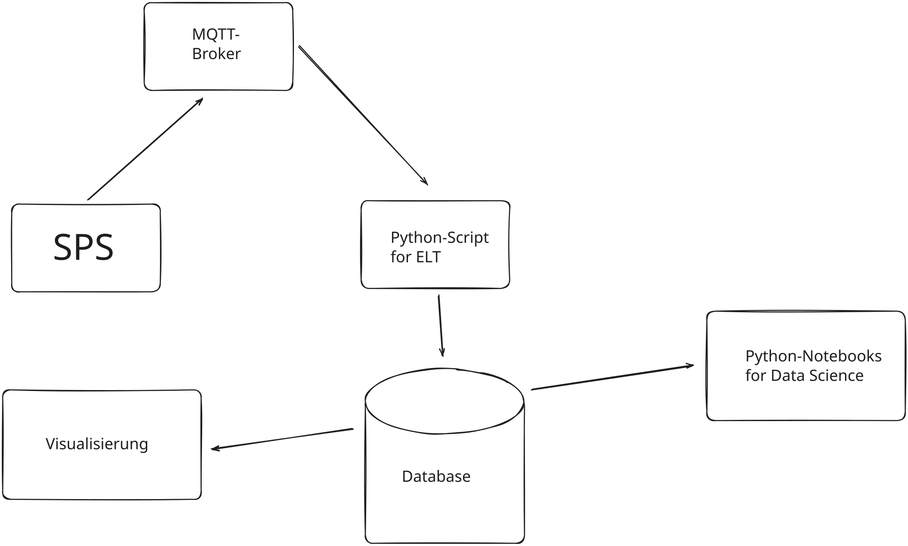
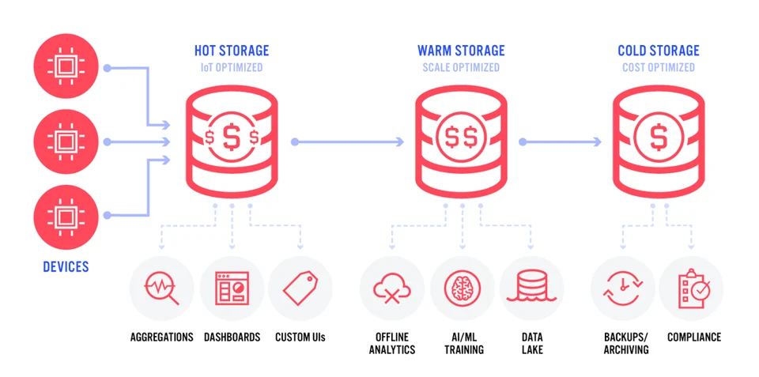
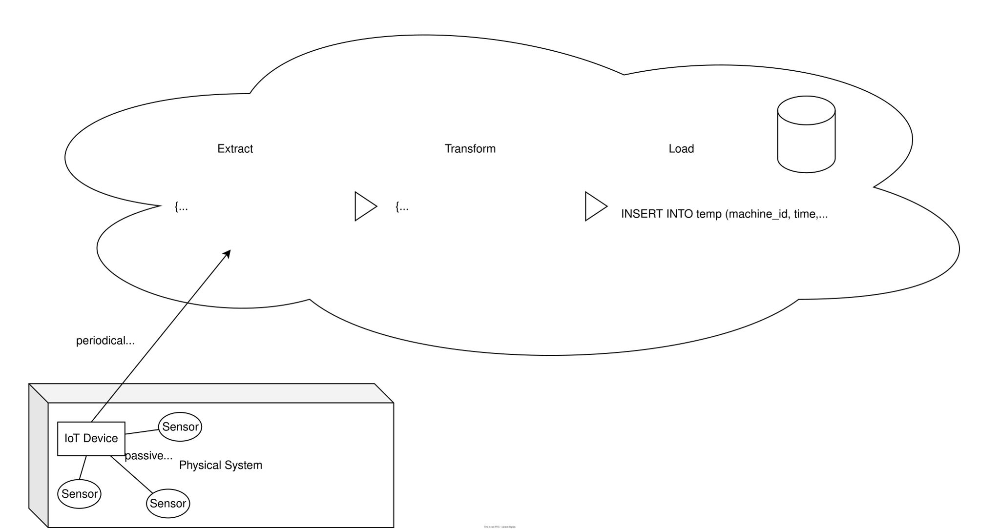
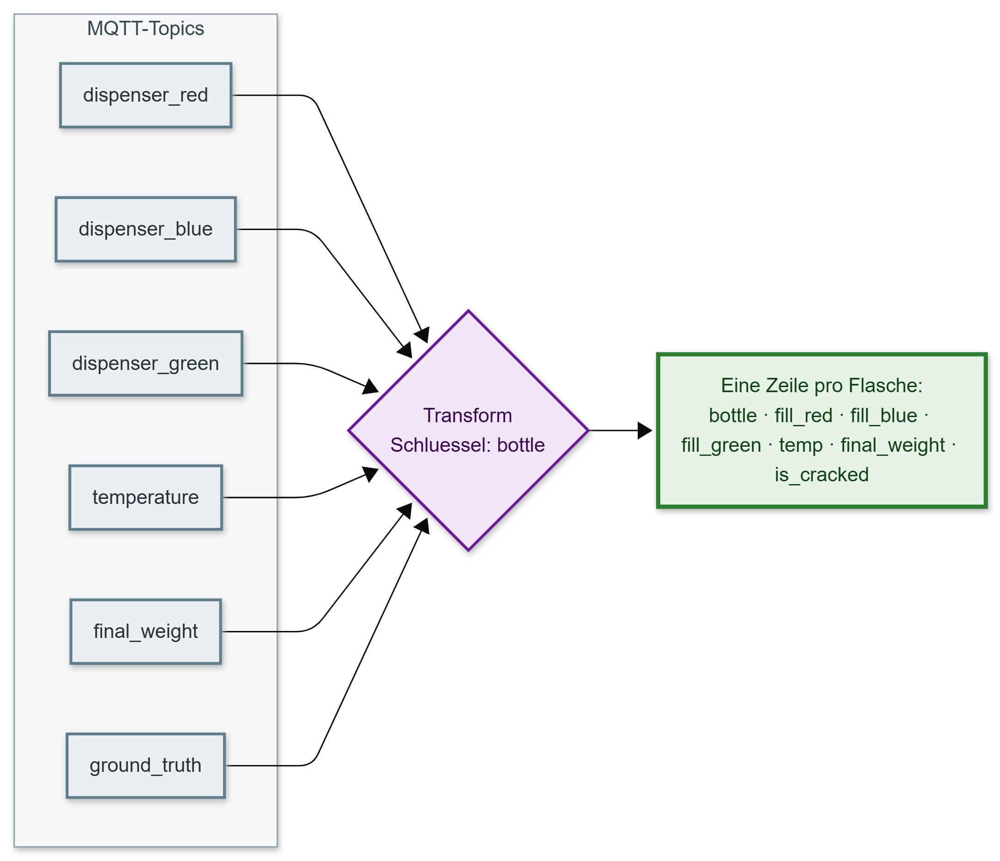
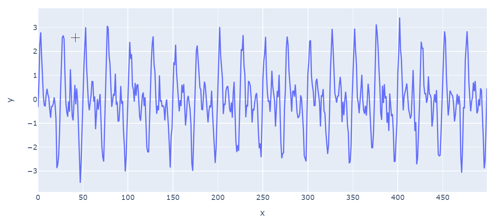

# Datenspeicherung

Dieses System holt die Daten der Anlage vom MQTT-Broker ab, speichert sie in einer Datenbank und visualisiert sie in einem Dashboard.



- **MQTT-Client** — holt die Daten vom Broker ab (*Extract*)
- **Datenbank** — speichert die Daten strukturiert (*Transform & Load*)
- **Visualisierung** — stellt die Daten dar

---

## Lebenszyklus von Daten



| Storage Type | Typische Software-Tools | Anwendungsfälle |
|--------------|-------------------------|-----------------|
| Hot Storage  | Arbeitsspeicher (Beckhoff HMI, Node-RED) | Dashboards, Echtzeitverarbeitung (z.B. Mittelwertbildung) |
| Warm Storage | Dokumentenbasierte Datenbanken (z.B. MongoDB, tinyDB), Zeitreihen-Datenbanken (z.B. InfluxDB) | Persistierung von Daten für Dashboards und Analysen |
| Cold Storage | Relationale Datenbanken (z.B. SQLite, PostgreSQL), Data Warehouses | Langfristige Speicherung für Analysen und Berichte |

---

## Extract, Transform, Load (ETL)



Eine **Pipeline** von den Datenquellen bis zum Speicher:

- **Extraktion**
    - periodisch: z.B. Temperatursensor über REST
    - ereignisgesteuert: z.B. Bewegungsmelder über MQTT
    - anfragegesteuert: z.B. Kamera über REST
- **Transformation**
    - syntaktisch (Form): z.B. Format der Zeitstempel
    - semantisch (Inhalt): z.B. Durchschnitt
- **Laden**
    - Einbringen in die zentrale Datenstruktur (z.B. Data Warehouse oder Datenbank), z.B. tinyDB oder CSV-Datei

### Speichern

- **Datenbank** — Softwaresystem zur Aufbewahrung von Daten
- **Data Warehouse** — Sammlung aufbereiteter Daten in fester Struktur
- **Data Lake** — unstrukturierte Sammlung von Daten

---

## 🏆 Aufgabe 12.1.2 (40%)

In dieser Aufgabe implementieren Sie ein System zur **Datenspeicherung** (Warm oder Cold Storage) und **Visualisierung**. Die gespeicherten Daten verwenden wir zu einem späteren Zeitpunkt für die Fehleranalyse (Aufgaben Lineare Regression und Classification).

Als Datenquelle dient eine laufende Simulation der Learning Factory. Sie veröffentlicht ihre Daten auf dem Kurs-Broker unter dem Topic `aut/SoSe26/learning_factory_simulation/#`.

**Abgabeformalien:** Dokumentieren Sie Ihr Vorgehen kurz als Markdown-Datei.

**Umfang fürs Bestehen der Aufgabe:**

- [ ] Einfache Lösung mit CSV-Datei als Datenbank
- [ ] Daten aller relevanten Topics (siehe unten) werden vollständig und korrekt gespeichert
- [ ] Python-Programm, das eine beliebige Zeitreihe aus der Datenbank visualisiert — der Plot **aktualisiert sich, während Daten hereinkommen** (eine Verzögerung von ~10 Sekunden ist in Ordnung)
- [ ] Der Report (Markdown) enthält einen Plot einer ausgewählten Zeitreihe
- [ ] Mindestens 15 Minuten Daten sind gespeichert

*Hinweis zum Speicher:* CSV genügt fürs Bestehen. Wer SQL nutzen möchte: **SQLite** ist in der Python-Standardbibliothek (`import sqlite3`) enthalten — kein Server nötig.

**Durch folgende Erweiterungen kann die Punktzahl erhöht werden:**

- [ ] Datenbank durch tinyDB, SQLite oder InfluxDB statt CSV
- [ ] Statt eines einfachen Live-Plots ein echtes Dashboard (z.B. Grafana, Plotly Dash oder Streamlit)
- [ ] Daten werden in Echtzeit angezeigt (max. 1 Sekunde Verzögerung)
- [ ] System über eine config-Datei konfigurierbar (z.B. MQTT-Server)
- [ ] Sinnvolle Fehlerbehandlung, z.B. bei Verbindungsabbruch zum MQTT-Server
- [ ] Daten oder Informationen über die Daten lassen sich einfach aus anderen Systemen abrufen (auch während das System läuft), z.B. über eine REST-API (siehe [REST](6_REST.md)) oder SQL-Abfragen

> **Wie weit geht das „oben"?** Wie derselbe Datenstrom mit einer Zeitreihen-Datenbank (InfluxDB) und einem Grafana-Dashboard aussieht — der Industrie-Standard —, zeigt die Seite [Zeitreihen & Visualisierung](7_1_Zeitreihen_und_Visualisierung.md). Für die Aufgabe ist das **optional** (Bonus); Pflicht bleibt CSV + Live-Plot.

---

## Datenquelle: der Simulator

Die Simulation veröffentlicht alle Topics unter dem Präfix `aut/SoSe26/learning_factory_simulation/`. Die Payloads sind UTF-8-codierte JSON-Strings.

| Topic | Wann | JSON-Felder |
|-------|------|-------------|
| `recipe` | einmalig beim Start (Retain) | `id`, `creation_date`, `color_levels_grams` |
| `dispenser_red` / `dispenser_blue` / `dispenser_green` | pro Flasche × Dispenser | `dispenser`, `bottle`, `time`, `fill_level_grams`, `recipe`, `vibration-index` |
| `temperature` | pro Flasche × Dispenser | `dispenser`, `time`, `temperature_C` |
| `scale/final_weight` | pro Flasche (nach dem Abfüllen) | `bottle`, `time`, `final_weight` |
| `drop_oscillation` | pro Flasche | `bottle`, `drop_oscillation` (Liste mit 500 Werten) |
| `ground_truth` | pro Flasche | `bottle`, `is_cracked` |

Auf ein paar Details lohnt es sich zu achten:

- `is_cracked` ist ein **String** (`"0"` oder `"1"`), kein Integer.
- `bottle` ist ebenfalls ein **String** (z.B. `"80290512"`) — beim Zusammenführen der Topics als Schlüssel behandeln (nicht damit rechnen), und in allen Topics konsistent als String oder konsistent als Zahl verwenden.
- `drop_oscillation` ist eine **Liste mit 500 Werten** — die Zeitreihe einer Schwingung.
- Der Feldname `vibration-index` enthält einen **Bindestrich** (`message["vibration-index"]`).
- `temperature` enthält nur `dispenser` und `time`, **keine** `bottle`-ID — die Zuordnung zur Flasche läuft also über den Zeitstempel.

---

## Erste Schritte: Daten empfangen

Beginnen Sie damit, das Topic zu abonnieren und die Nachrichten einfach in der Konsole auszugeben. So sehen Sie, welche Daten in welcher Struktur ankommen, bevor Sie ans Speichern gehen. Das folgende Skript nutzt `paho-mqtt` (Version 2.x):

```python
import paho.mqtt.client as mqtt

broker = "158.180.44.197"
port = 1883
topic = "aut/SoSe26/learning_factory_simulation/#"

def on_message(client, userdata, message):
    print(f"Topic:   {message.topic}")
    print(f"Payload: {message.payload.decode()}")
    print("-" * 40)

mqttc = mqtt.Client(mqtt.CallbackAPIVersion.VERSION2)
mqttc.username_pw_set("bobm", "letmein")
mqttc.on_message = on_message
mqttc.connect(broker, port)
mqttc.subscribe(topic, qos=0)

print(f"Warte auf Nachrichten unter: {topic}")
while True:
    mqttc.loop(0.5)
```

Wenn die Nachrichten ankommen, bauen Sie das System Schritt für Schritt aus:

1. **`mqtt_client`** — empfängt die Nachrichten und unterscheidet sie nach Topic. Mit `message.topic.split("/")[-1]` bekommen Sie den letzten Topic-Teil (Achtung: `scale/final_weight` hat zwei Ebenen).
2. **`transform`** — wandelt jede Nachricht mit `json.loads(...)` in ein Dictionary, führt die Werte einer Flasche (`bottle`) zusammen und passt die Typen an (z.B. `is_cracked` von String zu Zahl).
3. **`database`** — schreibt **eine Zeile pro Flasche** in die CSV (nicht eine Zeile pro Topic) — denken Sie die Struktur von Anfang an für die späteren Analysen mit.
4. **`visualisierung`** — lädt die CSV (z.B. mit `pandas`) und plottet eine Zeitreihe mit `matplotlib`. Der Plot soll sich aktualisieren, während neue Daten hereinkommen — z.B. indem Sie die CSV regelmäßig neu einlesen und neu zeichnen (`matplotlib`-interaktiver Modus `plt.ion()` / `plt.pause(...)`).

**Bewertete Eigenleistung:** Wie Sie die Daten transformieren, in welcher CSV-Struktur Sie sie ablegen und wie Sie sie visualisieren, ist der bewertete Kern dieser Aufgabe. Das Skript oben dient nur dazu, die Daten erstmals fließen zu sehen.

<figure class="diagram">

<figcaption>Jede Flasche löst mehrere MQTT-Nachrichten auf verschiedenen Topics aus. Der Transform verbindet alle Nachrichten mit derselben <code>bottle</code>-ID zu <strong>einer Zeile pro Flasche</strong>.</figcaption>
</figure>

---

## Komponenten

### 1. MQTT-Client (Extract)

- Der MQTT-Client ist ein Python-Programm, das die Daten vom MQTT-Broker abholt.
- Verwendet wird z.B. die Bibliothek `paho-mqtt`.
- Der Client abonniert das Topic `aut/SoSe26/learning_factory_simulation/#` und gibt die Daten an die Datenbank weiter.
- Hinweise:
    - Nutzen Sie das Skript oben und abonnieren Sie zunächst das Topic, um die Daten in der Konsole auszugeben.
    - Überlegen Sie sich dann Funktionen, um die Daten in eine Struktur zu bringen und zu speichern.
    - Passen Sie dieses Vorgehen anschließend für die übrigen Topics an.

### 2. Datenbank (Transform & Load)

- Hier treffen Sie eine Entscheidung, **wie** die Daten gespeichert werden sollen.
    - Für das Dashboard sollten die Daten leicht zu visualisieren sein.
    - Für die späteren Analysen sollten die Daten möglichst vollständig und sinnvoll miteinander verknüpft sein.
    - Sehen Sie sich dazu den Datenbedarf (unten) für Lineare Regression und Classification an.
- Treffen Sie bewusst die Entscheidung, ob Sie den Aufwand der Umwandlung beim **Speichern** oder beim **Laden** aufbringen wollen.


---

### Datenbedarf für die Aufgabe Lineare Regression

**Idee: Können wir die Waage am Ende des Prozesses einsparen?**

| bottle | vibration-index_red | time_red | fill_level_grams_red | recipe | temperature_C_red | final_weight_grams |
|--------|---------------------|----------|----------------------|--------|-------------------|--------------------|
| 20939  | 102.823497 | 1716554173 | 638.667673 | 21 | 23.045409 | 45.01 |
| 20940  | 105.050436 | 1716554177 | 628.085354 | 21 | 24.043060 | 44.01 |
| 20941  | 100.824738 | 1716554181 | 618.295130 | 21 | 23.664343 | 45.31 |
| 20942  | 107.097053 | 1716554185 | 607.837681 | 21 | 23.052217 | 45.41 |

- Der `vibration-index` ist eine Metrik, die jedem Dispenser beim Abfüllen jeder Flasche einen Vibrationswert zuordnet.
- Ebenso müssen die Werte für die anderen beiden Dispenser (blau und grün) gespeichert werden. Für die folgenden Aufgaben muss alles in **einer** Tabelle stehen.

### Datenbedarf für die Aufgabe Classification

**Idee: Können wir gesprungene Flaschen anhand der Schwingungen beim Aufprall aus der Vereinzelung identifizieren?**

Für jede Flasche wird gespeichert:

- ID der Flasche `bottle`
- ob die Flasche gesprungen ist `is_cracked`
- eine Liste mit 500 Vibrationswerten `vibration_values`, betrachtet als Zeitreihe einer Schwingung (diese `vibration_values` haben **nichts** mit dem `vibration-index` zu tun, sondern werden an der Vereinzelung gemessen)



---

## Lösungsvorschlag für die Projektstruktur

```plaintext
persistierung/
├── visualisierung
│   ├── visualisierung.py
│   └── __init__.py
├── database
│   ├── database.py
│   ├── transform.py
│   ├── data.csv
│   └── __init__.py
├── mqtt_client
│   ├── mqtt_client.py
│   └── __init__.py
├── README.md
└── requirements.txt
```

---

## Wohin führt das?

Diese Aufgabe ist die **Datendrehscheibe** der Lehrveranstaltung: Was Sie hier sauber speichern,
ist die Grundlage der beiden folgenden Themen.

- **[Regressionsmodelle](8_Regression.md)** — „Können wir die Waage einsparen?" nutzt die
  Tabelle *eine Zeile pro Flasche* (Füllstände, `vibration-index`, Temperatur → Endgewicht).
- **[Klassifikationsmodelle](9_Klassifizierung.md)** — „Erkennen wir gesprungene Flaschen?"
  nutzt `is_cracked` zusammen mit der `drop_oscillation`-Schwingung.

Deshalb lohnt es sich, die Struktur (siehe die Datenbedarf-Tabellen oben) **von Anfang an** für
diese Analysen mitzudenken — nicht nur für das Dashboard von heute.
