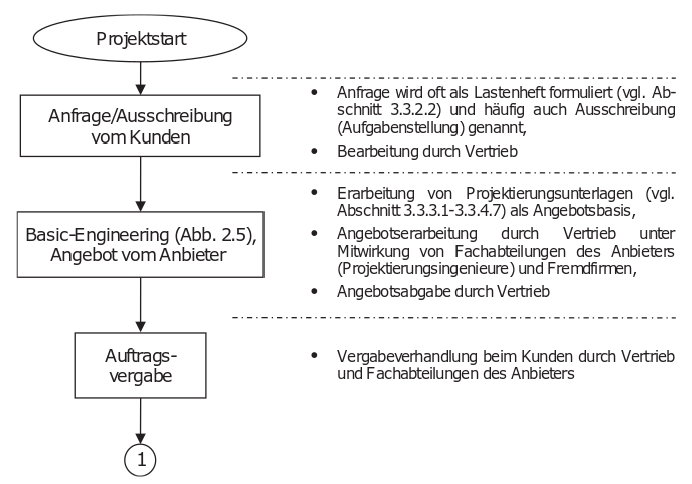
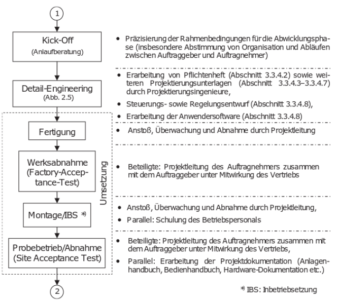
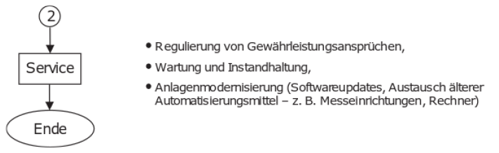
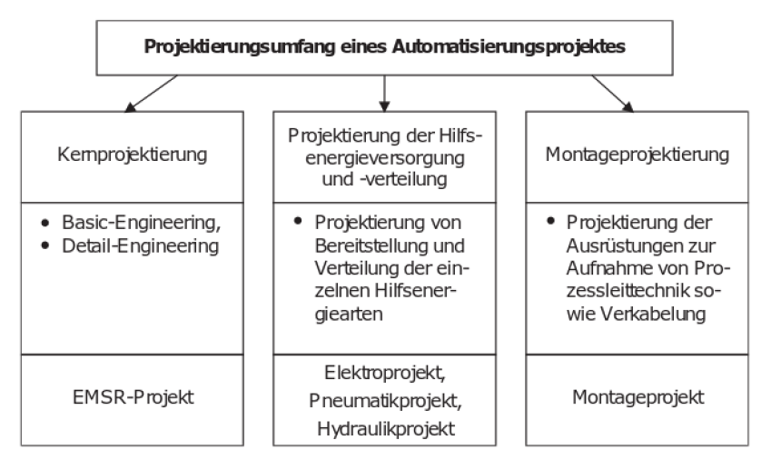
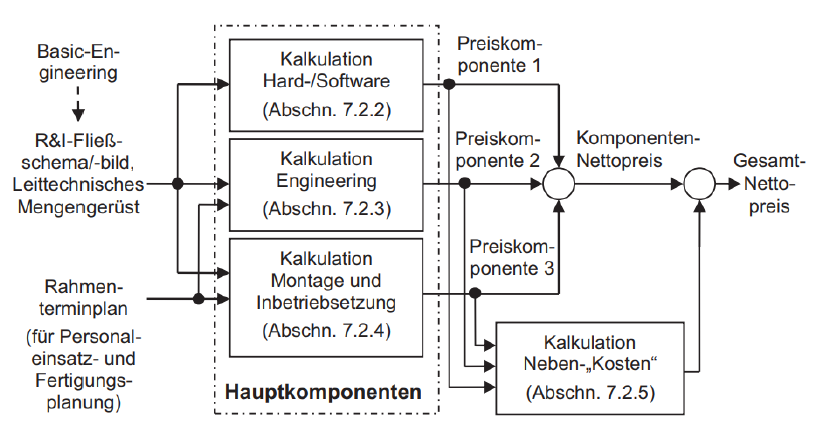

<!-- paginate: true -->

Serafin Kollegger & Julian Huber

# Projektierung von Automatisierungsanlagen

**Projektphasen**
**Preis/Kostenbildung**

---

# Projektphasen

- **Akquisitionsphase**
- **Abwicklungsphase**
- **Servicephase**

Diese Phasen gewährleisten einen strukturierten und effizienten Ablauf des Projekts, von der ersten Kundenanfrage bis zur langfristigen Betreuung der installierten Automatisierungsanlage.

[Th. Bindel D. Hofmann, Projektierung von Automatisierungsanlagen, 3. Auflage 2017, Springer, ISBN 978-3-658-16416-4]

---

## Akquisitionsphase

Die Akquisitionsphase umfasst die Aktivitäten, die vor dem eigentlichen Projektstart stattfinden, und zielt darauf ab, das Projekt zu gewinnen und die Grundlagen für die Projektumsetzung zu legen. Wichtige Schritte in dieser Phase sind:

- **Kundenakquise**: Identifizierung und Ansprache potenzieller Kunden, Präsentation des Unternehmens und seiner Dienstleistungen.
- **Anforderungsanalyse**: Sammlung und Analyse der Anforderungen des Kunden, um ein detailliertes Verständnis der benötigten Automatisierungsanlage zu erlangen.
- **Machbarkeitsstudie**: Bewertung der technischen und wirtschaftlichen Machbarkeit des Projekts.
- **Angebotserstellung**: Erarbeitung eines detaillierten Angebots, das Kosten, Zeitrahmen und technische Spezifikationen umfasst.
- **Vertragsverhandlung**: Verhandlung der Vertragsbedingungen und Abschluss des Vertrages mit dem Kunden.

[//]: # (Kundenakquise: Auch wenn Kundenunternehmen auf die Firma zugeht wird es eine Vorstellungsrunde geben. Häufig in mehreren Runden beim Kunden sowie beim Integrator. Damit jede Partei abschätzen kann, mit wem Sie in eine Kooperatin gehen, und ob diese potential hat zu funktionieren.)

[//]: # (Anforderungsanalyse ist mit unter der wichtigste Schritt. Wenn hier Fehlergemacht werden wird das Projekt scheitern. Diese Analyse ist ein gemeinschaftliches vorhaben zwischen den Parteien.)

[//]: # (Machbarkeitsstudien sind bei vielen Neuinvestitionen von Anlagen notwendig, um zu überprüfen ob die Prozesse der bisherigen Produktion oder bei der implementierung neuer Produktionsprozesse und -verfahren ein technisches System in der Lage sein kann die Aufgaben umzusetzten. Hilfestellung in diesen Bereichen sind Forschungseinrichtungen wie Frauenhofer aber auch z.B.das MCI. Im bezug auf wirtschafliche Machbarkeitsstudien können diese Einrichtungen bzw. externe Consulting und Beratungsfirmen Hilfe leisten.)

---

### 2. Abwicklungsphase
Die Abwicklungsphase umfasst die eigentliche Projektumsetzung und gliedert sich in mehrere Unterphasen:

- **Projektplanung**: Detaillierte Planung des Projekts, einschließlich Zeitplan, Ressourcenplanung und Budgetierung.
- **Design und Entwicklung**: Erstellung der detaillierten technischen Spezifikationen und Designentwürfe der Automatisierungsanlage. Entwicklung der Hardware und Software.
- **Fertigung und Beschaffung**: Herstellung oder Beschaffung der notwendigen Komponenten und Materialien für die Automatisierungsanlage.
- **Montage und Integration**: Zusammenbau der Komponenten und Integration der Systeme zu einer funktionalen Einheit.
- **Test und Inbetriebnahme**: Durchführung von Tests, um sicherzustellen, dass die Anlage den Anforderungen entspricht und ordnungsgemäß funktioniert. Inbetriebnahme der Anlage am Standort des Kunden.
- **Abnahme durch den Kunden**: Durchführung der Abnahmeprozeduren mit dem Kunden, um sicherzustellen, dass alle vertraglichen Anforderungen erfüllt sind.

---

### 3. Servicephase
Die Servicephase beginnt nach der Abnahme und umfasst die Betreuung der Anlage während ihres Betriebslebenszyklus:

- **Wartung und Support**: Regelmäßige Wartung der Anlage, um deren optimale Funktion sicherzustellen. Bereitstellung von technischem Support und Fehlerbehebung bei auftretenden Problemen.
- **Upgrades und Anpassungen**: Durchführung von Updates und Anpassungen, um die Anlage an veränderte Anforderungen oder technologische Fortschritte anzupassen.
- **Schulung**: Schulung des Kundenpersonals in der Bedienung und Wartung der Anlage.
- **Dokumentation**: Bereitstellung und Aktualisierung der technischen Dokumentation, um sicherzustellen, dass der Kunde über alle notwendigen Informationen verfügt.
- **Rückbau und Entsorgung**: Gegebenenfalls Unterstützung beim Rückbau und der umweltgerechten Entsorgung der Anlage am Ende ihres Lebenszyklus.

--- 

## Ablauf der Projektierungsphasen

---

### 1. Akquisitionsphase

---

### 2. Abwicklungsphase

---

### 3. Servicephase

---

## Projektumfang

[//]: # (Kernprojektierung setzt sich aus Basic und Detail Engineering zusammen, Nebenprojektierung startet mit Angebotvergabe/Beauftragung)

---

# Preis/Kostenbildung

---

# Laboraufgabe

- Konzepterstellung einer Beispiel Anlage
- Mechanisches Design, Aufstellgröße, Montagemöglichkeiten etc. mittels tehchnischer Skizzen (Kalkulation - Hardwarekosten und Montage/Fertigungskosten)
- Planung des Prozessablaufes
- Erhebung der vorläufigen Steuerungsstruktur (Kalkulation - für Software Engineering Kosten)
- Anlagenkomponenten Auswahl (Kalkulation - für Automatisierungshardwarekosten)
- Nebenkosten berechnung wie Angeben in oberer Abbildung
- Kalkulation Engineerig Kosten Basierend auf den oben erarbeiteten Konzept
