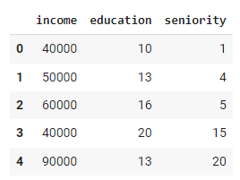
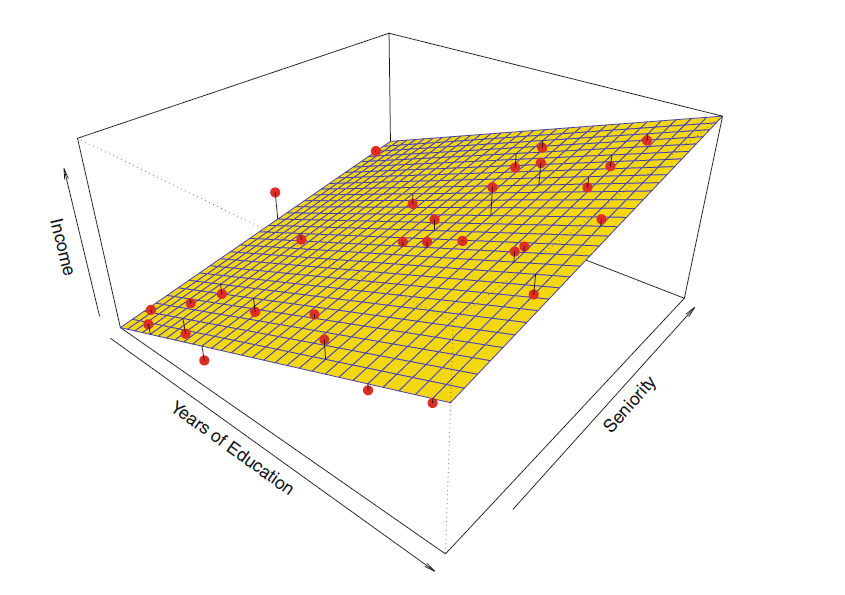
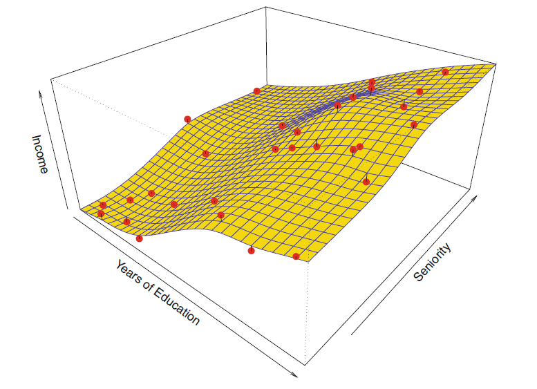
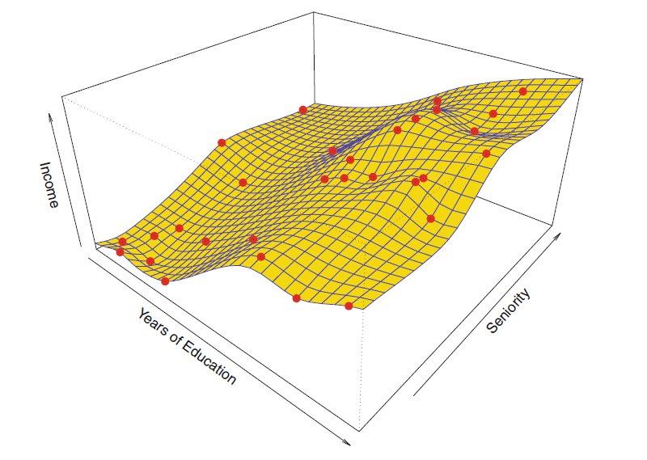
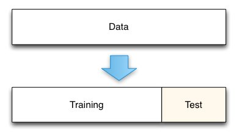
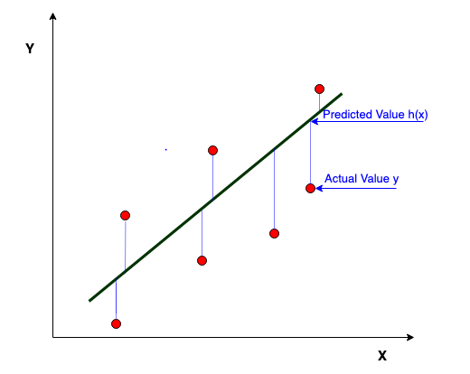
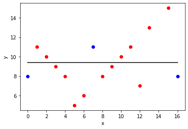
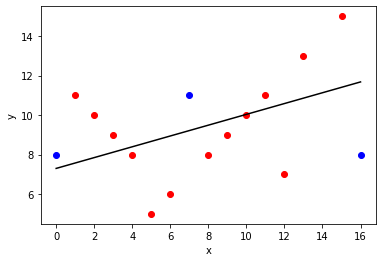
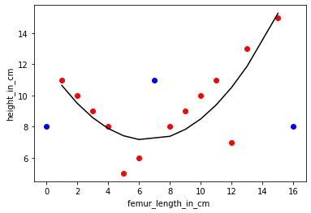

<!-- paginate: true -->

# Machine Learning in der Produktion - Regression


Serafin Kollegger & Julian Huber


---


## Lineare Regression

* Regressions-Modelle sagen eine kontinuierliche Variable $y$ auf Basis von $p$ Prädiktoren $X_1, X_2, ..., X_p$ vorher.
* Der Zusammenhang zwischen den Prädiktoren und der Zielvariablen wird durch die Regressionskoeffizienten $\beta_0, \beta_1, ..., \beta_p$ beschrieben, welche die Steigung der Beziehung zwischen den Prädiktoren und der Zielvariablen darstellen.
* Die Prädiktoren können kontinuierliche oder kategorische Variablen sein. Die Regressionskoeffizienten, werden anhand der Trainingsdaten geschätzt.

 

$f(\vec{X}) = Y = β_0 + β_1X_1 + β_2X_2 + ... + β_pX_p.$

 


---

### Beispiel: Lineare Regression für das Einkommen basierend auf Bildung und Berufserfahrung

 




 

 

$\text{income} ≈ β_0 + β_1 \cdot \text{education}+ β_2 \cdot \text{seniority}$

 

---


 

$\text{income} ≈ β_0 + β_1 \cdot \text{education}+ β_2 \cdot \text{seniority}$

 

 

$\text{income} ≈ 20 \text{k€} + 1.5 \frac{\text{k€}}{\text{a}} \cdot \text{education}+ 1 \frac{\text{k€}}{\text{a}} \cdot \text{seniority}$

 

* $\beta_0$: Ungebildete Arbeiter ohne Ausbildung erhalten ein Gehalt von 20.000 €
* $\beta_1$: Ein Jahr Ausbildung führt zu einem um 1.500 € höheren Gehalt
* $\beta_2$: Ein Jahr Berufserfahrung führt zu einem um 1.000 € höheren Gehalt

* Lineare Regression ist ein parametrischer und relativ unflexibler Ansatz
    * sie kann nur lineare Funktionen erzeugen
    * nur zwei Faktoren (Linien) zu interpretieren


---


### Matrix Representation Linearer Modelle

- $x_{i,j}$… Wert des Prädiktors $j$ der Beobachtung $i$
- $X_0=x_{:,0}$… sind alle $1$, so dass $x_{j,0} \cdot \beta_0 = \beta_0$ der Bias-Term ist 
(d.h., der Y-Achsenabschnitt / Ordinatenabschnitt / Aufpunkt des linearen Regressionsmodells)
- $\beta_j$… Gewicht des Prädiktors $j$

---


$$
\begin{bmatrix}
x_{1,0} & \cdots & x_{1,p} \\
x_{2,0} & \cdots & x_{2,p} \\
\vdots & \ddots & \vdots \\
x_{n,0} & \cdots & x_{n,p} \\
\end{bmatrix}
\begin{bmatrix}
\beta_0 \\
\beta_1 \\
\vdots \\
\beta_p \\
\end{bmatrix}
=
\begin{bmatrix}
x_{1,0} \cdot \beta_0 + x_{1,1} \cdot \beta_1 + \cdots + x_{1,p} \cdot \beta_p \\
x_{2,0} \cdot \beta_0 + x_{2,1} \cdot \beta_1 + \cdots + x_{2,p} \cdot \beta_p \\
\vdots \\
x_{n,0} \cdot \beta_0 + x_{n,1} \cdot \beta_1 + \cdots + x_{n,p} \cdot \beta_p \\
\end{bmatrix}
=
\begin{bmatrix}
y_1 \\
y_2 \\
\vdots \\
y_n \\
\end{bmatrix}
= Y
$$


---

Alle Werte eines Prädiktors $j$ für alle Beobachtungen $i$ sind in der Spalte $j$ der Matrix $X$ enthalten.

$$X_j = \begin{bmatrix}
x_{1,j} \\
x_{2,j} \\
... \\
x_{n,j} \\
\end{bmatrix}$$

Alle Prädiktoren für eine Beobachtung $i$ sind in der Zeile $i$ der Matrix $X$ enthalten.

$$x_i = \begin{bmatrix}
x_{i,0} \\
x_{i,1} \\
... \\
x_{i,p} \\
\end{bmatrix}$$

---

 

$\text{income} ≈ β_0 + β_1 \cdot \text{education}+ β_2 \cdot \text{seniority}$

 

$$
Y=\begin{bmatrix}
y_1 \\
y_2 \\
y_3 \\
y_4 \\
y_5 \\
\end{bmatrix}
=
\begin{bmatrix}
40.000 \\
50.000  \\
60.000  \\
40.000  \\
90.000  \\
\end{bmatrix}
$$

$$
X = \begin{bmatrix}
1 & 10 & 1  \\
1 & 13 & 4  \\
1 & 16 & 5  \\
1 & 20 & 15  \\
1 & 13 & 20 \\
\end{bmatrix}
$$


---

$$Y = X \cdot \beta = \begin{bmatrix}
1 & 10 & 1  \\
1 & 13 & 4  \\
1 & 16 & 5  \\
1 & 20 & 15  \\
1 & 13 & 20 \\
\end{bmatrix}
\cdot
\begin{bmatrix}
\beta_0 \\
\beta_1  \\
\beta_2  \\
\end{bmatrix}
=
\begin{bmatrix}
40.000 \\
50.000  \\
60.000  \\
40.000  \\
90.000  \\
\end{bmatrix}$$


* Observation 1
    * $y_1=\beta_0 + \beta_1 \cdot x_{1,1} + \beta_2 \cdot  x_{1,2}$
    * $40.000=\beta_0 + \beta_1 \cdot  10 + \beta_2 \cdot  1$
* Observation 2
    * $y_2=\beta_0 + \beta_1 \cdot  x_{2,1} + \beta_2 \cdot  x_{2,2}$
    * $50.000= \beta_0 + \beta_1 \cdot  13 + \beta_2 \cdot  4$

---

### Training Parametrischer Modelle


* $\text{income} ≈ β_0 + β_1 \cdot \text{education}+ β_2 \cdot \text{seniority}$
* Die Form ist festgelegt, aber wir können drei Parameter anpassen, um die Anpassung zu verbessern ($β_0, β_1, β_2$)
* $β_0$ ist der Achsenabschnitt
* Die Parameter einer linearen Regression werden durch Minimierung der Summe der quadrierten Fehler geschätzt
* Die Lösung kann entweder analytisch oder numerisch erfolgen, man spricht dabei auch vom *"Training"* oder *"Fitten"* des Modells
* Schätzer werden mit einen Dachzeichen versehen, z.B. $\hat{\beta}_0, \hat{\beta}_1, \hat{\beta}_2$ bzw. $\hat{f}(\vec{X})$ und $\hat{Y}$


---

$$
\hat{f}(x_1) = \vec{\beta} \times \vec{x} 
$$

$$
= \begin{bmatrix} 1 & x_1 \end{bmatrix} \times \begin{bmatrix}\hat{\beta}_0 \\ \hat{\beta_1}\end{bmatrix} = \begin{bmatrix} 1 &  x_1  \end{bmatrix} \times\begin{bmatrix} 81.3 \\ 1.88  \end{bmatrix}  
$$

$$
= 81.3  + 1.88  \cdot x_1
$$

---

## Test- und Trainingsdaten


### Nicht-parametrische Modelle



* $Y=f(X)$
* keine explizite Annahme über die funktionale Form von $f$ (z.B. lineare Funktion)
* aber eine Art Algorithmus von $f$
    * nahe an den Datenpunkten
    * ohne zu rau oder wellig zu sein
* z.B. ist eine handgezeichnete Linie ein nicht-parametrisches Modell

---

### Overfitting



* häufiger bei flexiblen, nicht-parametrischen Methoden
* perfekte Vorhersage für jeden Punkt in den Trainingsdaten
* wahrscheinlich keine gute Vorhersage für Punkte, die nicht in den Trainingsdaten sind

---

### Aufteilung der Stichprobe in Trainings- und Testdaten



* **Trainingsdaten**: die Daten, die wir zum Aufbau des Modells verwenden (z.B. zum Finden/Anpassen der richtigen Parameter für das Modell)
* **Testdaten**: Zurückgehaltene Stichprobe, die wir verwenden können, um zu testen, wie gut das Modell mit unbekannten Daten umgeht
* Häufige Aufteilung: 70% Trainingsdaten, 30% Testdaten zufällig ausgewählt

---

### Abwägung zwischen Vorhersagegenauigkeit und Modellinterpretierbarkeit


- parametrische Modelle sind in der Regel einfacher zu interpretieren

---

## Fehlermaße


* Messung der Güte im Training und Performance des Modells auf Testdaten

 

$Y = f(\vec{X}) + \epsilon$

 

* der Fehler jeder Vorhersage $e_j$ zeigt uns, wie gut die Vorhersagen mit den beobachteten Daten übereinstimmen

$$e_i = y_i-\hat{f}(\vec{x}_i)=y_i-\hat{y}$$

* Der mittlere quadratische Fehler ($\text{MSE}$) ist ein gängiges Genauigkeitsmaß,

$$\text{MSE} = \frac{1}{n}  \sum_{j=1}^ne_i^2 = \frac{1}{n}  \sum_{i=1}^n(y_i-\hat{f}(\vec{x}_i))^2$$



---

#### 🧠 Trainings- vs. Testdatensatz


* Viele Methoden minimieren den $\text{MSE}$ während des Trainings (Trainings-$\text{MSE}$, In-Sample-$\text{MSE}$)
* im Allgemeinen interessiert uns nicht wirklich, wie gut die Methode während des Trainings auf den Trainingsdaten funktioniert, 
* sondern wie unsere Methoden auf zuvor ungesehenen Testdaten funktionieren (Out-of-Sample-$\text{MSE}$)


---

#### Anpassung von Daten mit einem Modell mit geringer Flexibilität

$$f_{\text{low}}(x)=\hat{y}(x)=\beta_0$$

* (d.h., der Durchschnitt aller roten Punkte der Trainingsdaten)
* nur ein Parameter $\beta_0$

* schwarz: Vorhersage
* rot: Trainingsdaten (mittlere Anpassung)
* blau: Testdaten (gute Anpassung)




---

#### Anpassung von Daten mit einem Modell mit mittlerer Flexibilität

$$f_{\text{med}}(x)=\hat{y}(x)=\beta_0 + \beta_1 \cdot x$$

* zwei Parameter $\beta_0$ und  $\beta_1$

* schwarz: Vorhersage
* rot: Trainingsdaten (gute Anpassung)
* blau: Testdaten (gute Anpassung)





---

#### Anpassung von Daten mit einem Modell mit hoher Flexibilität

$$f_{\text{high}}(x)=\hat{y}(x)=\beta_0 + \beta_1 \cdot x + \beta_2 \cdot x^{2}$$

* drei Parameter $\beta_0$, $\beta_1$, $\beta_2$

* schwarz: Vorhersage
* rot: Trainingsdaten (sehr gute Anpassung)
* blau: Testdaten (schlechte Anpassung)




---

## Lineare Regression in Python

* Sie Jupyter Notebook `Regression.ipynb` im nächsten Abschnitt
* Wir verwenden die Python-Bibliothek `scikit-learn` für die Implementierung der linearen Regression und weiterer Modelle
* Alternativ können Sie auch die `statsmodels`-Bibliothek verwenden, welche jedoch stärker auf statistische Tests und Hypothesentests ausgerichtet ist

---

## Alternative Regressionsmodelle

* **Polynomiale Regression**: Erweitert die lineare Regression, indem sie die Prädiktoren durch Polynome höherer Ordnung erweitert
* **Multi-Layer Perceptron (MLP)**: Ein neuronales Netzwerk, das für Regressionsprobleme verwendet wird
* **Gradient Boosting**: Eine Methode, die viele schwache Lernalgorithmen kombiniert, um ein starkes Modell zu erstellen
* [SciKit Learn](https://scikit-learn.org/stable/tutorial/machine_learning_map/) bietet viele weitere Regressionsmodelle, die Sie verwenden können

---

<!-- _class : white --->


---

## 🏆 Aufgabe 12.3 (20%): Regressionsmodell für Endgewicht

- **Abgabeformalien:** Fügen sie ein Kapitel in ihrer Dokumentation hinzu, in dem Sie die Ergebnisse der Regression dokumentieren und geben Sie die Datei `reg_<Matrikelnummer1-Matrikelnummer2-Matrikelnummer3>.csv` mit ab
- Erstellen Sie ein Lineares Regressionsmodell zur Vorhersage des Endgewichts anhand aller sinnvollen Daten
- Erstellen Sie für Ihren Report eine Tabelle, welche die genuzten Spalten (`X`) für die Vorhersage (`y`) enthält und den MSE-Wert für die jeweiligen Spalten

 

| Genutzte Spalten | Modell-Typ | MSE-Wert (Training)| MSE-Wert (Test)|
|------------------|------------|--------------------|----------------|
| [`Vibration_index_blue`]         | Linear     | 0.5                | 0.6            |
| [`Vibration_index_blue`,`Vibration_index_blue`]         | Logistic   | 0.7                | 0.8            |
| Spalte 1, Spalte 2  | SVM        | 0.9                | 1.0            |

 


---

- Schreiben Sie die Formel für das beste Lineare Regressionsmodell auf in der Form $y = mx + b$ incl. der Parameter
- Machen Sie eine Prognose für das folgende Datenset [`X.csv`](X.csv) mit Ihrem besten Modell
- Als Orientierung kann folgendes Notebook dienen <a href="8_Regression_Python.ipynb" download>docs/8_Regression_Python.ipynb</a>, welches auch im nächsten Abschnitt vorgestellt wird
- Speichern Sie die Prognose in einer CSV-Datei `reg_<Matrikelnummer1-Matrikelnummer2-Matrikelnummer3>.csv` und dokumentieren Sie Ihre Ergebnisse in der Markdown-Datei

```csv

Flaschen ID, y_hat
1, 45.3
2, 43.2
```