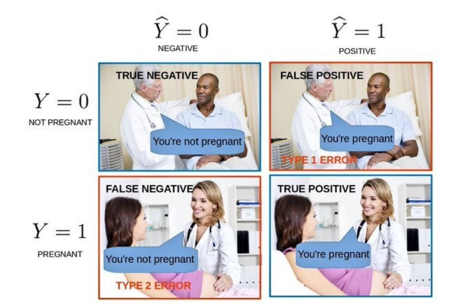
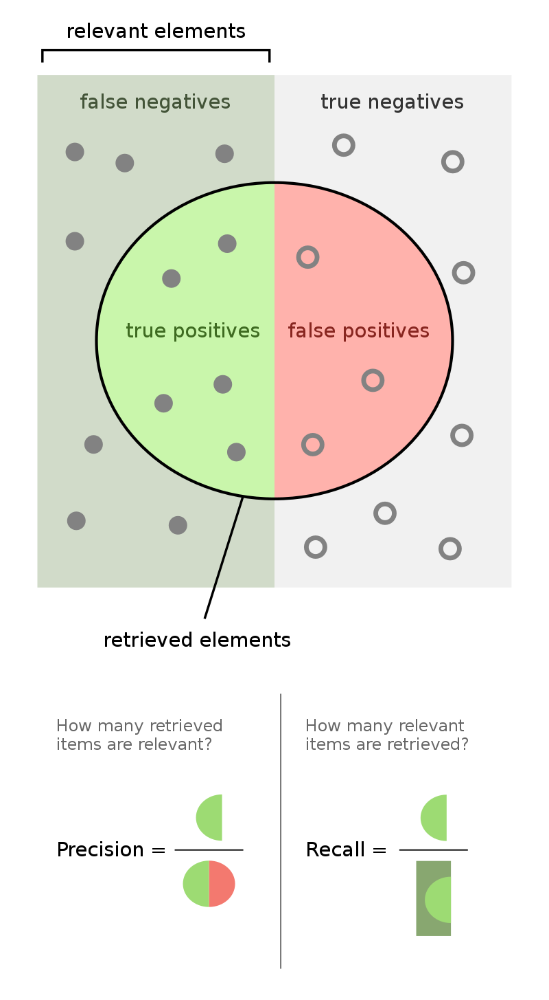
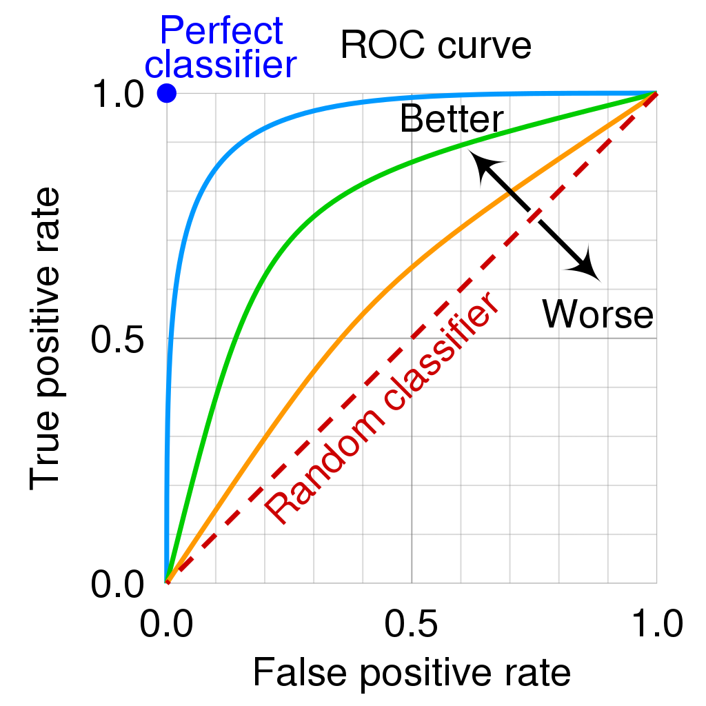
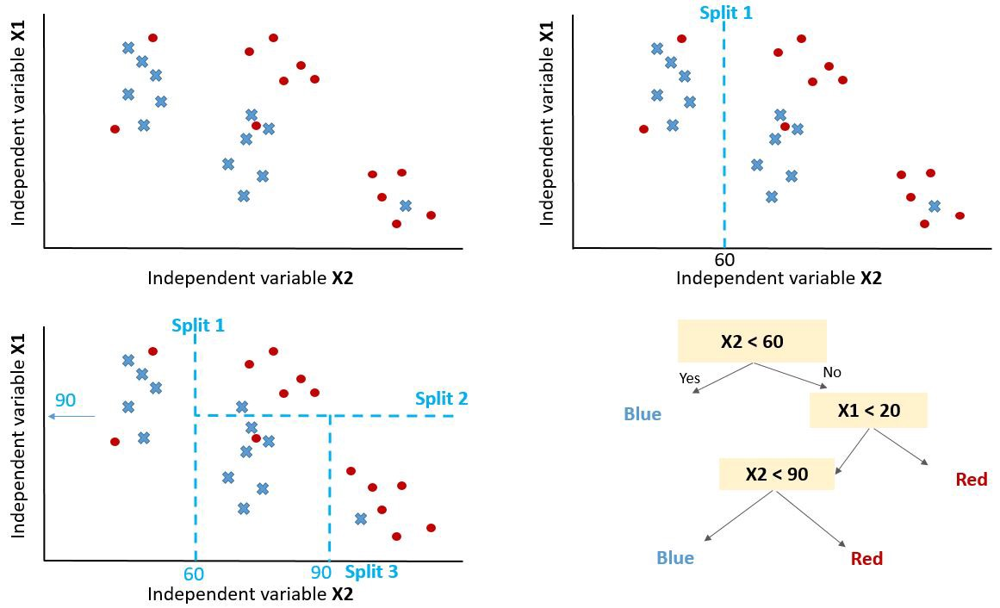
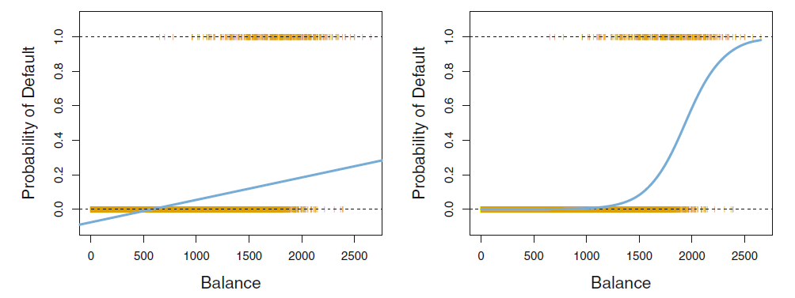
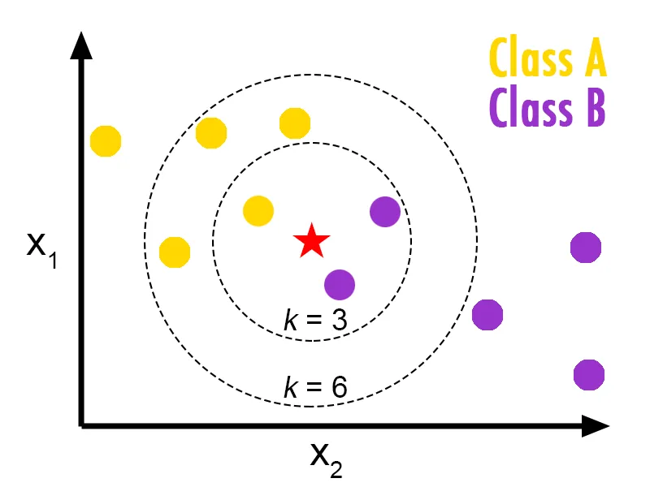

<!-- paginate: true -->

# Machine Learning in der Produktion - Klassifizierung

Serafin Kollegger & Julian Huber

---

## Klassifizierung

- Anstelle von numerischen Werten wird eine Klassifikation durchgeführt
- Meist wird eine Wahrscheinlichkeit für die Zugehörigkeit zu einer Klasse berechnet
- Häufig sind die Klassen binär
- z.B. $f(X) = P(y=1|X)=1-P(y=0|X)$
    - Klassenzuordnung erfolgt durch einen Schwellenwert $\theta$
    
$$
\hat{y} = \begin{cases} 1 & \text{wenn } f(X) > \theta \\ 0 & \text{sonst} \end{cases}
$$

---

### Fehlermaße

 

 

---

### Confusion Matrix

 

$\begin{array}{|c|c|c|}
\hline
& \text{Predicted: 0} & \text{Predicted: 1} \\
\hline
\text{Actual: 0} & TN & FP \\
\hline
\text{Actual: 1} & FN & TP \\
\hline
\end{array}$

 

* True Positive ($\text{TP}$): Die Instanz wurde korrekt als positiv ($1$) vorhergesagt
* True Negative ($\text{TN}$): Die Instanz wurde korrekt als negativ ($0$) vorhergesagt
* False Positive ($\text{FP}$): Die Instanz wurde fälschlicherweise als positiv ($1$) vorhergesagt
* False Negative ($\text{FN}$): Die Instanz wurde fälschlicherweise als negativ ($0$) vorhergesagt

---

### Precision, Recall, F1-Score

* $\text{Accuracy} = \frac{TP + TN}{TP + TN + FP + FN}$
    * Wie viele der vorhergesagten Instanzen sind korrekt?
* $\text{Precision} = \frac{TP}{TP + FP}$
    * Wie viele der als positiv ($1$) vorhergesagten Instanzen sind tatsächlich positiv?
* $\text{Recall} =\frac{TP}{TP + FN}$
    * Wie viele der tatsächlich positiven Instanzen wurden als positiv vorhergesagt?
* $\text{F1-Score} = 2 \cdot \frac{Precision \cdot Recall}{Precision + Recall}$

---

### Unbalanced Classes

- Bei ungleich verteilten Klassen kann die $\text{Accuracy}$ irreführend sein

 

$\begin{array}{|c|c|c|}
\hline
& \text{Predicted: 0} & \text{Predicted: 1} \\
\hline
\text{Actual: 0} & \text{TN}=900 & \text{FP}=100 \\
\hline
\text{Actual: 1} & \text{FN}=10 & \text{TP}=10 \\
\hline
\end{array}$

 

* Gegeben das Modell: $\hat{y}=0$

* $\text{Accuracy} = \frac{\text{TP} + \text{TN}}{\text{TP} + \text{TN} + \text{FP} + \text{FN}} = \frac{900 + 10}{900 + 100 + 10 + 10} = 0.91$
* $\text{Precision} = \frac{\text{TP}}{\text{TP} + \text{FP}} = \frac{10}{10 + 100} = 0.09$
* $\text{Recall} = \frac{\text{TP}}{\text{TP} + \text{FN}} = \frac{10}{10 + 10} = 0.5$

---

### Receiver Operating Characteristic (ROC) Curve

- Vergleicht die True Positive Rate (Recall) mit der False Positive Rate
- AUC (Area Under the Curve) gibt die Fläche unter der ROC-Kurve an
- Ein AUC von $1$ bedeutet ein perfektes Modell, ein AUC von $0.5$ bedeutet ein zufälliges Modell
- Die meisten Modelle geben eine Wahrscheinlichkeit für die Zugehörigkeit zu einer Klasse zurück
- Wenn die Wahrscheinlichkeit über einem Schwellenwert  $\theta$ liegt, wird die Instanz als positiv vorhergesagt
- Entsprechen kann man über den Schwellenwert die True Positive Rate und die False Positive Rate variieren und die ROC-Kurve erstellen

---

#### Beispiel verschiedene Schwellenwerte

 

* krank : Positiv
* gesund : Negativ

| $\hat{f}(X)$ Wahrscheinkeit für krank | $\theta$ Schwellenwert | $\hat{y}$ Vorhersage | $y$ Wahrheit | Gruppe |
|--------------------------|---------------|------------|---------|-|
| 0.9 | 0.8 | krank | krank | TP |
| 0.4 | 0.8 | gesund | gesund | TN |
| 0.6 | 0.8 | gesund | krank | FN |

| $\hat{f}(X)$ Wahrscheinkeit für krank | $\theta$ Schwellenwert | $\hat{y}$ Vorhersage | $y$ Wahrheit | Gruppe |
|--------------------------|---------------|------------|---------|-|
| 0.9 | 0.5 | krank | krank | TP |
| 0.4 | 0.5 | gesund | gesund | TN |
| 0.6 | 0.5 | krank | krank | TP |

 

---

## Modelle

* **Logistische Regression**: Abwandlung der linearen Regression für Klassifikation
* **kNearest Neighbors**: Klassifiziert anhand der k nächsten Nachbarn
* **Decision Trees**: Organisiert die Daten in einem Baum und trifft Entscheidungen anhand von Regeln

---

### Entscheidungsbäume / Decision Trees

 

 

* Jeder Knoten entspricht einer Entscheidung
* Jeder Blattknoten entspricht einer Klasse
* Der Baum wird anhand von Informations-Entropie oder Gini-Index erstellt
* Hyperparameter: Tiefe des Baumes, minimale Anzahl an Instanzen pro Blattknoten
* Erweiterungen: Random Forest, Gradient Boosting

---

### Logistische Regression

 

 

$$f(X) = \frac{1}{1+e^{-\beta_0-\beta_1X_1-\beta_2X_2-\ldots-\beta_nX_n}}$$

* Transformation der linearen Regression in den Bereich $[0,1]$
* mittels der Sigmoid-Funktion
* $f(X)$ ist die Wahrscheinlichkeit für die Zugehörigkeit zu einer Klasse

---

### kNearest Neighbors

 

 

* Klassifiziert anhand der k nächsten Nachbarn
* Hyperparameter: Anzahl der Nachbarn, Distanzmaß

---

## Feature Engineering

* Bei vielen Algorithmen ist es wichtig, die Daten entsprechend aufzubereiten
* Dies ermöglicht ein schnelleres Training und bessere Ergebnisse
---

### Normalisierung

 

| Observation | $y$ | Klasse | Schnabellänge mm $X_0$ | Schnabeltiefe in mm g $X_1$ | Gewicht in kg $X_2$ |
|---|---|---|---|---|---|
| 1 | 1 | Gentoo | 40 | 19 | 0.534 |
| 2 | 1 | Gentoo | 39 | 21 | 0.638 |
| 3 | 1 | Gentoo | 42 | 23 | 0.540 |
| 4 | 0 | Adélie | 20 | 18 | 0.453 |
| 5 | 0 | Adélie | 25 | 17 | 0.501 |
| 6 | $?$ | $?$ | 26 | 19 | 0.359 |

 

---

* Normalisierung einer Variable $X$ bedeutet, alles zwischen $0$ und $1$ zu setzen.

$$X_n=\frac{X−X_{\text{min}}}{X_{\text{max}}−X_{\text{min}}}$$

* Standardisierung einer Variable $X$ bedeutet, den Mittelwert ($\mu$) zu entfernen und durch die Abweichung ($\sigma$) zu teilen.

$$X_s=\frac{X−\mu}{\sigma}$$

---

$$\mu=\frac{1}{n}\sum_{j=1}^n x_j$$

$$\sigma=\sqrt{\frac{\sum_{j=1}^n (x_j-\mu)^2}{n-1}}$$

---

 

| Observation | $y$ | Klasse | Schnabellänge mm $X_0$ | Schnabeltiefe in mm $X_1$ | Gewicht in kg $X_2$ |
|---|---|---|---|---|---|
| 1 | 1 | Gentoo | 0.952 | 0.826 | 0.837 |
| 2 | 1 | Gentoo | 0.929 | 0.913 | 1.000 |
| 3 | 1 | Gentoo | 1.000 | 1.000 | 0.846 |
| 4 | 0 | Adélie | 0.476 | 0.783 | 0.710 |
| 5 | 0 | Adélie | 0.595 | 0.739 | 0.785 |
| 6 | ? | ? | 0.619 | 0.826 | 0.563 |

 

---

### Dummy und One-Hot-Encoding

* Da nicht alle Modelle mit kategorischen Variablen (z.B. Gender) umgehen können, müssen diese umgewandelt werden

 

| Observation | $y$ | Klasse | Schnabellänge mm $X_0$ | Schnabeltiefe in mm $X_1$ | Gewicht in kg $X_2$ | Gender |
|---|---|---|---|---|---|---|
| 1 | 1 | Gentoo | 40 | 19 | 0.534 | Male |
| 2 | 1 | Gentoo | 39 | 21 | 0.638 | Female |
| 3 | 1 | Gentoo | 42 | 23 | 0.540 | Female |
| 4 | 0 | Adélie | 20 | 18 | 0.453 | Male |
| 5 | 0 | Adélie | 25 | 17 | 0.501 | Female |
| 6 | ? | ? | 26 | 19 | 0.359 | Male |

 

---

#### Dummy Encoding

 

| Observation | $y$ | Schnabellänge mm $X_0$ | Schnabeltiefe in mm $X_1$ | Gewicht in kg $X_2$ | Gender_Male |
|---|---|---|---|---|---|
| 1 | 1 | 40 | 19 | 0.534 | 1 |
| 2 | 1 | 39 | 21 | 0.638 | 0 |
| 3 | 1 | 42 | 23 | 0.540 | 0 |
| 4 | 0 | 20 | 18 | 0.453 | 1 |
| 5 | 0 | 25 | 17 | 0.501 | 0 |
| 6 | ? | 26 | 19 | 0.359 | 1 |

 

---

#### One-Hot-Encoding

 

| Observation | $y$ | Schnabellänge mm $X_0$ | Schnabeltiefe in mm $X_1$ | Gewicht in kg $X_2$ | Gender_Male | Gender_Female |
|---|---|---|---|---|---|---|
| 1 | 1 | 40 | 19 | 0.534 | 1 | 0 |
| 2 | 1 | 39 | 21 | 0.638 | 0 | 1 |
| 3 | 1 | 42 | 23 | 0.540 | 0 | 1 |
| 4 | 0 | 20 | 18 | 0.453 | 1 | 0 |
| 5 | 0 | 25 | 17 | 0.501 | 0 | 1 |
| 6 | ? | 26 | 19 | 0.359 | 1 | 0 |

 

---

### Features aus Zeitreihen

* Zeitreihen können in verschiedene Features umgewandelt werden
* z.B. Lags, Mittelwert, Standardabweichung, Quantile, etc.
* Hierfür gibt es Bibliotheken wie [TS Fresh](https://tsfresh.readthedocs.io/en/latest/text/quick_start.html) und [Prophet](https://facebook.github.io/prophet/) für Prognosen

 

| $t$ Date | $y_t$ Temperatur | $y_{t-1}$ | $\max(y_{t-1},y_{t-2},y_{t-3})$ |
|---|---|---|---|
| 2022-01-01 | 20 | 19 | 19 |
| 2022-01-02 | 21 | 20 | 20 |
| 2022-01-03 | 22 | 21 | 21 |
| 2022-01-04 | 23 | 22 | 22 |
| 2022-01-05 | 24 | 23 | 23 |

 

* Bei Zeitreihen werden häufig autorergressive Modelle verwendet, welche die Vorhersage aus den vorherigen Werten berechnen, z.B.:
* Auf diese Weise kann die Zahl an Datenpunkten reduziert werden

$$\hat{y_t} = f(y_{t-1},\max(y_{t-1},y_{t-2},y_{t-3}))$$

---

### Transformation in Frequenzraum

* Bei einer Klassifikation von zeitabhängigen Daten kann es sinnvoll sein, die Daten in den Frequenzraum zu transformieren
* Hierfür gibt es verschiedene Methoden, z.B. die Fourier-Transformation

 

| $y$ Vogel | $X$ Wellenform | $X_{\text{Fourier, 50Hz}}$ | $X_{\text{Fourier, 100Hz}}$ | $X_{\text{Fourier, 150Hz}}$ |
|---|---|---|---|--|
| Amsel | `[123, 124, 125, 126, ...]` | `0.1` | `0.2` | `0.3` |
| Rotkehlchen | `[124, 123, 122, 121, ...]` | `0.2` | `0.1` | `0.3` |
| Star | `[125, 126, 127, 128, ...]` | `0.3` | `0.2` | `0.1` |

 

---

## 🏆 Aufgabe 12.4 (20%): Klassifikationsmodell für defekte Flaschen

- **Abgabeformalien:** Fügen sie ein Kapitel in ihrer Dokumentation hinzu, in dem Sie die Ergebnisse der Klasisfikation mittels Confusion Matrix und unten gezeigter Tabelle dokumentieren
- Erstellen Sie ein Klassifikationsmodell zur Vorhersage von defekten Flaschen anhand der Daten aus der `Drop Vibration`. Diese repräsentieren eine Zeitreihe der Vibrationen von Flaschen bei der Vereinzelung.
- Erstellen Sie eine Tabelle, welche die genuzten Spalten für die Vorhersage enthält und den F1-Score für die jeweiligen Spalten
- Als Orientierung kann folgendes Notebook dienen <a href="9_Classification_Python.ipynb" download>9_Classification_Python.ipynb</a>, welches auch im nächsten Abschnitt vorgestellt wird

z.B.: 
 

| Genutzte Features | Modell-Typ | F1-Score (Training) |F1-Score (Test) |
|------------------|------------|----------|----------|
| $\text{mean}()$         | kNN|          |          |
| $\text{mean}(), y_{t-1}$         | Log. Regression|          |          |
| ...         |            |          |          |

 

