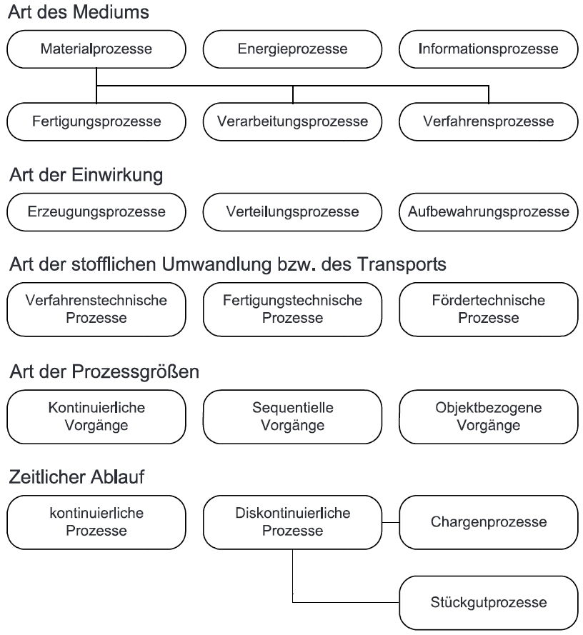
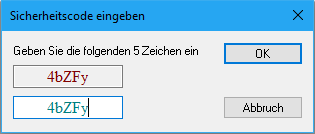
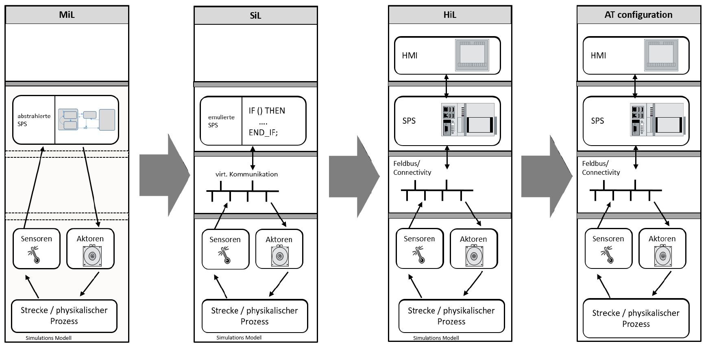

<!-- paginate: true -->

**SoSe 2024**
Serafin Kollegger & Julian Huber

# Automatisierungstechnik
**Grundlagen Automatisierungstechnik**
**SPS & SPS-Norm**
**Digitale E/A-Geräte**
**Einführung TwinCAT**
**Prozesszustandsbeschreibung**


---

# Grundlagen Automatisierungstechnik 

- Automatisierungstechnik ist ein interdisziplinäres Fachgebiet, in welchem Produktionsarbeiten durch Maschinen und Anlagen automatisiert werden. 
- Die Automatisierung erfolgt durch den Einsatz von prozessorbasierten Steuerungen in Kombination mit Ein-/Ausgangsmodulensowie Sensoren und Aktoren.
- Prozessorbasierte Steuerung:
    - Microcontroller
    - CNC-Steuerung
    - Roboter Steuerung 
    - Speicherprogrammierbare Steuerung  

---

- Eine Echtzeitfähigkeit der Steuerung ist notwendig. Echtzeitfähige Systeme werden häufig als oparative Technologies (OT) Systeme bezeichnet.
- Im gegensatz können die übergeordneten Produktionssysteme durch IT-Technologie umgesetzt werden. 
- Die hierarchische Darstellung der Unternehmensebenen zeigt, welche Systeme für eine Produktionsbetrieb benötigt werden und wie diese zusammenwirken . Dieses Schaubild wird auch Automatisierungspyramide genannt.

---

## Automatisierungspyramide


---

### Was ist Echtzeit?

---

### Echtzeit

.
- **weiche Echtzeitanforderungen:**

Echtzeitaufgaben haben eine vorgegebene Reaktionszeit, deren Verletzung aber noch nicht sofort katastrophale Auswirkungen hat. Beispiel: Medienwiedergabe

.
- **harte Echtzeitanforderungen:**

Eine Verletzung der vorgegebenen Reaktionszeit führt unmittelbar zum maximalen Schaden. Die Einhaltung der Zeitvorgabe ist noch wichtiger als bei der weichen Echtzeitanforderung. 
Beispiele: Brennen einer Blu-ray, Achsenansteuerung einer CNC Fräse.


---

### Echtzeit


---

### Echtzeit


---

# Grundlagen zur Automatisierung

## Begriffsdefinitionen

Die Automatisierungstechnik ist das technische Fachgebiet, das sich mit Technologien und Methoden beschäftigt, um einzelne Arbeitsschritte,  zusammenhängende Arbeitsschritte oder den gesamten Umfang von Arbeitsschritten eines Prozesses mit Hilfe von Anlagen, Maschinen und Geräten ohne menschliches Zutun auszuführen.

Ein Prozess wird nach ANSI/EIA-632-1998 als eine Reihe miteinander verbundener Aufgaben, die gemeinsam Inputs in Outputs umwandeln definiert.

---

## Darstellung eines Prozesses als Blackbox


---

## Technische Prozessumsetzung 

Damit der Prozess technisch umsetzbar ist, bedarf es einem System
(Anlage, Maschine oder Gerät), welches mit Hilfe der Prozessleittechnik
entwickelt wird.

 Die Prozessleittechnik ist die Ingenieursdisziplin, welche sich mit den Architekturen, Mechanismen und Algorithmen zur Aufrechterhaltung des Outputs eines bestimmten Prozesses, innerhalb eines gewünschten Bereichs befasst. 

---

## Darstellung eines Technischen Systems zur Prozessumsetzung


---

## Technischen Systems

- Das technische System übernimmt Grundfunktionalitäten für Steuerungs-, Regelungs- und Visualisierungsvorgänge.
- Diese Funktionen werden unter dem Begriff "Automatisierung" zusammengefasst.
- Als Steuerungen haben sich Speicherprogrammierbare Steuerungen (SPS) und Industrie-PCs (IPC) als Standard etabliert.
- Diese nutzt vorgefertigte Programme aus internen Speichern des Systems und bestimmen durch logische und mathematische Zusammenhänge neue Stellgrößen.
- Diese Stellgrößen werden durch die Komponenten des technischen Systems in physikalische Größen umgewandelt und greifen so in den technischen Prozess ein. 

---

## Unterscheidung Steuern und Regeln

- **Steuern:**
  - System bestimmt Ausgangsgrößen aufgrund vordefinierter Systemverhalten.
  - Zielgrößen werden nicht erfasst, und Störeinflüsse sind nicht kompensierbar.
  - Steuerungen verwenden oft digitale Messgrößen wie Näherungsschalter.
  - Ablaufsteuerung ist eine häufig implementierte Form des Steuerns von sequentiellen Prozessen.
  - Ablaufsteuerungen verwenden meist digitale Messgrößen als Feedback, um weitere Prozessschritte einzuleiten.

---

- **Regeln:**
  - Durch kontinuierliche Messungen der Prozessparameter wird die Abweichung zu den Vorgabeparametern verglichen.
  - Der entstehende Fehler wird durch einen Regler ausgeglichen, der die Stellgröße im System vorgibt.
  - Störeinflüsse können kompensiert werden.
  - Bei komplexen Automatisierungssystemen sind prozessschrittspezifische Vorgabeparameter erforderlich.
  - Diese Parameter werden in der Regel durch eine Ablaufsteuerung an die Regler übergeben.

---

### Vergleich Steuern und Regeln?

---

### Ziele der Automatisierung

Mit einer Automation von Prozessen bzw. Produktionsanlagen werden
unterschiedliche Ziele verfolgt. Teilweise können diese Ziele im
Widerspruch stehen, sodass eine Priorisierung auf anlagen- und
unternehmensspezifische Eigenschaften erfolgen muss. Die Ziele sind:

-   Steigerung der Qualität,

-   Humanisierung,

-   Steigerung der Sicherheit und

-   Rationalisierung.

---

### Wie können die Ziele der Automatisierung im Wiederspruch stehen?

---

## Klassifizierung von Prozessen

- Prozesse sind unterteilbar in verschiedene Klassen, daraus folgt:
    - unterschiedliche Anforderungen an das Automatisierungssystem 
    - technologisches Fachwissen
    - anwendbare Entwicklungsmethoden
- Die Klassifizierung von Prozessen erfolgt anhand verschiedener Kriterien, siehe Abbildung.



---

### Fragen zur Klassifizierung von Prozessen

Welche Prozessklassen kommen in einer Getriebefertigung vor?

Welche Prozessklassen werden in der Herstellung von Medikamenten benötigt?

---

### Antwort

**Getriebe** 
- Medienart: Materialprozesse mit Fertigungs- und Verfahrensschritten
- Einwirkungen: Verteilungsprozesse und Aufbewahrungsprozesse
- Prozessgrößen: Sequentielle Vorgänge 
- Zeitlicher Ablauf: diskontinuierlich 

**Medikamenten Herstellung**

- Medium und Stoffliche Umwandlung: verfahrenstechnischer Materialprozess
- Einwirkung: Erzeugungsprozess
- Prozessgrößen: kontinuierliche und sequentielle Vorgänge 
- Zeitlicher Ablauf: kontinuierliche Prozesse 

---

## Wann ist Automatisierung sinnvoll?


---

# Speicherprogrammierbare Steuerung - SPS

- Speicherprogrammierbare Steuerungen (SPS) sind aktuell die weitverbreitetste Hardware für die Automatisierung von Maschinen und Anlagen.
- Es existieren zwei etablierte Varianten: Hard-SPS mit speziell entwickelter Hardware und Soft-SPS mit Standardkomponenten aus PC-Systemen und herkömmlichem Betriebssystem (z.B., Windows).
- Hard-SPS besteht aus Stromversorgung, Steuerungsprozessor CPU, digitalen Ein- und Ausgangsbaugruppen sowie einem internen Bussystem.
- Soft-SPS ermöglicht die Ausführung anderer Software wie C++ Programme auf dem Industrie-PC.

---

- Zur Vermeidung von Blockaden zwischen rechnerinternen Prozessen ist eine spezielle Softwarearchitektur erforderlich, um den SPS-Code echtzeitfähig abzuarbeiten.
- Die Laufzeit (Runtime) ersetzt die speziell entwickelte Hardware CPU der Hard-SPS.
- Als Kommunikationsschnittstelle zu den Busklemmen dient ein Feldbussystem wie EtherCAT, ProfiNet usw.
- Moderne standard Netzwerkkarten können als Master des Feldbussystems konfiguriert werden.
- Beide SPS-Varianten unterliegen der SPS-Norm, die im folgenden Kapitel behandelt wird.

---

## SPS-Norm DIN EN 61131-3 (IEC 61131-3)

- Programmierung von automatisierten Systemen ist üblicherweise anwendungsspezifisch.
- Ziel der SPS-Norm: Rationelleres und herstellerunabhängiges Programmerstellungskonzept.
- Die Norm führt vier Grundkonzepte ein, um allgemeine und wiederverwendbare Programmbausteine zu entwickeln.
- In diesen Bausteinen sollten anwendungsspezifische SPS-Operanden, Eingänge, Ausgänge, Zähler und Zeitglieder sowie Merker nicht eingesetzt werden.
- Anlagenspezifische Zuweisungen, Zähler und Merker sollen erst bei der Erstellung des übergeordneten Anlagenprogramms berücksichtigt werden.
- Die vier Konzepte sind detaillierter in den nachfolgenden Punkten beschrieben.

---
### SPS-Norm DIN EN 61131-3 (IEC 61131-3)
-   **Datentypen**

    Eine einheitliche Definition für Datentypen, Konstanten und Variable
    sind verbindlich vorgeschrieben. Für symbolische und absolute
    Adressierungen sind die definierten Datentypen Grundlage der
    expliziten Ausführung der Variablendeklaration. Beispiele einiger Datentypen: 
     
     `bSensor AT%I* : BOOL;` &emsp; &ensp; Boolsche Variable, adressiert auf einen DI
     `iCount : INT := 100;`  &emsp; &emsp;  Ganzzahlige Zählervariable
     ``nNumber : BYTE;`` &emsp; &emsp; &emsp; &emsp;Bitfolge entsprechend einer Zahl
    `sText : STRING := 'AUT' ` &ensp;Textsymbole mit 4 Byte Speichergröße;
    `rTemp : REAL; ` &emsp; &emsp; &emsp; &emsp; Gleitkommazahl einer Temperatur 32 Bit Auflösung


---
### SPS-Norm DIN EN 61131-3 (IEC 61131-3)
-   **Programmorganisationseinheiten (POU's)**

    Programmorganisationseinheiten sind hierarchisch gegliederte
    Programmeinheiten, welche aus einem Hauptprogrammtypen (*Program*)
    mit Zugriff auf E/A-Operanden und zwei Unterprogrammtypen mit und
    ohne Speichermöglichkeit (mit *Function_Block* und ohne *Function*)
    besteht. 
    Aus dieser Organisationsform heraus, lassen sich verallgemeinerte
    Programmbausteine erstellen, welche beliebig oft in einer oder
    mehreren Anlagen eingesetzt werden können. Dadurch wird
    sichergestellt, dass bei immer wachsendem Automatisierungsaufwand
    von komplexer werdenden Anlagen, die Steuerungsentwicklung nicht im
    gleichen Maße ansteigt. Aus den entwickelten Bausteinen können dafür
    auch Bibliotheken angelegt werden.
---

#### Hierarchie von Programm Organisationseinheiten (POU)

 

---

### SPS-Norm DIN EN 61131-3 (IEC 61131-3)
-   **Programmiersprachen**

    Um die Varianz der Anwendungsfälle und der Programmierkenntnisse der    Steuerungsentwickler abzudecken sind fünf Programmiersprachen zur    Programmentwicklung zur Verfügung gestellt. Diese ermöglichen eine    grafische bzw. textuelle Programmerstellung und können z.B.Relaissteuerungen mittels dem Kontaktplan (KOP) oder Abläufe durch
    die Ablaufsprache (AS) einfach realisieren. Eine weitere grafische Programmsprache liegt mit der Funktionsbausteinsprache (FBS/FUP)    vor.

    Textuelle Programmiersprachen sind die Anweisungsliste (AWL), für die Programmierung von lineare Prozesse, oder der Sturkturierte Text (ST), mit hochsprachenähnlichen Funktionalitäten. Während  dieser Lehrveranstalltung wird ausschließlich mit ST gearbeitet.    Einige SPS-Systeme bieten auch die Möglichkeit UML-Graphen zur   erstellen. 

---

### SPS-Norm DIN EN 61131-3 (IEC 61131-3)
-  **Programmiersprachen**


---

### SPS-Norm DIN EN 61131-3 (IEC 61131-3)
-   **Programmablauf**

    Der Programmablauf basiert auf dem Taskkonzept, welches die
    Ausführung der Programmorganisationseinheiten priorisiert und
    zeitzyklisch oder ereignisorientiert abarbeitet. Bei der Entwicklung
    des Steuerungsprogramms muss der Code nach den zeitzyklischen oder
    ereignisorientierten Anforderungen entworfen werden.  
    
---

### SPS-Norm DIN EN 61131-3 (IEC 61131-3)
-   **Programmablauf**
  


---

### SPS-Norm DIN EN 61131-3 (IEC 61131-3)
- Zusätzlich Funktionalitäten in TwinCAT 3 


    - **Data Unit Type (DUT)- Anwenderspezifische Datentypen**

        Zusätzlich zu den Standard-Datentypen können Sie eigene Datentypen
    wie Strukturen, Aufzählungen/Enumeration, Referenzen und Unions
    definieren.

    -   **Globale Variablen Listen (GVL)**

        Der Inhalt von Globalen Variablen Listen ist innerhalb des
    SPS-Projektes für alle POU's zugreifbar. Deswegen
    eignen sie sich für die Verwendung von Hardware oder HMI
    Schnittstellen.

---

SPS-Programmierkonventionen

In der Welt der Programmiersprachen gibt es verschiedene Konventionen, die abhängig vom Tooling, Fokus und Ursprung der Programmiersprache sowie von der Branche, in der die Anwendung verwendet wird, Beachtung finden.

In Anlehnung an allgemein anerkannte Programmierrichtlinien (zum Beispiel die MISRA C++ 2008 – Guidelines[…], die Java Code Conventions, den C# Programming Guide oder PLCopen) finden Sie im Folgenden Programmierhinweise, die die Erstellung von optimalem und funktionstüchtigem SPS-Programmcode erleichtern.

---

Beachten Sie die SPS-Programmierkonventionen, um die folgenden Vorteile zu erreichen:

    einheitlicher Aufbau der SPS-Programme
    konsistente Benennung von Objekten, Variablen und Instanzen
    leichte Lesbarkeit und intuitive Verständlichkeit von Code und insbesondere von den Schnittstellen von Funktionsbausteinen, Methoden und Funktionen
    vereinfachte Entwicklung, Nutzung und Wartung der Programme
    erhöhte Codequalität durch die systematische und frühzeitige Vermeidung von Fehlerquellen

---

Neue Beckhoff TwinCAT 3 SPS Bibliotheken, Programmbeispiele und Applikationen richten sich nach diesen „TwinCAT 3 SPS-Programmierkonventionen“.

Ausnahmen:

    Tc2_MC2_xxx Bibliotheken entsprechen der PLCopen-Programmierkonvention.
    Tc2_xxx Bibliotheken entsprechen den ursprünglichen TwinCAT-2-Bibliotheken.
    Branchenspezifische Bibliotheken richten sich im Einzelfall nach dem Standard der Branche.
    Bausteine aus der IEC 61131-Norm, die Bestandteil der Bibliothek Tc2_Standard sind.
...

---

### TwinCAT Einführung I

---


# E/A-Geräte

- Alle Prozesssignale müssen durch E/A-Geräte erfasst bzw. gesetzt werden.
- Zur Reduzierung des Verkabelungsaufwands kommunizieren E/A-Geräte mit der SPS über Feldbussysteme.
- Bei Soft-SPS ist dieses Konzept immer erforderlich, während Hard-SPS in vielen Fällen auf das Feldbussystem verzichten kann, indem die Klemmen direkt an die SPS angeschlossen werden.
- Der Feldbus wird durch Buskoppler auf einen lokalen Klemmenbus übersetzt und galvanisch getrennt.
- Eingangsgeräte schreiben ihre Werte aus den Prozesssignalen auf den Klemmenbus, während Ausgangsgeräte die Klemmenbussignale lesen und die Prozesssignale setzen.
- Sowohl die Prozesssignale als auch der Klemmenbus sind galvanisch getrennt, was bei Störungen die Unversehrtheit der Bussysteme gewährleistet.

---

## Hardwarekomponenten


---

### Adressierung von Prozesssignalen

- Die Prozesssignale werden durch Adressen angesprochen, die flexibel oder explizit vergeben werden können.

**Flexible Adressierung**

- Flexible Adressbits bzw. -bytes, -words oder -doublewords können mit AT%I* oder AT%Q* vergeben werden. 
- Die Größe der zu übertragenden Daten wird automatisch festgelegt. 
- Die endgültige Zuweisung auf einen Klemmenkanal erfolgt durch manuelle Verknüpfung zu den E/A-Geräten. 
- Neben den Ein- und Ausgangsspeicherpräfixen I und Q gibt es einen Merkerspeicher mit Präfix M. 

---

**Explixite Adressierung**


---

## Digitale Ein- / Ausgangsklemmen

- Digitale Signale, auch als binäre Signale bekannt, haben Wertezuweisungen von logischer 0 oder 1 in der Steuerung.
- Es ist wichtig, das Spannungsniveau zu definieren, welches die logische 0 und 1 für physikalische Signale aus dem Prozess darstellt.
- Gängige Nennspannungen für digitale Signale sind 3 V, 4 V, 12 V oder 24 V, wobei es hierbei nicht um die Schaltniveaus, sondern nur um die Nennspannung geht.
- Da reale Signale niemals den genauen Spannungswert annehmen, werden Schaltniveaus aufgrund von Störungen und Leitungswiderständen festgelegt.
- Diese Schaltniveaus lassen sich in einer Hysteresiskurve darstellen.

---

### Hysteresiskurve von Digitalen Signalen


---

## Digitale Eingangsklemmen

- Bei der Auswahl von digitalen E/A-Klemmen ist es entscheidend, die Art des Sensors zu berücksichtigen.
- Es gibt eine grundlegende Unterscheidung zwischen 2-Leiter- und 3-Leiter-Sensoren.
- 3-Leiter-Sensoren benötigen im nicht ausgelösten Zustand weniger Leistung als 2-Leiter-Sensoren, da kein Reststrom für die Leistungsversorgung erforderlich ist.

---

### PNP | NPN Konzept (Sourcing | Sinking)

- Ein weiterer wichtiger Faktor bei der Auswahl ist die Bestimmung, ob der Sensor als Stromquelle oder als Stromsenke ausgeführt ist.
- Sensoren, die als Stromquelle agieren, werden als PNP (Positive-Negative-Positive) bezeichnet, und in diesem Fall muss das Eingangsgerät als Stromsenke fungieren.
- Digitale Eingangsgeräte mit einer Senkenfunktion sind beispielsweise die Modelle EL100x & EL101x.
- Falls der Sensor jedoch als NPN (Negative-Positive-Negative) Sensor konfiguriert ist, ändert sich die Richtung des Stromflusses.
- In diesem Fall sollte ein passendes Eingangsgerät mit Quellfunktionalität am Eingang ausgewählt werden, wie beispielsweise die Modelle EL108x & EL109x.

---

### 2- & 3-Leitersensoren (Sinking Device)


---

### NO | NC Konzept (Öffner | Schließer)
- Die Schaltzustände der Sensoren werden häufig mit "normally open" (NO) und "normally closed" (NC) bezeichnet.
- Dies bezieht sich auf das Verhalten der Sensoren im nicht aktiven Zustand.
- Bei NO liegt kein Signal am Eingangsgerät an, und innerhalb der SPS wird der Wert 0 *[FALSE]* angezeigt.
- Bei NC liegt ein Signal an, und der Wert 1 *[TRUE]* wird angezeigt.

---

### Schaltzustände NO & NC

 &emsp; &emsp; &emsp; &emsp; &emsp; 

---

## Prellung von mechanischen Tastern

- Mechanische Taster zeigen Tendenz zum Prellen, dabei entsteht wiederholtes Öffnen und Schließen des Kontakts durch elastische Materialverformungen.
- Das Prellen kann zu undefinierten Flanken führen, was Fehler im Steuerungsprogramm verursachen kann.
- Durch Eingangsfilter mit längeren Schaltzeiten, z.B. 3 ms, kann das Signal geglättet werden.
- Die Glättung des Signals stellt sicher, dass bei der Änderung der Schalterstellung eine klare Flanke erzeugt wird.


---

### Eingangsfilter (notwendig für mechanische Taster)


---

## Digitale Ausgangsklemmen

- Digitale Ausgangsklemmen bei SPS dienen dem Senden von digitalen (binären) Signalen an externe Geräte oder Aktoren.
- Sie ermöglichen das Schalten elektrischer Signale zur Steuerung von Prozessen in der realen Welt.
- Die Signalsteuerung kann durch Relais oder Halbleiterschalter realisiert werden.
- Es gibt interne (Typ 2) oder externe (Typ 1) Spannungsversorgungsmöglichkeiten.
- Externe Versorgung ermöglicht es in einigen Fällen das Schalten größerer Leistungen zu realisieren.
- Binärausgänge schalten oft induktive Lasten, was zu hohen Spannungsspitzen beim Trennen des Stromkreises führen kann.
- Eine Freilaufdiode verhindert das Auftreten dieser Spitzen. 


---

### Schaltbild von DO-Geräten mit externen oder interen Spannungsversorgung


---
###  Digitale Ausgangsklemmen
- Standartklemmen für digitale Ausgänge (DO) variieren im Nennstrom. Beispielsweise haben EL200x-Modelle mit 24 Vdc zwei, vier oder acht Kanäle mit 0.5 A, während EL202x-Modelle zwei oder vier Kanäle mit 2 A bieten.
- Einige Klemmen verfügen über zusätzliche Diagnosefunktionen wie Drahtbrucherkennung.
- Digitale Ausgänge können nach dem PNP- oder NPN-Prinzip arbeiten. Bei externer Spannungsversorgung kann die Masse (0 V) als Ausgang durchgeschaltet werden, wie bei der Klemme EL208x.
- Weiters gibt es verschiedene Ausführungsvarianten von digitalen Ausgängen, darunter Push-Pull-Outputs mit Tristate, pulsweitenmodulierte (PWM) Ausgänge für Aktoren oder LED-Steuerung, sowie PWM-Lichtwellenleiter-Ausgangssignale für spezielle Anwendungsfälle.
- siehe Beckhoff Infosys: Feldbuskomponenten/EL2xxx

---

## TwinCAT Einführung II

- Diese Abschnitte bieten lediglich einen allgemeinen Überblick über die TwinCAT-Entwicklungsumgebung und nicht eine umfassende Einführung.
- Die vollständige Dokumentation der Benutzeroberfläche und der TwinCAT-Projektstruktur ist im Beckhoff-Infosys verfügbar.
- Die Vorlesung behandelt die ersten Schritte in der TwinCAT 3 Entwicklungsumgebung, und es stehen Tutorial-Videos wie <https://www.youtube.com/watch?v=GOFUsWc61Hk&t=21s> von Christian Stöcker zur Verfügung.
---

**Projekterstellung und Lizenzierung I**

- TwinCAT 3, die Entwicklungsumgebung für Automatisierungsaufgaben, ist in Visual Studio integriert bzw. in der VS-Shell eingebettet.
- Jede Automatisierungsaufgabe wird in einem eigenen Projekt bearbeitet.
- Der Projektspeicherordner kann idealerweise denselben Namen wie das Projekt haben.
- Standardmäßig werden alle TwinCAT-Projekte im Pfad (C:\\ Users\\ \[Ihr Benutzer\]\\ Documents\\ TcXaeShell) gespeichert.
- Aufgrund unterschiedlicher Bibliothekspfade auf verschiedenen PCs gibt es ein Austauschformat namens .tnzip.
- Projekte können unter *[Datei/Save Project as Archive]* als .tnzip-Archiv gespeichert und durch *[Datei/Öffnen/Open Solution from Archive]* geöffnet werden.
- Beim Öffnen muss das extrahierte Projekt lokal in einen neuen Ordner gespeichert werden.

---

**Projekterstellung und Lizenzierung II**
- Um eine Soft-SPS-Instanz zu erstellen, wird innerhalb eines TwinCAT-Projektes ein SPS-Projekt aus einer vorgefertigte Vorlage erstellt.
- Mehrere SPS-Projekte können innerhalb eines Projekts entwickelt und auf einem IPC (Industrie-PC) ausgeführt werden.
- Vordefinierte Templates stehen zur Verfügung und beinhalten eine standardisierte Projektstruktur gemäß IEC 61131-3.
- Die Erstellung erfolgt durch einen Rechtsklick auf den SPS-Baustein am linken Bildrand mit *[Neues Element hinzufügen/Standard PLC Project]*.
- Die SPS-Instanz kann beispielsweise den Namen SPS haben, oder bei mehreren Instanzen SPS1 und SPS2.
- Eine Taskreferenz zum Programm *[Main]* ist bereits angelegt und mit einer Zykluszeit von 10 ms im System hinterlegt.

---

**Projekterstellung und Lizenzierung III**

- Die erstmalige Programmausführung ist nun möglich, selbst wenn noch kein Code vorhanden ist.
- Das Projekt muss durch Klicken auf die Schaltfläche *[Konfiguration aktivieren]*  in die Laufzeit geladen werden.
- Nach dem Aktivieren kann das Zielsystem (die Soft-SPS) in den *Run Mode*  versetzt werden.
- Lizenzen werden abgefragt und können durch Eingabe eines Codes für Entwickler für sieben Tage freigegeben werden.

&emsp; &emsp; &emsp; &emsp;&emsp;&emsp;&emsp;&emsp;&emsp;&emsp;&emsp;&emsp;

- Dieser Schritt kann beliebig oft wiederholt werden.

---

### Laufzeitmodi (Runtimemode)

- Der oben genannte *Run Mode* ist einer von drei Modi, die die
Laufzeit (Runtime) der SPS annehmen kann, die Symbole sind 


---

**Konfig Mode**
- Grundsätzlich ist beim Entwickeln die Laufzeit im *Konfig Mode*. Wie der Name schon vermuten lässt, kann in diesem Modus die SPS konfiguriert werden. D.h. die Zykluszeiten und Priorisierung der Tasks kann eingestellt werde, neue Programme und Programmsegmente können erzeugt werden u.v.m..

**Free Run Mode**
- Der zweite Modus ist der *Free Run Mode*. Mit diesem ist es möglich Peripheriegeräte und E/A-Geräte einzulesen und zu parametrisieren. D.h. im *Free Run Mode* ist eine aufrechte Verbindung über den Feldbus und andere Schnittstellen vorhanden.

**Run Mode**
- Im *Run Mode* ist die SPS einsatzbereit und kann gestartet werden. Ab diesem Zeitpunkt sind die Kerne der CPU für die Rechenzeit des Programms blockiert und somit ein echtzeitfähiger Betrieb möglich.

---


### Bibliotheken und Standard FB's

- In TwinCAT sind standardmäßig drei Bibliotheken (References) hinterlegt, die POU's nach IEC 61131-3 enthalten. Beispiele hierfür sind Timer, Stringfunktionen, Zähler und Trigger.
- Diese Bibliotheken ermöglichen zusätzlich den Zugriff auf systemeigene Parameter aus dem Programm heraus.
- Ein Beispiel für einen Bibliotheksfunktionsblock ist der *TON*, der eine Einschaltverzögerung umsetzt.
- Der Funktionsblock hat zwei Eingänge, *.In* vom Datentyp Bool und *.PT* vom Datentyp Time und zwei Ausgänge, *.Q* vom Datentyp Bool und *.ET* vom Datentyp Time.

---

### Blockschaltbild TON


---

### TON Funktionsweise
- Der Eingang *.IN* fungiert als Startsignal. Nach Ablauf der vorgegebenen Zeit *.PT* (Periodtime) wird der Ausgang *.Q* auf TRUE bzw. 1 gesetzt.
- Der zweite Ausgang *.ET* gibt die verstrichene Zeit (Elapsed Time) seit dem Startsignal an und behält den Wert der voreingestellten Zeit *.PT* nach Erreichen der Periodendauer.
- Sobald *.IN* auf FALSE gesetzt wird, wird die verstrichene Zeit *.ET* zurückgesetzt.
- Dieses Verhalten ist im Zeit-Signal Diagramm dargestellt.


---

### FB Aufruf in einem Programm
Aufgerufen wird ein Bibliotheksfunktionsblock, wie jeder Funktionsblock
durch Deklarierung im Deklarationsteil und Funktionsaufruf im
Programmteil.

```
PROGRAM MAIN                // Deklarationsteil
VAR
	fbTon 	    : TON;
	bIn 	    : BOOL;
	bOut 	    : BOOL;
	tPt	    : TIME;
	tEt	    : TIME;
END_VAR     
-----------------------------------------------------------------------------------------------
fbTon(	IN := bIn,                  // Programmteil
	PT := tPt,
	Q  => bOut,
	ET => tEt); 
```


---

# Einführungsaufgabe - Blinklicht

- Einführungsaufgabe: Entwurf eines Blinklichts als Einstieg in die SPS-Programmierung.
- Das Licht wird durch eine steigende Flanke eines Eingangs gestartet und bei erneuter Flanke ausgeschaltet.
- Die Flankenerkennung erfolgt durch einen Trigger-Funktionsbaustein (FB) *R_TRIG*.
- Die Blinklichtsteuerung wird durch einen TON Timerbaustein erstellt.
- Eine Probeinbetriebnahme soll anhand der virtuellen Teaching Factory durchgeführt werden.  

---

### Blockschaltbild Flankenerkennung R_TRIG

- Wenn der Eingang *.CLK* = TRUE wird, wird der Ausgang *.Q* = TRUE.
- Jede weitere Ausführung des FB gibt *Q = FALSE* zurück, bis eine fallende und erneut eine steigende Flanke auftreten.
  

---

### Start- und Stopsignal durch einen nicht rastenden Schalter

```
fbTrigOn(CLK:= bIN , Q=> );

// Flankenabfrage
IF fbTrigOn.Q AND NOT bBlink THEN
	bBlink := TRUE;
ELSIF fbTrigOn.Q AND bBlink THEN
	bBlink := FALSE;
END_IF 
```


---

## Blincklichtsteuerung

- Das Blinklicht kann mithilfe eines *TON* FB erzeugt werden.
- Der negierte Ausgang *.Q* wird mit dem Startsignal *bBlink* durch ein logisches UND-Verknüpfung auf den Eingang *.IN* des FB *TON* geschrieben.
- Dies führt zu einem periodischen Sägezahnsignal von *.ET*, wie im Zeit-Signal-Diagramm dargestellt ist.

---

### Zeit-Signal-Diagramm des zyklischen TON
&emsp; &emsp; &emsp; &emsp;  

---
### Erstellung des Periodischen Blinksignals 

- Das eigentliche Blinksignal kann durch eine Abfrage, ob die erstrichene Zeit kleiner oder größer als die halbe Periodendauer ist, erstellt werden.
- *bOut* ist der Ausgang des Blinksignals 

```
fbTON(IN:=bBlink AND NOT fbTON.Q, PT:=T#1S);

IF bBlink AND fbTON.ET < T#1S/2 THEN
	bOUT := TRUE;
ELSE
	bOUT := FALSE;
END_IF
```

---

## FB Implementierung 

- Die Start- und Stopfunktion kann zusammen mit der Blinklichtsteuerung in einem Funktionsbaustein *FB_BlinkBsp* implementiert werden.

&emsp; &emsp; &emsp; &emsp; &emsp; &emsp; &emsp; &emsp; 

---

## FB Verwendung im MAIN 


- Um den Funktionsbaustein [FB_BlinkBsp]{.roman} auszuführen, muss dieser
im Programm [MAIN]{.roman} aufgerufen werden und mit den richtigen
Signalen der [IFC_HW]{.roman} verknüpft werden.
- Die GVL *IFC_HW* ist das Hardware Interface der Teaching Factory, in ihr werden alle Prozesssignale zusammengefasst, um sowohl die reale als auch virtuelle Anlage steuern zu können. 
- Download von Sakai *Ressourcen/Source Code Files/IFC_HW.TcGVL* möglich   

```
PROGRAM MAIN
VAR	
	fbBlink		: FB_BlinkBsp;
	
END_VAR
------------------------------------------------------------------------------------------------
fbBlink(bIN:=IFC_HW.bExecute , bOUT=>IFC_HW.bAmpelGelb );
```


---


# Prozesszustandsbeschreibung

- Die beiden hier besprochenen Prozessbeschreibungsvarianten dienen der grafischen Darstellung von ansonsten verbal beschriebenen Prozessen.
- Einsatz finden diese Beschreibungen bei der Programmerstellung, Inbetriebnahmen und Fehlersuche. 
- Mit Hilfe einer richtig erstellten Prozessbeschreibung, ist die Lösung der entsprechenden Steueraufgabe quasi gefunden.

---

## Ablauf-Funktionsplan

- Der Ablauf-Funktionsplan eignet sich für Prozesse mit unterscheidbaren Aktionen, die ereignis- oder zeitgesteuert in Reihen- oder Parallelfolge ablaufen.
- Er bietet grafische Elemente für eine Ablaufbeschreibung, die Steuerzustände mit entsprechenden Aktionen und Übergangsstellen mit entsprechenden Bedingungen darstellen.
- Die Herausforderung bei der Anwendung dieser Methode liegt in der Einteilung der Steuerzustände und Übergangsstellen, was Übung und Erfahrung erfordert.
- Der Ablauf-Funktionsplan dient dazu, das Denken während der Entwurfsphase der Anlage zu unterstützen.


---

## Ablauf-Funktionsplan
Beispiel 2-Punkt Temperaturregelung


---


## Zustandsübergangsdiagramm 

- Wenn Prozessabfolgen keinen zwangsläufigen schrittweisen Ablauf mehr haben, wird die Anwendung des Ablauf-Funktionsplans schwierig.
- Eine alternative Beschreibungsmethode in solchen Fällen ist das Zustandsübergangsdiagramms.
- Ein Zustandsübergangsdiagramm beschreibt eine Zustandsmaschine (State Machine), die es ermöglicht, aus jedem Zustand in jeden anderen Zustand zu wechseln, sofern dies für den Ablauf des Prozesses erforderlich ist.
- Jeder Zustand wird als Kreis mit einer eindeutigen Nummer dargestellt.
- Die Übergänge zwischen den Zuständen werden im Diagramm durch Pfeile dargestellt, wobei aus einem Zustand mehrere Übergänge wegführen bzw. hinführen können.
- Ähnlich wie bei Ablauf-Funktionsdiagrammen können in den Zuständen und Übergängen Aktionen durchgeführt werden, bis der Zustand verlassen oder die Transition vollendet ist.

---

## Zustandsübergangsdiagramm
Beispiel einer Maschinentürsteuerung


---

#### Info
Da es in dieser Prozessbeschreibung mehrere Transitionen pro Zustand
geben kann und diese auch gleichzeitig zutreffen können ist eine
Priorisierung der Übergänge notwendig. Dies kann durch aufsteigende
Nummerierung der Pfeile festgelegt werden. Wobei 1 die höchste Priorität
ist.

Um beim Start der State Machine aus einem definierten Zustand zu
starten, wird dieser durch einen gestrichelten Pfeil aus dem Nichts
gekennzeichnet. Dieser Zustand wird normalerweise mit der Zustandsnummer
0 nummeriert.

---

#### Info
Bei Störungen oder ähnlichem kann es notwendig sein, Sprunghaft den
Zustand zu wechseln. Der Zielzustand, z.B. Fehlerzustand, muss von allen
Zuständen aus erreichbar sein. Diese Art der Transition wird als
Any-Transition bezeichnet und mit einem durchgehenden Pfeil aus dem
Nichts in den Zustand markiert. Diese Transition sollte immer mit
höherer Priorität als die Transitionen zwischen den Zuständen versehen
sein. Um nach Aufhebung der Störung wieder mit dem Prozess fortfahren zu
können, gibt es Return-Transitionen, welche durch einen Merker den
Zustand vor der Any-Transition gespeichert haben. Die Priorität dieser
Transition muss nicht zwangsläufig höherer ausfallen wie die der
allgemeinen Schrittkette. 


---


## Virtuelle Inbetriebnahme

- Die virtuelle Inbetriebnahme (VIB) ermöglicht den virtuellen Durchlauf des Inbetriebnahmeprozesses, noch bevor physische Anlagenkomponenten vorhanden sind.
- Diese Methode bezieht sich auf die Simulation und Überprüfung von Anlagenprozessen und -steuerungen in einer virtuellen Umgebung.
- Software-Tools bilden alle relevanten Aspekte einer Produktionsanlage virtuell nach, einschließlich Steuerungen, Sensoren, Aktoren und mechanischer Komponenten.
- Früherkennung von Fehlern und Problemen im Steuerungs- und Automatisierungssystem vor der physischen Installation hilft, teure Nachbesserungen zu vermeiden.
- Die Simulation ermöglicht die Optimierung und den Test von Steuerungsprogrammen, um eine effiziente und fehlerfreie Funktionalität sicherzustellen.
- Die Methode ermöglicht Schulungen und Training für das Bedienpersonal vor der physischen Anwesenheit der Anlage.

---

### Einsatzbereich der VIB
- Die virtuelle Inbetriebnahme wird in verschiedenen Branchen wie der Automobilindustrie, Luft- und Raumfahrt, Prozessindustrie und Fertigung eingesetzt.
- Integration von Product Lifecycle Management (PLM)-Systemen für eine nahtlose Verbindung zwischen virtueller und realer Umgebung.
- Früherkennung und Behebung von Fehlern sowie Optimierung von Steuerungsprogrammen durch diese Methode.
- Effiziente und risikoarme Entwicklung, Validierung und Inbetriebnahme von Produktionsanlagen.
  
---

### XiL (X in the Loop)
- Abkürzungen MiL, SiL, HiL und AT configuration sind mit verschiedenen Phasen der virtuellen Inbetriebnahme verbunden und repräsentieren unterschiedliche Testebenen.

&emsp;&emsp; &emsp; &emsp; 

---

**MiL - Model-in-the-Loop**

MiL bezieht sich auf die Testebene, bei der das Modell der
Steuerungssoftware in einer Simulationsumgebung getestet wird, noch
bevor die reale Hardware verfügbar ist. Hier wird das Simulationsmodell
des Steuerungssystems verwendet, um die Funktionalität und das Verhalten
der Software zu überprüfen.

---

**SiL - Software-in-the-Loop**

Bei SiL wird die Testebene erreicht, wenn die Software in einer
Simulationsumgebung auf ihre Funktionalität überprüft wird. Hierbei wird
das reale Steuergerät oder die Hardware-Schnittstelle simuliert, um die
Wechselwirkung zwischen der Software und der Hardware zu testen.

---

**HiL - Hardware-in-the-Loop**

HiL bezieht sich auf die Testebene, bei der die reale Hardware in einer
physikalischen Simulation integriert wird. Hier wird die
Steuerungssoftware mit der Simulierten Hardware verbunden, um das
Zusammenspiel in einer realistischen Umgebung zu überprüfen. Dies
ermöglicht eine detaillierte Verifikation der Steuerungssoftware in
Bezug auf die physischen Hardwarekomponenten.

---

**AT configuration - Acceptance Test Configuration**

AT configuration bezieht sich auf die Konfiguration der Akzeptanztests.
In dieser Phase wird die virtuelle Inbetriebnahme genutzt, um
sicherzustellen, dass das Gesamtsystem, bestehend aus Hard- und
Software, die gestellten Anforderungen erfüllt. Dies ist die letzte
Stufe vor der physischen Inbetriebnahme der Anlage.

Zusammengefasst spiegeln diese Abkürzungen die schrittweise Entwicklung
und Verfeinerung der virtuellen Inbetriebnahme wider, beginnend mit dem
Modelltest (MiL), über den Softwaretest (SiL), den Hardwaretest (HiL)
bis hin zur Akzeptanzprüfung (AT configuration) des Gesamtsystems. Diese
Schritte helfen dabei, Fehler frühzeitig zu erkennen, die Software zu
optimieren und die Gesamtzuverlässigkeit der Anlage sicherzustellen,
bevor diese physisch aufgebaut wird.

---

# Basisaufgaben - 10 Punkte (MECH & WING)

Diese Beispiele dienen zur Erhöhung des Verständnisses der bisherigen
Inhalte und sollen direkt Einblicke in eine praktische Umsetzung geben.
Im ersten Beispiel wird die Vereinzelung der Teaching Factory
beschrieben. Das zweite Beispiel dient der Erstellung einer
Betriebszustandsanzeige in Form einer Ampelleuchte. Bitte beachten Sie,
dass eine zeitnahe Umsetzung von großem Vorteil ist, da die hier
besprochenen Inhalte in den nächsten Kapiteln verstanden werden müssen.

---

## Vereinzelung  

Die Vereinzelung ist der erste Arbeitsschritt im Abfüllprozess der
Teaching Factory. Die hier gezeigte Implementierung und das zu Grunde
liegende Konzept können mit wenigen Anpassungen für alle
Vereinzelungsprozesse verwendet werden. Zur Umsetzung dieses Beispiel
wird der Automatisierungsprozess in sechs Schritte unterteilt. Durch
diese Vorgangsweise können auch alle weiteren Prozesse automatisiert
werden. Die einzelnen Schritte sind:

---

-  **Prozessschema erstellen (Anlagendesign)**, dabei soll die allgemeine
    Funktionsweise bildlich dargestellt und alle Komponenten mit Namen
    versehen werden. Der Prozess kann wörtlich beschrieben werden.

-   **Ablaufdiagramm erstellen (Anlagenablauf)**, aus dem Prozessschema soll
    ein Ablauf definiert werden. Hier ist speziell auf die Reihenfolge
    und Prozessverzweigungen Rücksicht zu nehmen. Durch die
    Namensvergebung der Komponenten ist eine eindeutige Zuordnung
    zwischen Prozessschema und Ablaufdiagramm vorhanden.

-   **Sensor- und Aktuatorauswahl (Anlagenauslegung)**, durch die Auswahl
    der Sensoren und Aktuatoren sind die notwendigen Elektrischen
    Signale bekannt.

---

-   **Auswahl der E/A-Geräte (Anlagensteuerung)**, mit der Signalliste der
    Sensoren und Aktuatoren können passende E/A-Geräte definiert werden.

-   **SPS-Programmierung (Anlagenprogrammierung)**, mit Hilfe des
    Ablaufdiagramms und der Signalliste kann jeder Schritt im Prozess
    mit den dazugehörenden Signalzuständen beschrieben und in ein
    Zustandsübergangsdiagramm überführt werden. Dieses Diagramm dient zu
    Programmierunterstützung.

-   **Prozess und Programmoptimierung (Anlagenoptimierung)**, der Prozess
    und das Programm können validiert und optimiert werden nachdem der
    Prozess automatisiert wurde.

---

**1. Prozessschema erstellen (Anlagendesign)**

- Das Schema der Vereinzelung, dargestellt in nachstehender Abbildung, umfasst:
  - Den vertikalen Speicherbereich, der die Teileförderung durch Gravitation ermöglicht.
  - Die Vereinzelungskammer, die durch zwei Schleusen begrenzt ist.
  - Notwendige Sensoren für die Teileerkennung.
  - Ein Abtransportsystem, dargestellt als Förderband, das in anderen Anlagen durch unterschiedliche Komponenten wie z.B. eine Rutsche ersetzt werden kann.

---

### Schema der Vereinzelung 


---

### Ablaufbeschreibung
- Ausgangszustand: Der Speicher wird manuell mit Flaschen befüllt, und beide Schleusen befinden sich in geschlossener Position.
- Die Sensoren "Flaschenkopf" und "Flasche in Speicher" detektieren eine korrekt positionierte Flasche durch die Signalkombination "Flaschenkopf" = FALSE und "Flasche in Speicher" = TRUE.
- Die erste Schleuse kann geöffnet werden, bis der Sensor "Flasche in Kammer" eine Flasche erkennt.
- Nach dem Erkennen wird die obere Schleuse wieder geschlossen.
- Sobald die obere Schleuse geschlossen ist, kann die untere Schleuse geöffnet werden und wird wieder geschlossen, wenn die Flasche die Kammer verlassen hat.
- Damit ist der Ausgangszustand wieder erreicht, und der Prozess kann erneut beginnen.

---

**2. Ablaufdiagramm erstellen (Anlagenablauf)**

- Um den Prozess von menschlicher Sprache in Maschinensprache zu überführen, bietet sich die Erstellung eines Ablaufdiagramms an.
- Das Ablaufdiagramm ist in nachstehender Abbildung dargestellt und umfasst drei Symboltypen:

&emsp; &emsp; &emsp; &emsp; &emsp; &emsp; 


- Für die meisten Ablaufdiagramme sind diese Symbole ausreichend. Zusätzliche Symbole, für zum Beispiel Datenspeicherung oder Meldungen, können bei bedarf ergänzt werden.
---

### Ablaufdiagramm Vereinzelung
 

---

- Der Vereinzelungsprozess besteht aus vier Arbeitsschritten, da jede Schleuse einmal geöffnet und geschlossen werden muss.
- Es gibt drei Zustandsabfragen, wobei die letzten beiden in den vorherigen Arbeitsschritt zurückkehren. Somit gibt es keine Prozessverzweigung, sondern ein Arbeitsschritt wird so lange ausgeführt, bis eine Änderung der Abfrage erfolgt.
- Bei der ersten Abfrage erfolgt eine Art Prozessabzweigung, bei der eine Fehlermeldung für nicht vorhandene Flaschen angezeigt wird.
- Diese Fehlerbehandlung wird vorerst vernachlässigt und später im Kapitel zur Fehlerbehandlung wieder aufgenommen.
- Eine Mischung von Prozessprogramm und Fehlerbehandlungsprogrammen führt zu einem unübersichtlichen Code und erfordert daher eine andere Vorgehensweise.

---

**3. Sensor- und Aktuatorauswahl (Anlagenauslegung)**

- Die Flaschenförderung im Speicher wird durch Gravitation realisiert, wobei alternative Methoden wie die Verwendung von Förderbändern möglich sind.
- Es ist wichtig, zwischen aktiven und passiven Fördersystemen zu unterscheiden, da dies einen Einfluss auf die erforderlichen E/A-Geräte hat.
- Die Separation der Flaschen erfolgt durch zwei Schleusen, aber auch ein Drehtisch mit einer Ausnehmung für eine Flasche könnte genutzt werden.
- Sowohl lineare als auch rotierende Antriebe können als Aktuatoren für die Separation dienen, wobei es zahlreiche Ausführungsvarianten für beide Kategorien gibt.
- Die Flaschenförderung nach der Vereinzelung kann entweder durch eine rutschfähige Bahn als passives Element oder durch ein Förderband mit einem entsprechenden Aktor als aktives Element implementiert werden.

---

- Die Detektion von Flaschen bietet diverse Möglichkeiten, bei denen unterschiedliche Sensoren einsetzbar sind oder sogar auf Sensoren verzichtet werden könnte, was jedoch die Steuerbarkeit der Anlage einschränken würde.
- Die Umsetzung des Prozesses durch die Auswahl verschiedener Wirkprinzipien, Aktuatoren und Energieversorgungsformen ermöglicht eine facettenreiche Gestaltung der Anlage.
- In nachstehender Tabelle sind die gewählten Sensoren und Aktoren für die Vereinzelung nach dem Schema der Vereinzelung, aus vorherigen Abschnitt, aufgelistet.

---
#### Sensor / Aktor - Liste


---

**4. Auswahl der E/A-Geräte (Anlagensteuerung)**

- Für die im technischen System vorhandenen digitale Ein- und Ausgänge können passende E/A-Geräte ausgewählt werden.
- Sensor-Signale können mit einer digitalen Eingangsklemme in die Steuerung integriert werden, wobei auf den Prellschutz in der Eingangsklemme verzichtet werden kann, da es sich um nichtmechanische Sensoren handelt.
- In diesem Beispiel wird eine 8-Kanal Klemme verwendet, da es in den weiteren Komponenten der Teaching Factory zusätzliche digitale Eingangssignale gibt, die auf der selben Klemme angeschlossen werden.
- Bei den bipolaren 24 V Signalen ist die Auswahl etwas komplexer. Während des Ausfahrens der Zylinder muss Leitung A mit 24 V versorgt und Leitung B an 0 V angeschlossen sein. Um den Zylinder wieder einfahren zu können, muss eine Umpolung in den Leitungen A und B erfolgen.
- Dieses Verhalten kann durch eine Relaisschaltung mit vier Relais umgesetzt werden, wie in folgender Abbildung dargestellt.

---

### Relaisschaltung für 2 E-Zylinder


---

#### Klemmen-Variablen Verknüpfung
- Die Kanäle 1 und 2 der beiden Klemmen EL 2652 müssen mit den Aktuatorenanschlüssen verdrahtet werden.
- Dadurch wird Kanal 1 der Klemme 11 (K11) die Funktion zugewiesen, den zweiten Aktor zu öffnen, wenn das Relais geschaltet wird. Voraussetzung dafür ist, dass Kanal 1 der Klemme 12 (K12) nicht betätigt wird und somit das Relais auf 0 V durchschaltet.
- Gleiches gilt für Aktor 1 und Kanal 2 an der Klemme 11 und 12.
- Die Zuweisung aller Kanäle der Klemmen ist in nachstehender Tabelle ersichtlich.
- Auch die DI's für die Klemme EL1018 werden dort aufgelistet.
- Diese Prozesssignale und alle weiteren Prozesssignale der Teaching Factory werden innerhalb der SPS-Steuerung in einer Globalen Variablen Liste *IFC_HW* zusammengefasst, was das Hardware Interface bildet und die Signale der Anlage mit den Variablen des Steuerungsprogramms verknüpft.

---
#### Klemmen-Variablen Verknüpfung


---

**5. SPS-Programmierung (Anlagenprogrammierung)**

- Der Prozess der Vereinzelung wird durch einen Funktionsblock implementiert, der für mehrere Vereinzelungen einsetzbar ist.
- Die E/A-Signale aus obiger Tabelle (Klemmen-Variablen Verknüpfung) werden nicht Eins zu Eins als E/A-Variablen für diesen Funktionsblock verwendet.
- Stattdessen werden die Schaltzustände der Ezylinder durch zwei bool'sche Variablen *bGate1* und *bGate2* ersetzt.
- Somit wird der Funktionsblock hardwareseitig abgegrenzt, um für andere Aktuatortypen einsetzbar zu bleiben. 
- Die Schleusen sind im Zustand *False* von *bGate1* oder *bGate2* geschlossen und im Zustand *True* für *bGate1* oder *bGate2*  geöffnet.

---

- Die Zuordnung zu den globalen Variablen aus der *IFC_HW* und somit den tatsächlichen Relaiszuständen erfolgt nach Aufruf des Funktionsblocks durch eine weitere Funktion im übergeordneten, anwendungsspezifischen Hauptprogramm.
- Um sicherzustellen, dass der Prozess gemäß dem Ablaufdiagramm funktioniert, müssen die Ausgangszustände für jeden Arbeitsschritt definiert werden.
- Die Signale müssen den Abfragen entsprechend zugeordnet werden, damit der Zustand im richtigen Moment wechselt.
- Diese Zuordnung der Zustände und Signale wird in Abbildung nachstehender Abbildung dargestellt, wobei auch eine Durchnummerierung nach Zustandswechsel erfolgt.

---

#### Zustandssignalliste (ohne Signale)


---

#### Zustandssignalliste


---


---

### Erstellung des Zustandsübergangsdiagramms 
- Die Implementierung der Prozessschrittkette in Strukturierten Text (ST) wird durch das Zustandsübergangsdiagramm erleichtert.
- Da es sich um ein einfaches Beispiel handelt und die Zustandsvariablen auf zwei bool'sche Werte beschränkt sind, können diese in die Zustände S1 bis S5 eingetragen werden.
- Bei komplexeren Systemen ist es oft übersichtlicher, die Zustandsvariablen nur in der Zustandsliste anzuführen.

---

#### Zustandsübergangsdiagramm der Vereinzelung

**Ausgänge:**
``bGate1(2) := False;`` &#8594; Schleuse zu
``bGate1(2) := True;`` &#8594; Schleuse offen
**Eingänge:**
``bSens1 := True;`` &#8594; Flasche in Kammer
``bSens2 := True;`` &#8594; Flasche in Speicher
**Interne Variablen:**
``fbTimer : TON``
``nState : INT``


---

#### Programmüberführung
- Die Programmüberführung aus dem Zustandsübergangsdiagramm in Strukturierten Text (ST) erfolgt durch die Verwendung einer CASE-Anweisung.
- Die CASE-Anweisung dient der Auswahl von 1-n unterschiedlichen Programmteilen basierend auf einer INTEGER Variable.
- Für das Programmieren einer State Machine kann die Zustandsnummer S1-Sn als Auswahlvariable verwendet werden.
- Im Programmteil werden die Signalzustände entsprechend gesetzt.
- Zum Verlassen eines Zustands wird eine einfache IF-Anweisung verwendet, die die Eingangsvariablen der Übergangsbedingung abfragt.
- Sobald die Übergangsbedingung erfüllt ist, werden die Aktionen der IF-Abfrage ausgeführt, wie beispielsweise "on exit" Aktionen und das setzen der Auswahlvariable auf die neue Zustandsnummer.
- Ein Beispiel hierfür ist der Zustand S1 mit der Auswahlvariable nState: INT := 1.

---
#### Programmüberführung mit CASE-Anweisung

``` 
 CASE nState OF
 1: // Start
 	// Zustand
 	bGate1 := FALSE;
	bGate2 := FALSE
 
 	IF bSens2 THEN
 		nState := 2; // oeffnen Schleuse oben
 	END_IF
 
 2: // oeffnen Schleuse oben	
	...

 n: // n-ter State 
 END_CASE
 ```

---

#### CASE-Anweisung mit Enumerationsinstanzen

```
 CASE State OF
 State.Start: 
 	// Zustand
 	bGate1 := FALSE;
	bGate2 := FALSE
 
 	IF bSens2 THEN
 		State := State.OpenGate1; 
 	END_IF
 
 State.OpenGate1: 	
	...

 n: // n-ter State 
 END_CASE
 ```

---
### Hardware Schnittstelle

- Aufgrund unzureichender Ausgänge dieses Funktionsblocks zur Ansteuerung der Relais muss ein weiterer Funktionsbaustein erstellt werden.
- Dieser Funktionsbaustein soll die Relaissignale gemäß der Tabelle "Signalliste" ausgeben.
- Die Wahrheitstabelle für einen Aktor ergibt sich aus dieser Tabelle.
- Da zwei Ausgangswerte benötigt werden, kann keine einfache Funktion verwendet werden.
- Ziel des Funktionsbausteins ist es, die Ablaufsteuerung für allgemeine Vereinzelungen zu ermöglichen und die anwendungsspezifischen Signale in der übergeordneten Steuerung zu setzen.

---

#### Wahrheitstabelle Relaissteuerung


---

#### Relaissteuerung FB
``` 
FUNCTION_BLOCK FB_RCrtl
VAR_INPUT
	bIN : BOOL;
END_VAR
VAR_OUTPUT
	bQ1 : BOOL;
	bQ2 : BOOL;
END_VAR
-------------------------------------------------

IF bIn THEN
	bQ1 := TRUE;
	bQ2 := FALSE;
ELSIF NOT bIn Then
	bQ1 := FALSE;
	bQ2 := TRUE;
END_IF
```

---

**6. Prozess- und Programmoptimierung (Anlagenoptimierung)**

- Im aktuellen Steuerprogramm der Vereinzelung zeigen sich zwei ungünstige Verhaltensweisen.
  - Erstens erfolgt die zyklische Vereinzelung der Flaschen ohne externe Kontrolle.
  - Zweitens besteht die Möglichkeit, dass eine Flasche bei einer Fehlfunktion des Förderbandes in der unteren Schleuse stecken bleibt, was zu Beschädigungen führen kann.
- Um diese Probleme zu adressieren, wird in Abbildung 26 eine optimierte Ablaufsteuerung vorgeschlagen.
- Diese Optimierung beinhaltet zwei zusätzliche Eingangssignale, um die Vereinzelung zu initiieren und den eigentlichen Vereinzelungsprozess zu starten.

---

- Zur Minimierung des Risikos von Flaschenklemmungen wird die Ablaufsteuerung um einen Sensor erweitert.
- Ideal wäre ein Näherungssensor am ersten Abfüllplatz, der die Flasche außerhalb der Kammer detektieren kann.
- Sobald die Flasche diese Stelle erreicht, kann der Vereinzelungsprozess abgeschlossen werden.
- Eine zusätzliche Erweiterung des Zustandsgraphen betrifft die Betriebszustandsvariablen.
- Jeder Prozesszustand befindet sich in einem der definierten Betriebszustände.
- Diese Betriebszustände können beispielsweise als Off, Init, Ready, Production, Done, Error, Stop oder Setup festgelegt werden.

---

- Sie sind einheitlich für die gesamte Anlage, einschließlich einzelner Komponenten, Aktoren und Sensoren.
- Die Betriebszustände dienen als standardisierte Schnittstelle zwischen übergeordneten und untergeordneten Steuereinheiten.
- Sie werden als Ausgang an eine übergeordnete Steuereinheit zurückgemeldet, um den Gesamtprozess der Anlage zu steuern.
- Wenn die Produktion gestoppt werden soll, kann das bEnable Signal entzogen werden.
- Dadurch wird der Prozesszustand "Off" aktiviert, mit dem die Produktion beendet wird.


---

### Zustandübergangsdiagramm Optimiert


---

### Optimierung des Steuerungscodes
- Die vorgestellten Erweiterungen der Ablaufsteuerung können als ein allgemeines Framework für Funktionsbausteine auf den Ebenen Modul-, Prozess- und Hardware betrachtet werden.
- In einem späteren Kapitel wird detailliert aufzeigen, wie das Ebenenkonzept aufgebaut ist und welche Unterschiede zwischen den einzelnen Ebenen bestehen.
- Als Ergebnis dieser Erweiterungen ist festzustellen, dass alle Funktionsbausteine gleichartig angesteuert werden können und ein einheitliches Feedback liefern, wenn ein Prozess startbereit oder abgeschlossen ist.
- Diese Harmonisierung führt zu einem reduzierten Programmieraufwand.
- Die Verwendung eines definierten Frameworks ermöglicht zudem die Aufteilung der Programmierung auf mehrere Entwickler, ohne dass ein erheblicher Abstimmungsaufwand erforderlich ist.

---

# Betriebszustandsampel
## Teil von Basisaufgabe 1 ##

- Zweck: Die Betriebszustandsampel soll den allgemeinen Anlagenzustand veranschaulichen und den Bedienern der Anlage einen direkten Überblick über den Betriebszustand ermöglichen.
- Funktion: Ein spezieller Funktionsbaustein wird benötigt, um definierte Leuchtsignale zu generieren, die den Betriebszustand anzeigen.
- Normative Grundlage: Die Definition der Zusammenhänge zwischen den Leuchtsignalen und dem Betriebszustand orientiert sich an der Norm EN ISO 13849-1.
- Signalvielfalt: Da acht verschiedene Betriebszustände durch nur drei Leuchtfarben dargestellt werden müssen, sind Leucht- und Blinksignale sowie zweifarbige Signale erforderlich.
- Tabelle: Die genauen Zusammenhänge zwischen den Leuchtsignalen und den Betriebszuständen sind in nachstehender Tabelle aufgeführt.

---
## Leuchtsignaltabelle
&emsp; &emsp; &emsp; &emsp; &emsp; 

---

## Implementierung der Betriebszustandsampel
- DUT-Typ (Data Unit Type): Ein benutzerdefinierter Datentyp vom Typ Enumeration wird für die Implementierung der Zustandsampel erzeugt.
- Funktionsbaustein-Eingang: Der erstellte DUT-Typ repräsentiert die Betriebszustände und wird als Eingang in den Funktionsbaustein verwendet, wie in Abbildung unten dargestellt.
- Zuweisung der Leuchtsignale: Die Ausgänge des Funktionsbausteins werden gemäß der oben genannten Tabelle über eine Case-Anweisung den entsprechenden Leuchtsignalen zugeordnet.
- Das Blinksignal kann als Funktionsbaustein ähnlich wie im Einführungsbeispiel ohen Starttrigger verwendet werden.

---

## Blockschaltbild Betriebszustandsampel


---

### Enumeration 

- Definition einer Enumeration: Eine Enumeration ist eine Liste von aussagekräftigen Elementen, die für den Programmierer leicht lesbar sind, da sie textuelle Elementnamen aufweisen. Jedes Element wird entweder automatisch eine Ganzzahl zugewiesen, beginnend bei null und inkrementell um eins ansteigend, oder kann manuell zugewiesen werden. Diese Zahl dient als eindeutige ID der Enumeration.
- Konfiguration durch erweiterte Attribute: Enumerationen können durch erweiterte Attribute wie 'strict', 'qualified only' oder 'to string' konfiguriert werden.

---
### Enumeration

- 'qualified only'-Attribut: Wenn das 'qualified only'-Attribut gesetzt ist, kann ein Element aus einer Enumeration nur zusammen mit dem Geltungsbereich aufgerufen werden. Dadurch wird der Programmierer gezwungen, den Geltungsbereich beim Aufruf des Elements anzugeben, um Zweideutigkeiten mit anderen Variablen zu vermeiden.
- 'strict'-Attribut: Durch das 'strict'-Attribut wird festgelegt, dass nur Enum-Elemente zugewiesen werden dürfen. Dadurch können Fehler vermieden werden, die durch die Zuweisung von beliebigen Ganzzahlen entstehen können, auch wenn kein Bezeichner dafür vergeben ist.
- 'to string'-Attribut: Das 'to string'-Attribut ermöglicht eine direkte Stringausgabe der Bezeichner der Enumeration, was beim Debugging hilfreich ist. Dadurch wird die Integration in eine HMI erleichtert und das Lesen der Enumeration im Online-Modus während der Programmausführung erleichtert.

---

### Beispiel einer Enumeration

```
{attribute 'qualified_only'}
{attribute 'strict'}
TYPE E_ColorBasic :
(
    eRed, 
    eYellow,
    eGreen := 10,
    eBlue,
    eBlack
) // Basic data type is INT, default initialization for all E_ColorBasic  variables is eYellow
;
END_TYPE
```


