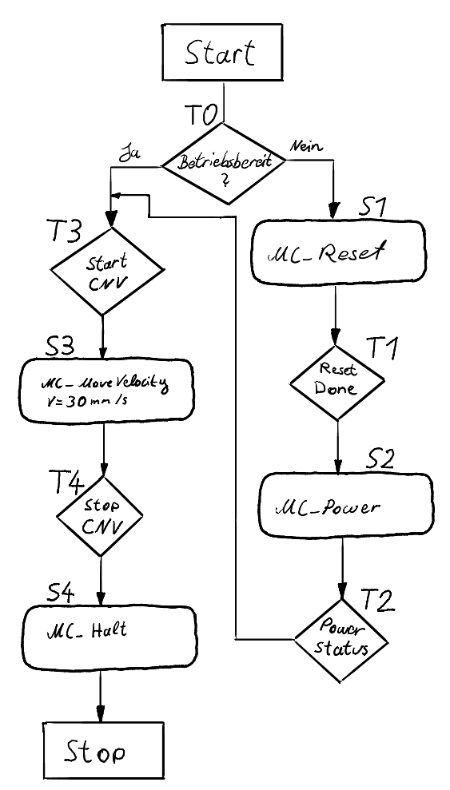
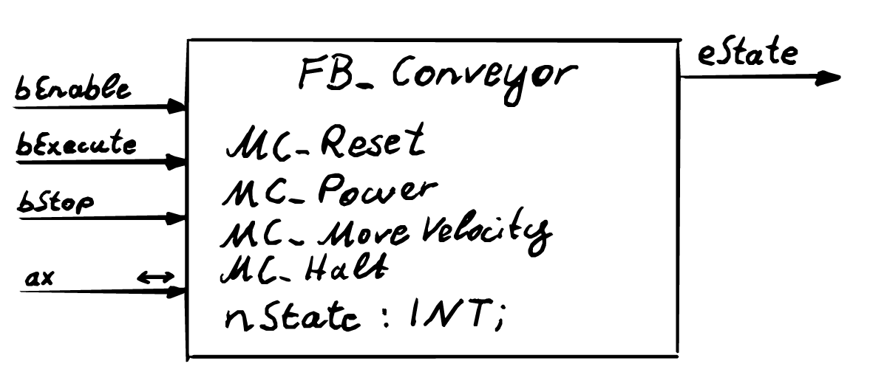
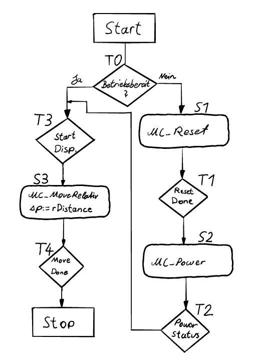
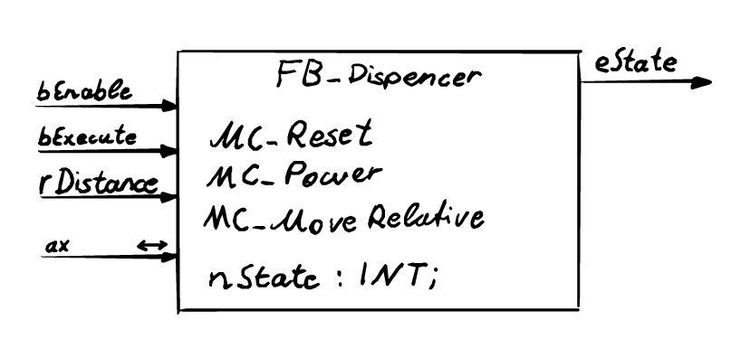
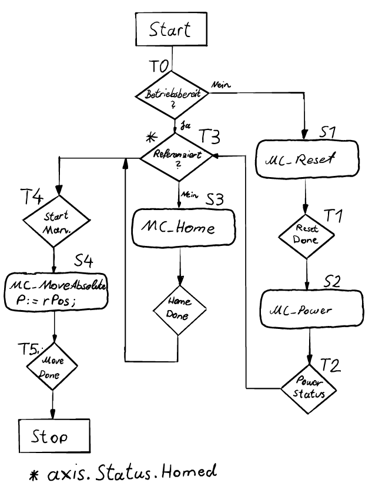
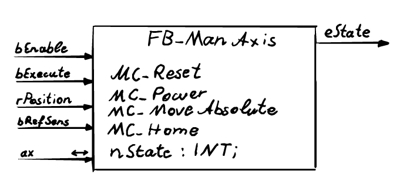

<!-- paginate: true -->

**SoSe 2024**
Serafin Kollegger & Julian Huber

# Automatisierungstechnik
**Motorsteuerung**
**TwinCAT Motion Baukasten**
**Tc2_Mc2 Motion-Bibliothek**
**Beispiel Förderband**

--- 

# Motorsteuerung 

## Grundlagen zur Motorsteuerung

---

### Ebenenansicht der Motorsteuerung

---

- Die Motorsteuerung für Beckhoff TwinCAT SPS gliedert sich grundsätzlich in drei Ebenen:
  - Steuerungslogik: Hier wird eine Motorapplikation programmiert, was die Applikationsebene darstellt.
  - NC-Achsen: Diese fungieren als virtuelle Abbildungen von Motorachsen und transformieren die Applikationswerte in Motordaten und umgekehrt.
  - Hardwareebene: Diese umfasst den Motordriver oder Verstärker, der die Motorsignale basierend auf den Eingabewerten der Motordaten regelt, um sicherzustellen, dass die Istwerte den Sollwerten entsprechen.
- Die Art des Motors und des E/A-Geräts bestimmen, wie die Applikationsdaten in Motorsignale umgewandelt werden.
- Beispielsweise erfordert ein Servomotor andere Signale als ein Steppermotor.
- Die Motordaten werden über den Feldbus an das E/A-Gerät gesendet und gelangen somit zur Hardwareebene.

---
## TwinCAT Motion Baukasten

[Video Link XPlanar](https://www.youtube.com/watch?v=IYw8fy9VQ24)

---

- TwinCAT Motion ist eine Komponente des TwinCAT-Automatisierungssystems von Beckhoff, speziell entwickelt für die Steuerung von Bewegungsachsen und Antrieben in Maschinen und Produktionsanlagen.
- Der TF50x0 | NC PTP Baukasten wird in dieser Vorlesung verwendet und kann mithilfe verschiedener Bibliotheken genutzt werden.
- Die Tc2_Mc2-Bibliothek ist ein integraler Bestandteil der TwinCAT Motion-Umgebung und dient der Konfiguration der angeschlossenen Achsen und Antriebe.
- Konfiguration umfasst die Definition von Achsentypen, Regelungsparametern, Verfahrbereichen und anderen relevanten Einstellungen.
- Eine Auswahl verschiedener Regelungsalgorithmen, darunter P-PI-D-Regler und erweiterte Regelungen wie Zustandsregelungen, steht für die Achsensteuerung zur Verfügung.
- Weitere Motion-Bibliotheken mit ähnlichen, aber meist leistungsschwächeren, Funktionalitäten sind ebenfalls verfügbar.

---

## Applikationsebene

Die Bewegungsarten der Tc2_Mc2 sind gemäß den Spezifikationen von PLCopen-motion-control gestaltet und umfassen drei Kategorien:

- Kontinuierliche Bewegung: Diese wird durch Geschwindigkeitseingaben definiert.
- Diskrete Bewegung: Diese wird durch Positions- oder Zeitangaben definiert.
- Synchronisierte Bewegung: Diese wird durch die Bewegung der Master-Achse definiert.

Die Unterschiede zwischen diesen Kategorien liegen in ihren erforderlichen Steuereingängen. Zusätzliche Eingaben wie maximale Geschwindigkeiten, Beschleunigungen und Bewegungsrichtung ergänzen die Definition der Bewegung.

---

## Kontinuierliche Bewegung 
### MC_MoveVelocity

---

- Das Verhalten von *MC_MoveVelocity* kann in einem PVA-Zeit (Position, Velocity, Acceleration) Diagramm beschrieben werden.
- Da es sich um eine kontinuierliche Bewegung handelt, wird lediglich eine Geschwindigkeit vorgegeben.
- Die Achse beschleunigt bzw. verlangsamt sich mit $a_{\text{in}}$ von der Ausgangsgeschwindigkeit $v_0$ zum Zeitpunkt $t_0$ (Erstaufruf des Funktionsblocks) bis die eingestellte Geschwindigkeit $v_{\text{in}}$ zum Zeitpunkt $t_1$ erreicht ist, wie durch den Ausgang des FBs *.InVelocity* gekennzeichnet.
- Ab diesem Zeitpunkt wird die Geschwindigkeit gehalten, bis eine Abbruchbedingung erreicht wird (Zeitpunkt $t_2$), wie in diesem Beispiel durch *MC_Halt*, welches die Achse mit definierter Verzögerung $a_{\text{halt}}$ zum Anhalten bringt (Zeitpunkt $t_3$).
- Alternativ kann auch ein neuer *MC_MoveVelocity* Befehl mit neuer Geschwindigkeit aufgerufen werden.

---

&emsp; &emsp; &emsp; &emsp; 

---

## Diskrete Bewegung
### MC_MoveAbsolute

---

- Bei dieser Bewegung wird die Achse auf eine absolute Position gefahren, was eine diskrete Bewegung darstellt.
- Eine Nullposition ist definiert, die sich durch einen Neustart der Anlage nicht verändert. Diese Eigenschaft kann durch einen Absolutencoder oder durch Referenzierungsfahrten (Homing) erzeugt werden. Erklärungen zu beiden Implementierungsarten folgen in weiteren Kapiteln.
- Der notwendige Eingang für diesen Funktionsblock ist die Zielposition $p_1$.
- Zusätzlich können maximale Geschwindigkeiten $v_{\text{max}}$, Beschleunigungen $a_{\text{max}}$ und Verzögerungen $a_{\text{min}}$ angegeben werden. Andernfalls werden die voreingestellten Werte verwendet, wie im Kapitel zur Parametrisierung des Motors näher erläutert.
- Nach Erreichen der angegebenen Zielposition wird der Ausgang des Funktionsblocks *.Done* auf *True* gesetzt. Dieser Wert bleibt bestehen, bis die Achse einen neuen Bewegungsbefehl ausführen soll.
- Die Berechnung der aktuellen Geschwindigkeiten und die Zeitpunkte der Phasenwechsel der Bewegung ($t_1$ und $t_2$) werden von *MC_MoveAbsolute* durchgeführt.

---

&emsp; &emsp; &emsp; &emsp; 

---

## Diskrete Bewegung
### MC_MoveRelative

---

- Diese Bewegung ist ähnlich wie *MC_MoveAbsolute* eine diskrete Bewegungsart, jedoch soll hier ein relativer Weg zurückgelegt werden.
- Das bedeutet, dass die Position vor Start des Funktionsblocks gedanklich auf Null gesetzt wird und der Positionseingang $\Delta p$ angefahren wird.
- Somit kann die Zielposition der Achse durch $p_0 + \Delta p$ berechnet werden.
- Wie bei *MC_MoveAbsolute* können auch hier die Geschwindigkeitswerte $v_{\text{max}}$ und die Beschleunigungswerte $a_{\text{max}}$ und $a_{\text{min}}$ vorgegeben werden.
- Sobald der relative Weg zurückgelegt wurde, wird der Ausgang *Done* auf *True* gesetzt, bis ein neuer Befehl erfolgt.

---

&emsp; &emsp; &emsp; &emsp; 

---

## Achsen Referenz (Axis_Ref)

- Der Datentyp AXIS_REF enthält Information zu einer Achse. AXIS_REF ist eine Schnittstelle zwischen der SPS und der NC und wird den MC-Funktionsbausteinen als Referenz auf eine Achse mitgegeben.
- Jeder Funktionsblock besitzt einen Eingang *Axis* mit einem zweiseitigen Pfeilsymbol.
- Dieser Eingang ist keine gewöhnliche Variable, sondern eine *In_Out*-Variable.
- Dadurch werden Daten des Datentyps *Axis_Ref* empfangen und ausgegeben.
- Dies ermöglicht eine bidirektionale Kommunikation mit der NC-Achse, wie in oben stehender Abbildung des Ebenenmodells zwischen SPS-Task und NC-Task dargestellt.
- Jede Achse in der Anlage erhält eine individuelle Achsenreferenz.
Dadurch kann jede Achse eindeutig durch den Aufruf eines Bewegungsbausteins angesteuert werden

---

## Zustandsdiagramm der Tc2_Mc2

---

### Organisationsbausteine der Tc2_Mc2

**MC_Power**
**MC_Reset**

---

#### Motorfreigabe (MC_Power)

- Organisationsbausteine wie MC\_Power und MC\_Reset sind notwendig, um die Zustände einer Achse zu steuern.
- MC\_Power steuert die allgemeine Reglerfreigabe, während MC\_Reset zur Quittierung von Fehlern genutzt wird.
- Durch Setzen von *.Enable* wird die allgemeine Reglerfreigabe erteilt.
- Zusätzlich müssen der Steuerung die Richtungen mitgeteilt werden, in denen sich die Achse bewegen darf. Dies wird durch die Eingänge *.Enable\_Positive* für Vorwärtsbewegungen und *.Enable\_Negative* für Rückwärtsbewegungen ermöglicht.
- Wie für alle Funktionsbausteine der Tc2\_Mc2, muss auch hier eine Achsenreferenz angegeben werden, um die jeweilige Achse freizugeben.
- Durch den Ausgang *.Status* wird der freigegebene Betriebsstatus übermittelt.

---

---

#### Motorreset (MC_Reset)

- Durch das Setzen von *.bExecute* wird der Reset ausgeführt. Sobald dieser abgeschlossen ist, wird der Ausgang *.Done* gesetzt.
- Solange der Funktionsblock aktiv ist, wird *.Busy* ausgegeben.
- Falls während der Ausführung ein Fehler auftritt, wird das Signal *.Error* gesetzt und eine Fehlernummer durch *.ErrorID* ausgegeben.
- Dieser Befehl muss nach jedem Fehler einer Achse ausgeführt werden, um die Achse danach durch MC\_Power freizugeben.

---

---

## NC-Achsenebene

---

### Allgemeine Konfiguration

---

### Allgemeine Parameter

---

### Encoder Konfiguration

---

### Encoder Parameter

---
### Reglerimplementierung

---

### Reglerparameter

---

### Online-Betrieb (Jogging Mode)

---
## Hardware Ebene

---

### Inkremetalencoder

---

### Absolute Encoder

---

### Multiturn Encoder (Hall Effekt)

---

# Basisaufgaben

---

### Förderband - 5 Punkte

---

#### Blockschaltbild der Förderbandsteuerung

---

### Implementierung in der realen Anlage

---

### Dispenser - 5 Punkte

---
#### Blockschaltbild der Dispenser-Steuerung

---

### Manipulatorachsen - 5 Punkte

Langsame Referenziergeschwindigkeit = 15 mm/s

---
#### Blockschaltbild Manipulatorachsen-Steuerung

---
# Hardware Inbetriebnahme

---

[def]: images/Ablaufdiagramm_Forderband.png