<!-- paginate: true -->

**SoSe 2024**
Serafin Kollegger & Julian Huber

# Automatisierungstechnik
**Mess-/Steuerkette**
**AD-Wandler**
**PID-Regler**

---

# Mess-/Steuerkette 

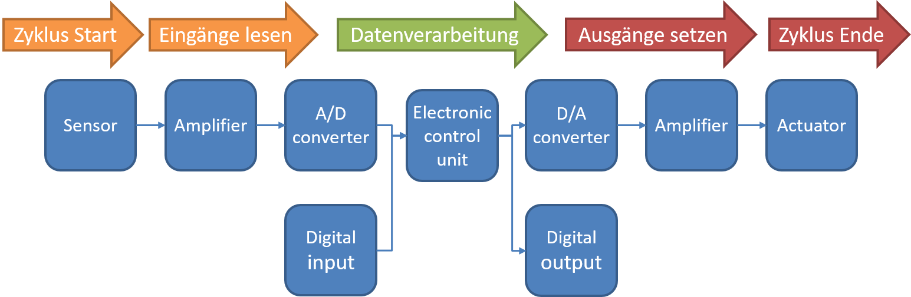

---

# Hardware der Messsteuerkette
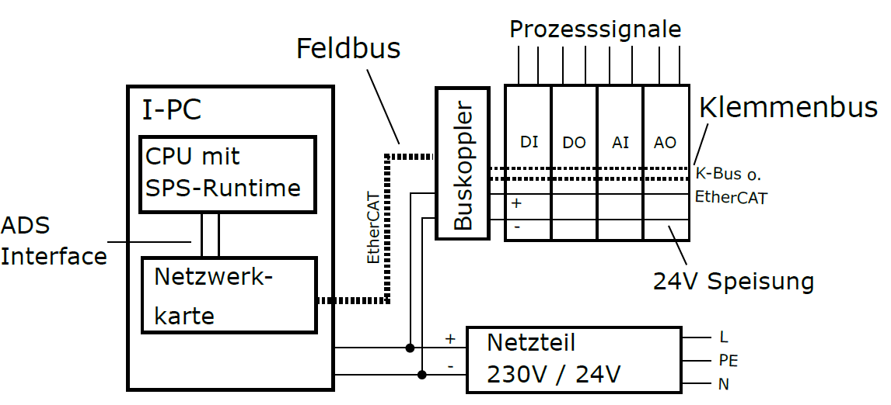

---

# Feldbus
## Schnittstelle E/A-Geräte und Steuerung
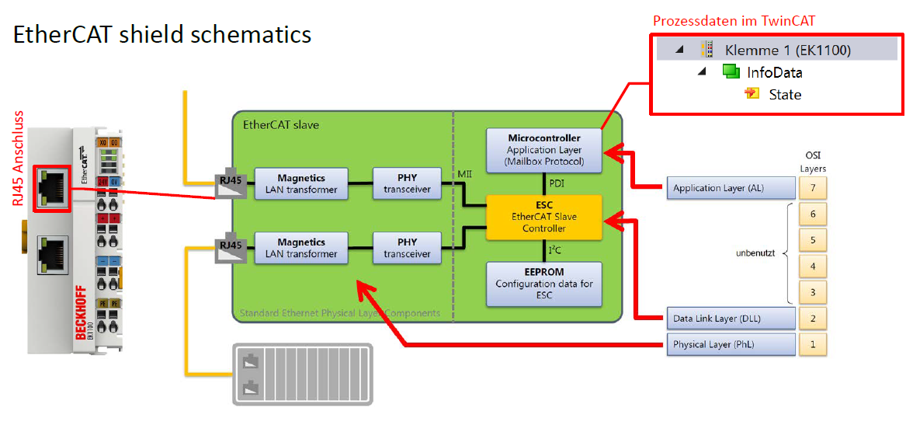

Wie funktioniert EtherCAT https://www.youtube.com/watch?v=9-s3fzGxEI4

---

# Sensoren & Eingangssignale

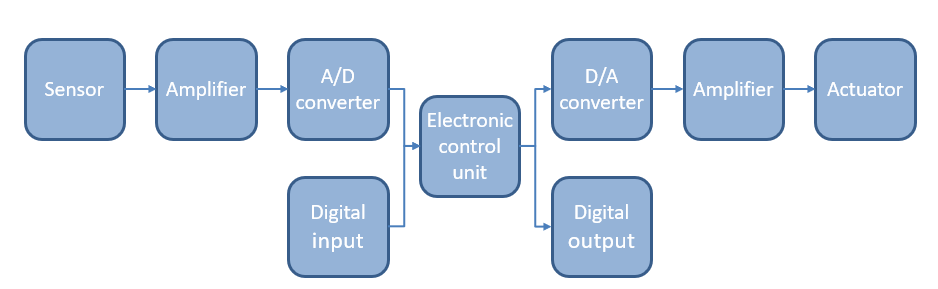

---

# Sensoren & Eingangssignale

Sensoren mit Wirkungsweise:

- **Temperatursensoren**
  - Änderung des Widerstands oder der Spannung

- **Drucksensor**
  - Änderung des Widerstands oder der Kapazität

- **Kraftsensor**
  - Änderung des Widerstands oder der elektrischen Ladung

- **Lichtsensor**
  - Änderung des Widerstands oder der Spannung

- **Positionssensor**
  - Änderung des Widerstands oder der elektrischen Impulse

---

## Signaltypen Analoger Sensoren

**Volt-Basiert:**
0...10V , -10...10V

**Strom-Basiert:**
0...20mA , 4...20mA

Wie können die oft sehr kleinen Änderungen der Messgrößen in standartisierte Signale umgewandelt werden? 

---

## Verstärker

Sensoren zusammen mit Verstärkern werden als Transmitter bezeichnet, heutiger Standard für industrielle Sensoren. 

---

## Vorteile von Transmittern 

Transmitter in einem Gehäuse kombiniert:

- Sensor
- Verstärker

Vorteile:

- Der Verstärker ist nah am Sensor und in kompakter Bauform
- Kalibrierung wird vom Hersteller durchgeführt **!!!**
- Kosteneffektiv

---

## Reduktion von Störungen bei der Signal übertragung

Zur reduktion von EMS können Transmitter in einer differential Schaltung angeordnet werden. 

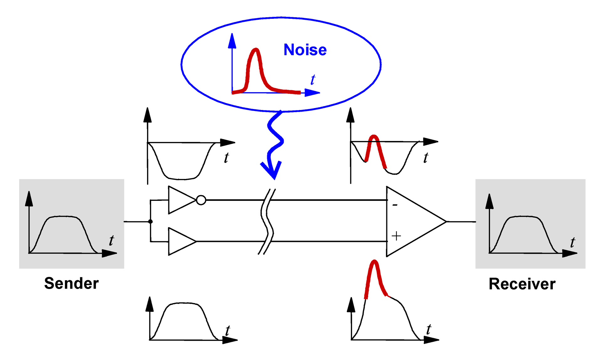

---

## Reduktion von Störungen bei der Signal übertragung II

Dabei wird das Signal mit einen Positiven und Negativen Spannungsbereich übertragen. Gemessen wird die Differenz der beiben Signale. Störungen fallsen somit an beiden Leitungen gleich an und die Differenz der Signale bleibt jene, welche ohne Störung erwartet wird. 

---

## Analog/Digital - Wandler

### EL 3xxx

---

## Analog/Digital - Wandler
- Verstärker oder Transmitter geben analoge Signale (0..10V, 4..20mA) aus
- Signale müssen in digitale Werte umgewandelt werden
- Damit sie von einem Computer verarbeitet werden können
- Dies wird von einem Analog-Digital-Wandler (ADC) durchgeführt
- Heutzutage wird binäre Logik verwendet
- Analoge Signale werden in Binärzahlen umgewandelt. Binärzahlen bestehen aus Binärziffern. Eine Ziffer kann zwei Zustände haben, die normalerweise durch die Zeichen „0“ und „1“ dargestellt werden. Zur Darstellung einer Zahl benötigen wir mehr Ziffern

---

## Kontinuierliche vs. Diskrete Signale

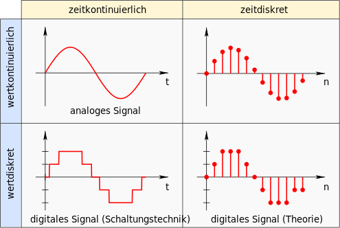

---

## Kontinuierliche vs. Diskrete Signale
- **Auflösung und Abtastrate**
  - Die Anzahl der Ziffern (Bits), die von einem ADC erzeugt werden, wird als Auflösung des ADC bezeichnet und in Bits angegeben.
  - Die Anzahl der Umwandlungen pro Sekunde wird als Abtastrate bezeichnet.
  - Derzeit sind folgende Auflösungen und Abtastraten üblich:

| Auflösung | Teilung     | Abtastrate      |
|-----------|-------------------------------|----------------|
| 8 Bit     | 256 Schritte           | bis zu 10 GSamples/s |
| 12 Bit    | 4096 Schritte         | bis zu 2 GSamples/s |
| 16 Bit    | 65536 Schritte       | bis zu 250 MSamples/s |
| 24 Bit    | 16 Millionen Schritte | bis zu 100 kSamples/s |

- Höhere Auflösung und/oder höhere Geschwindigkeit führen zu höheren Kosten.
---

## Beispiel Wertediskretisierung / Auflösung

$$ \Delta u = \frac{u_{max}-u_{min}}{2^{n}} $$

für dieses Signal: 
$$ \Delta u = 1.25 V \rightarrow u_{max} = 10V; n = 3;  $$
Damit liegt der tatsächliche Spannungswert zwischen 0 und 1,25V bei umgewandelter Zahl 0.

---

## Beispiel Zeitdiskretisierung / Abtastrate

Abtastrate wird durch die Zykluszeit vorgegeben. In Fällen wo eine erhöhte Abtastfrequenz erforderlich ist, werden eingene Tasks eingesetzt. In Sonderfällen, wenn es die Klemmen zulassen, kann Oversampling Funktion verwendet werden. 

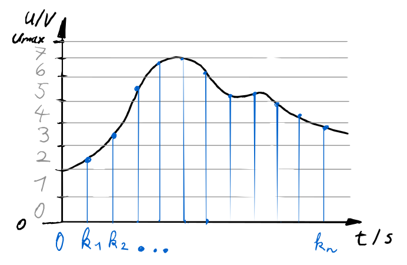

---
# Nyquist-Shannon Theorem

- **Abtasttheorem**
  - Wenn die höchste Frequenz im Signal **f** ist, dann muss das Signal mit mindestens **2 * f** abgetastet werden.
  - Wurde von Nyquist und Shannon entwickelt.
  - Beschreibt, wie oft ein Signal abgetastet werden muss, um es reproduzieren zu können.
  - Beispiel: Wenn Sie ein Signal mit maximal 10 Hz messen möchten, müssen Sie mindestens 20 Abtastungen pro Sekunde durchführen.
  - Für den praktischen Gebrauch benötigen Sie eine Abtastrate, die mindestens 2,5-mal höher ist, aufgrund der Toleranzen der Komponenten.
---

### Abtastfrequenz von Harmonischen Signalen

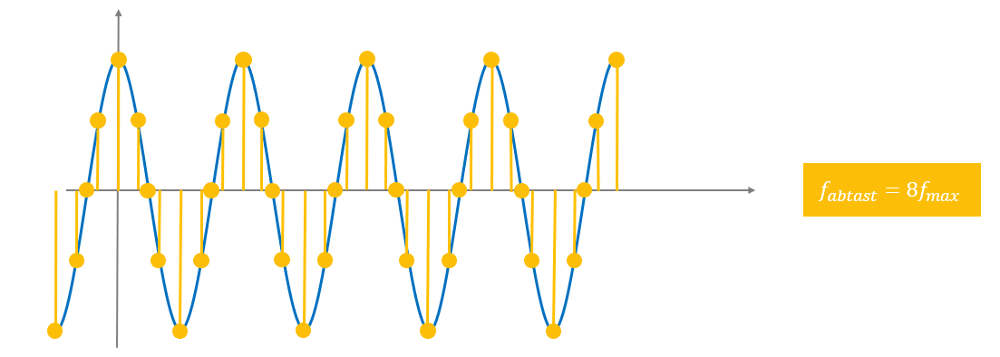

---

## Bodediagramm des Eingangsfilters

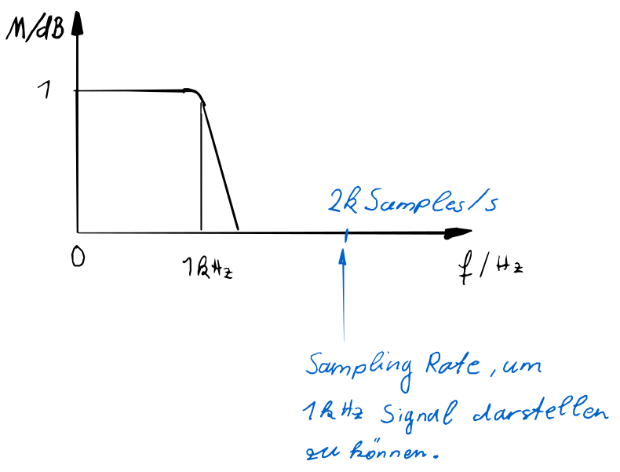

---

## Skalierung der Eingangswerte

- Damit in der Steuerung mit geeigneten Werten gearbeitet werden kann, muss der Eingang des Feldbuses auf den gemessenen physikalischen Wert zurückgerechnet werden.

- Die dazu benötigten Größen, sind Auflösung ADC, Sensorreichweite, Sensorsensitivität und Messbereich.

- Mit diesen Werten kann bei linearen Sensor verhalten auf die gemessene Größe gerechnet werden durch eine lineare Funktion.
- Beispiel Ultraschallsensor: 
    - Messbereich : 350mm
    - Totzone : 30mm
    - Sensorsensitivität: 0.07 mm
    - Sensorausgang : 0...10V
    - ADC Auflösung : 12 Bit (16- Bit Darstellung im Feldbus)

---

$$ y = kx+d $$
d...Totzone (30 mm aus Datenblat)
$$ d = h_{min} $$
k...Steigung mit 
$$ k = \frac{ih_{max} - ih_{min}}{h_{max}-h_{min}}$$

x...ADC Eingangswert über Feldbus
y...Messgröße in Sensoreinheit (mm)

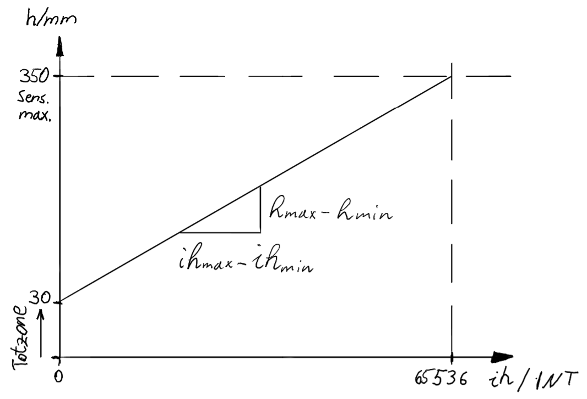

---

### Inkremetalencoder

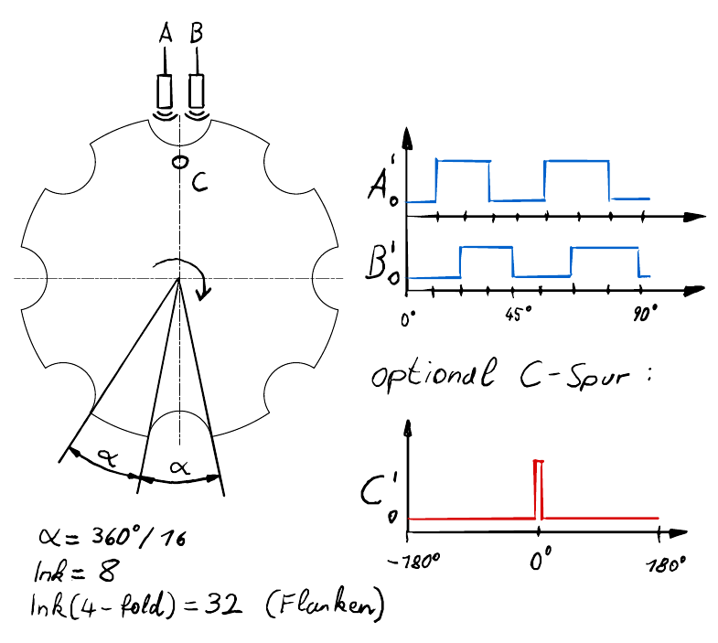

---

### Absolute Encoder
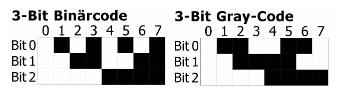

---

### Multiturn Encoder (Hall Effekt)

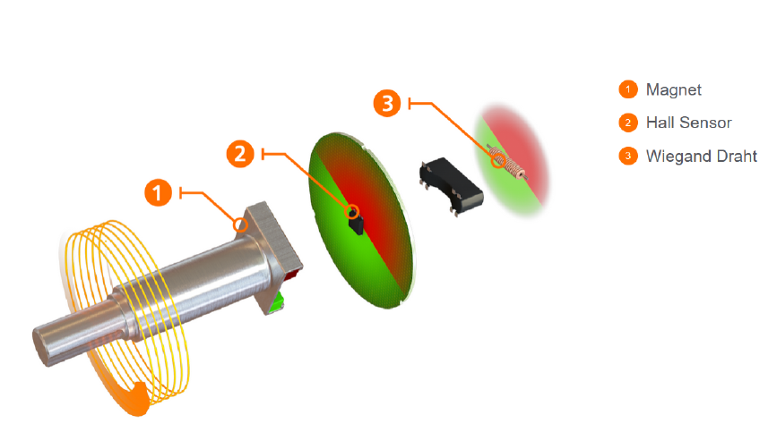

---

# Aktoren & Ausgangssignale

Im Vergleich zu Sensoren sind für Aktuatoren oft keine Standartsignale definiert. Weiters handelt es sich heufig um Komponenten mit hoher Leistung, d.h. die ansteuerung kann nicht direkt erfolgen, sondern durch leistungsverstärker. 

Das Niquist-Shannon Theorem gilt auch für die Wiederherstellung von Analogen signalen. 

Feldbus übertragung der Analogwerte basiert normalerweise auf INT Daten Typ (16 Bit), d.h. 16Bit somit sind die ADC Reichweiten auf diese 16 Bit festgelegt. Ein 12 Bit DAC bekommt Zahlen von 0 bis 65536, um seine Reichweite abzubilden, kann diese aber nur in 12 Bit Auflösung, Analogwerte wiedergeben. Somit sind 16 zahlen im feldbus immer die gleichen Ausgangssignale. 

---

## Datenaufzeichnung - Scope Baustein

---

# Reglerimplementierung

---

## Reglerstruktur

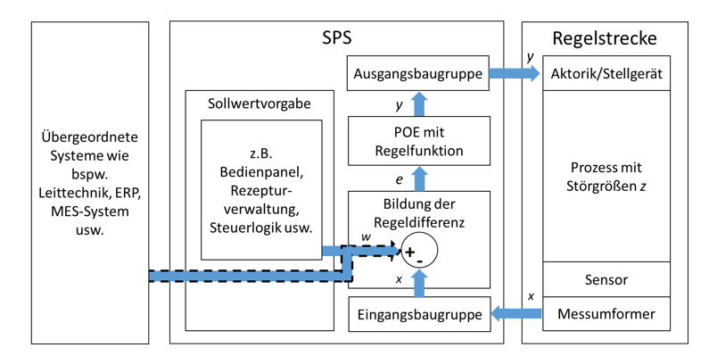

---

## PID Regler mit direkten Parametern

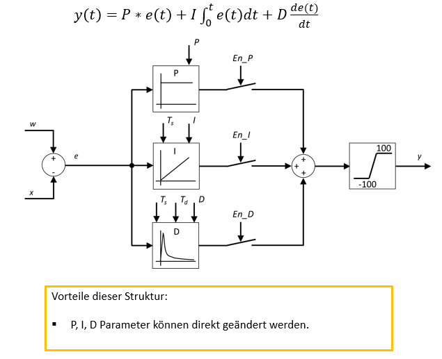

---

## PID Regler mit zeitlichen Parametern

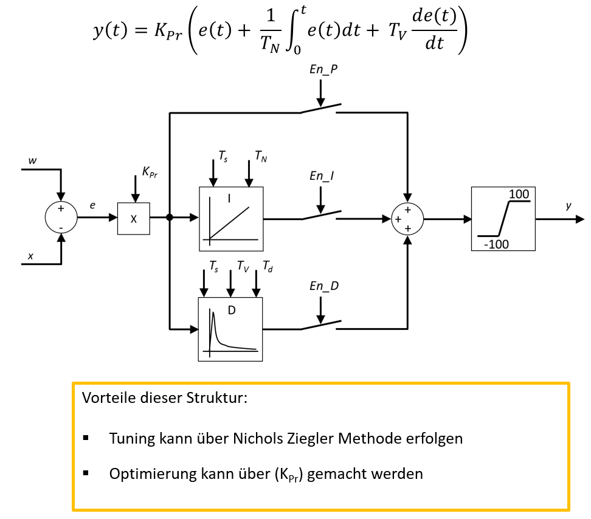

---

## Ziegler Nichols Parameter Tunning Methode

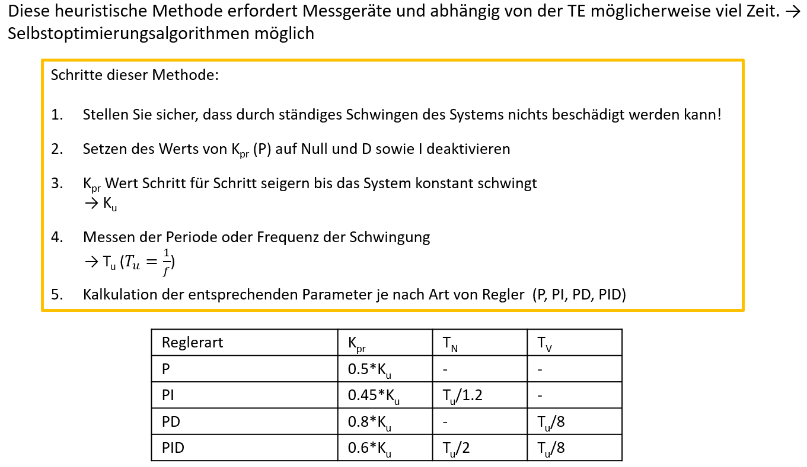

---

## Ziegler Nichols für PT1 Tt-Glied

$$ T_u = T_t; T_g = T; K_s = K $$
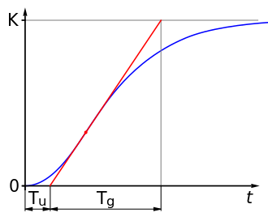
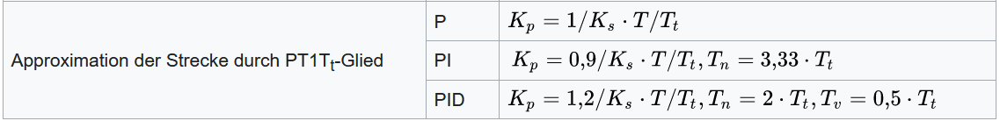

---

## PID-Verhalten

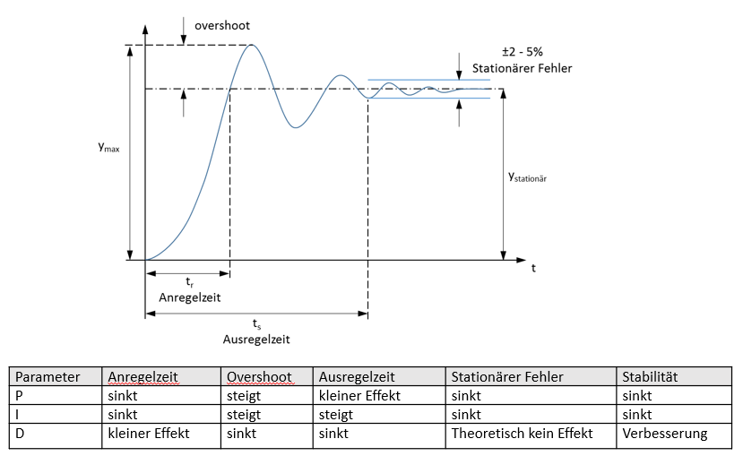

---

## Anti Wind-Up

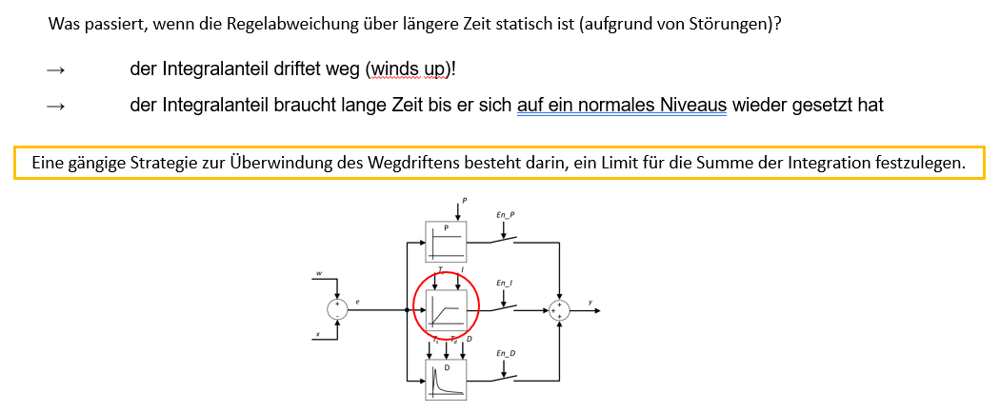

---

## Demonstration an virtueller Lüfterstrecke
